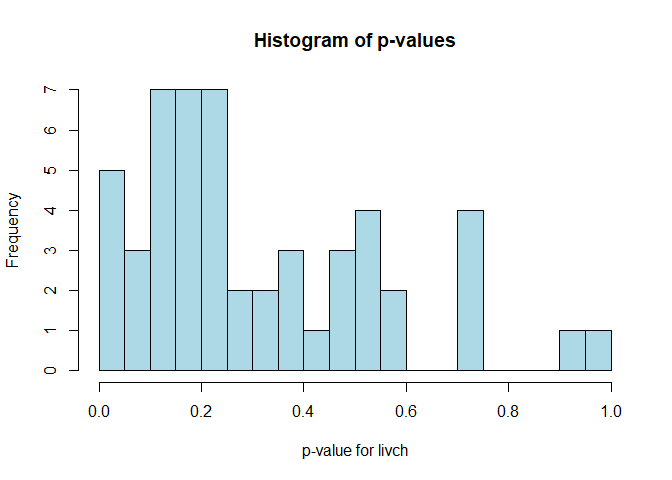
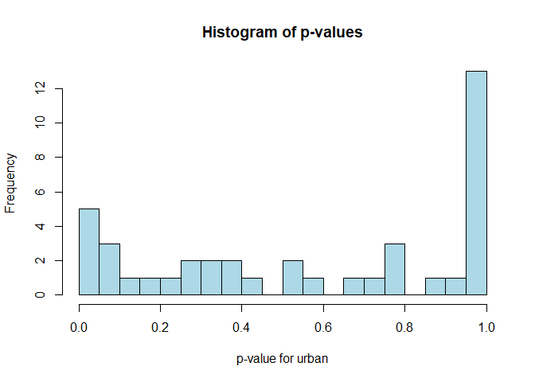
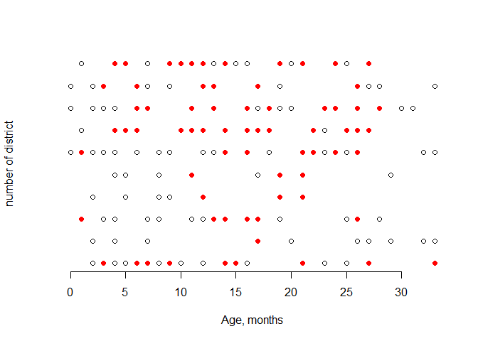
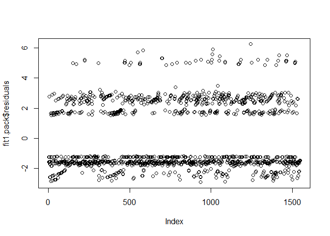
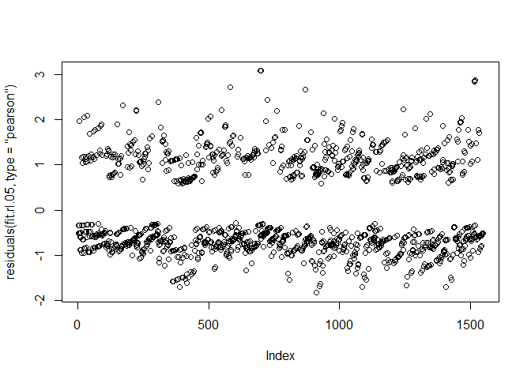
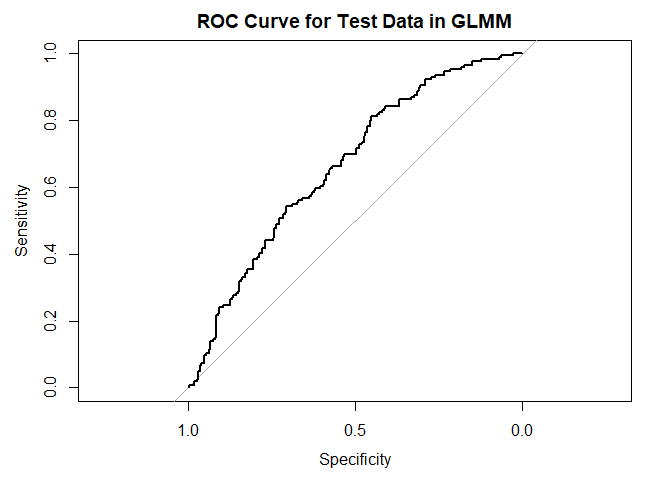
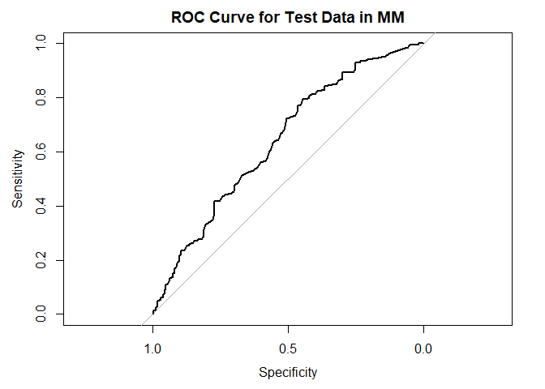

final 2
================
Kindle Zhang qz2527
2024-12-07

``` r
data(Contraception)
Contraception$use = as.numeric(Contraception$use) - 1
Contraception$urban = as.numeric(Contraception$urban) - 1
Contraception = Contraception |> 
  select(-woman)

Contraception$age = round(Contraception$age - min(Contraception$age))
Contraception = Contraception |> 
  arrange(district, age)

set.seed(24)
trainIndex = createDataPartition(Contraception$use, p = 0.8, list = FALSE)
trainData = Contraception[trainIndex, ]
testData = Contraception[-trainIndex, ]

# summary data
str(trainData)
```

    ## 'data.frame':    1548 obs. of  5 variables:
    ##  $ district: Factor w/ 60 levels "1","2","3","4",..: 1 1 1 1 1 1 1 1 1 1 ...
    ##  $ use     : num  0 0 0 0 0 1 0 0 0 0 ...
    ##  $ livch   : Factor w/ 4 levels "0","1","2","3+": 1 1 1 1 1 1 2 1 2 2 ...
    ##  $ age     : num  0 0 1 1 2 2 2 2 2 2 ...
    ##  $ urban   : num  1 0 1 0 1 1 1 1 0 0 ...

``` r
summary(trainData)
```

    ##     district         use         livch         age            urban       
    ##  1      : 104   Min.   :0.0000   0 :445   Min.   : 0.00   Min.   :0.0000  
    ##  14     :  96   1st Qu.:0.0000   1 :289   1st Qu.: 6.00   1st Qu.:0.0000  
    ##  46     :  69   Median :0.0000   2 :235   Median :12.00   Median :0.0000  
    ##  25     :  54   Mean   :0.3831   3+:579   Mean   :13.32   Mean   :0.2939  
    ##  30     :  53   3rd Qu.:1.0000            3rd Qu.:20.00   3rd Qu.:1.0000  
    ##  52     :  49   Max.   :1.0000            Max.   :33.00   Max.   :1.0000  
    ##  (Other):1123

``` r
colSums(is.na(trainData))
```

    ## district      use    livch      age    urban 
    ##        0        0        0        0        0

``` r
table(trainData$use)
```

    ## 
    ##   0   1 
    ## 955 593

``` r
table(trainData$livch, trainData$use)
```

    ##     
    ##        0   1
    ##   0  337 108
    ##   1  158 131
    ##   2  122 113
    ##   3+ 338 241

# EDA

## in every district: use vs livch

``` r
split_data = split(trainData, trainData$district)

chisq_tests_livch = lapply(split_data,
                           function(group)
                             chisq.test(table(group$use, group$livch)))
chisq_tests_livch
```

    ## $`1`
    ## 
    ##  Pearson's Chi-squared test
    ## 
    ## data:  table(group$use, group$livch)
    ## X-squared = 4.2827, df = 3, p-value = 0.2325
    ## 
    ## 
    ## $`2`
    ## 
    ##  Pearson's Chi-squared test
    ## 
    ## data:  table(group$use, group$livch)
    ## X-squared = 2.4375, df = 3, p-value = 0.4867
    ## 
    ## 
    ## $`3`
    ## 
    ##  Chi-squared test for given probabilities
    ## 
    ## data:  table(group$use, group$livch)
    ## X-squared = 2, df = 3, p-value = 0.5724
    ## 
    ## 
    ## $`4`
    ## 
    ##  Pearson's Chi-squared test
    ## 
    ## data:  table(group$use, group$livch)
    ## X-squared = 5.8376, df = 3, p-value = 0.1198
    ## 
    ## 
    ## $`5`
    ## 
    ##  Pearson's Chi-squared test
    ## 
    ## data:  table(group$use, group$livch)
    ## X-squared = 4.898, df = 3, p-value = 0.1794
    ## 
    ## 
    ## $`6`
    ## 
    ##  Pearson's Chi-squared test
    ## 
    ## data:  table(group$use, group$livch)
    ## X-squared = 2.2108, df = 3, p-value = 0.5298
    ## 
    ## 
    ## $`7`
    ## 
    ##  Pearson's Chi-squared test
    ## 
    ## data:  table(group$use, group$livch)
    ## X-squared = 1.4204, df = 3, p-value = 0.7008
    ## 
    ## 
    ## $`8`
    ## 
    ##  Pearson's Chi-squared test
    ## 
    ## data:  table(group$use, group$livch)
    ## X-squared = 4.0923, df = 3, p-value = 0.2517
    ## 
    ## 
    ## $`9`
    ## 
    ##  Pearson's Chi-squared test
    ## 
    ## data:  table(group$use, group$livch)
    ## X-squared = 3.0129, df = 3, p-value = 0.3896
    ## 
    ## 
    ## $`10`
    ## 
    ##  Pearson's Chi-squared test
    ## 
    ## data:  table(group$use, group$livch)
    ## X-squared = 4.95, df = 3, p-value = 0.1755
    ## 
    ## 
    ## $`11`
    ## 
    ##  Chi-squared test for given probabilities
    ## 
    ## data:  table(group$use, group$livch)
    ## X-squared = 13.111, df = 3, p-value = 0.004402
    ## 
    ## 
    ## $`12`
    ## 
    ##  Pearson's Chi-squared test
    ## 
    ## data:  table(group$use, group$livch)
    ## X-squared = 6.764, df = 3, p-value = 0.07981
    ## 
    ## 
    ## $`13`
    ## 
    ##  Pearson's Chi-squared test
    ## 
    ## data:  table(group$use, group$livch)
    ## X-squared = 4.2941, df = 3, p-value = 0.2314
    ## 
    ## 
    ## $`14`
    ## 
    ##  Pearson's Chi-squared test
    ## 
    ## data:  table(group$use, group$livch)
    ## X-squared = 2.9217, df = 3, p-value = 0.4039
    ## 
    ## 
    ## $`15`
    ## 
    ##  Pearson's Chi-squared test
    ## 
    ## data:  table(group$use, group$livch)
    ## X-squared = 6, df = 3, p-value = 0.1116
    ## 
    ## 
    ## $`16`
    ## 
    ##  Pearson's Chi-squared test
    ## 
    ## data:  table(group$use, group$livch)
    ## X-squared = 4.5, df = 3, p-value = 0.2123
    ## 
    ## 
    ## $`17`
    ## 
    ##  Pearson's Chi-squared test
    ## 
    ## data:  table(group$use, group$livch)
    ## X-squared = 4.9219, df = 3, p-value = 0.1776
    ## 
    ## 
    ## $`18`
    ## 
    ##  Pearson's Chi-squared test
    ## 
    ## data:  table(group$use, group$livch)
    ## X-squared = 4.8462, df = 3, p-value = 0.1834
    ## 
    ## 
    ## $`19`
    ## 
    ##  Pearson's Chi-squared test
    ## 
    ## data:  table(group$use, group$livch)
    ## X-squared = NaN, df = 3, p-value = NA
    ## 
    ## 
    ## $`20`
    ## 
    ##  Pearson's Chi-squared test
    ## 
    ## data:  table(group$use, group$livch)
    ## X-squared = NaN, df = 3, p-value = NA
    ## 
    ## 
    ## $`21`
    ## 
    ##  Pearson's Chi-squared test
    ## 
    ## data:  table(group$use, group$livch)
    ## X-squared = 3.1111, df = 3, p-value = 0.3748
    ## 
    ## 
    ## $`22`
    ## 
    ##  Pearson's Chi-squared test
    ## 
    ## data:  table(group$use, group$livch)
    ## X-squared = 5.8385, df = 3, p-value = 0.1197
    ## 
    ## 
    ## $`23`
    ## 
    ##  Pearson's Chi-squared test
    ## 
    ## data:  table(group$use, group$livch)
    ## X-squared = NaN, df = 3, p-value = NA
    ## 
    ## 
    ## $`24`
    ## 
    ##  Pearson's Chi-squared test
    ## 
    ## data:  table(group$use, group$livch)
    ## X-squared = NaN, df = 3, p-value = NA
    ## 
    ## 
    ## $`25`
    ## 
    ##  Pearson's Chi-squared test
    ## 
    ## data:  table(group$use, group$livch)
    ## X-squared = 16.722, df = 3, p-value = 0.0008063
    ## 
    ## 
    ## $`26`
    ## 
    ##  Pearson's Chi-squared test
    ## 
    ## data:  table(group$use, group$livch)
    ## X-squared = 1.997, df = 3, p-value = 0.573
    ## 
    ## 
    ## $`27`
    ## 
    ##  Pearson's Chi-squared test
    ## 
    ## data:  table(group$use, group$livch)
    ## X-squared = 1.3462, df = 3, p-value = 0.7182
    ## 
    ## 
    ## $`28`
    ## 
    ##  Pearson's Chi-squared test
    ## 
    ## data:  table(group$use, group$livch)
    ## X-squared = 2.2638, df = 3, p-value = 0.5195
    ## 
    ## 
    ## $`29`
    ## 
    ##  Pearson's Chi-squared test
    ## 
    ## data:  table(group$use, group$livch)
    ## X-squared = 3.7827, df = 3, p-value = 0.2859
    ## 
    ## 
    ## $`30`
    ## 
    ##  Pearson's Chi-squared test
    ## 
    ## data:  table(group$use, group$livch)
    ## X-squared = 14.393, df = 3, p-value = 0.002416
    ## 
    ## 
    ## $`31`
    ## 
    ##  Pearson's Chi-squared test
    ## 
    ## data:  table(group$use, group$livch)
    ## X-squared = 4.2728, df = 3, p-value = 0.2335
    ## 
    ## 
    ## $`32`
    ## 
    ##  Pearson's Chi-squared test
    ## 
    ## data:  table(group$use, group$livch)
    ## X-squared = 1.3727, df = 3, p-value = 0.712
    ## 
    ## 
    ## $`33`
    ## 
    ##  Pearson's Chi-squared test
    ## 
    ## data:  table(group$use, group$livch)
    ## X-squared = NaN, df = 3, p-value = NA
    ## 
    ## 
    ## $`34`
    ## 
    ##  Pearson's Chi-squared test
    ## 
    ## data:  table(group$use, group$livch)
    ## X-squared = 0.51689, df = 3, p-value = 0.9152
    ## 
    ## 
    ## $`35`
    ## 
    ##  Pearson's Chi-squared test
    ## 
    ## data:  table(group$use, group$livch)
    ## X-squared = 4.4445, df = 3, p-value = 0.2173
    ## 
    ## 
    ## $`36`
    ## 
    ##  Pearson's Chi-squared test
    ## 
    ## data:  table(group$use, group$livch)
    ## X-squared = 5.5067, df = 3, p-value = 0.1382
    ## 
    ## 
    ## $`37`
    ## 
    ##  Pearson's Chi-squared test
    ## 
    ## data:  table(group$use, group$livch)
    ## X-squared = 2.5, df = 3, p-value = 0.4753
    ## 
    ## 
    ## $`38`
    ## 
    ##  Pearson's Chi-squared test
    ## 
    ## data:  table(group$use, group$livch)
    ## X-squared = NaN, df = 3, p-value = NA
    ## 
    ## 
    ## $`39`
    ## 
    ##  Pearson's Chi-squared test
    ## 
    ## data:  table(group$use, group$livch)
    ## X-squared = 6.97, df = 3, p-value = 0.07286
    ## 
    ## 
    ## $`40`
    ## 
    ##  Pearson's Chi-squared test
    ## 
    ## data:  table(group$use, group$livch)
    ## X-squared = 1.4, df = 3, p-value = 0.7055
    ## 
    ## 
    ## $`41`
    ## 
    ##  Pearson's Chi-squared test
    ## 
    ## data:  table(group$use, group$livch)
    ## X-squared = 0.27898, df = 3, p-value = 0.9639
    ## 
    ## 
    ## $`42`
    ## 
    ##  Pearson's Chi-squared test
    ## 
    ## data:  table(group$use, group$livch)
    ## X-squared = 5.2, df = 3, p-value = 0.1577
    ## 
    ## 
    ## $`43`
    ## 
    ##  Pearson's Chi-squared test
    ## 
    ## data:  table(group$use, group$livch)
    ## X-squared = 4.7121, df = 3, p-value = 0.1941
    ## 
    ## 
    ## $`44`
    ## 
    ##  Pearson's Chi-squared test
    ## 
    ## data:  table(group$use, group$livch)
    ## X-squared = 8.8917, df = 3, p-value = 0.03077
    ## 
    ## 
    ## $`45`
    ## 
    ##  Pearson's Chi-squared test
    ## 
    ## data:  table(group$use, group$livch)
    ## X-squared = 6.0359, df = 3, p-value = 0.1099
    ## 
    ## 
    ## $`46`
    ## 
    ##  Pearson's Chi-squared test
    ## 
    ## data:  table(group$use, group$livch)
    ## X-squared = 8.8632, df = 3, p-value = 0.03117
    ## 
    ## 
    ## $`47`
    ## 
    ##  Pearson's Chi-squared test
    ## 
    ## data:  table(group$use, group$livch)
    ## X-squared = 4.3333, df = 3, p-value = 0.2276
    ## 
    ## 
    ## $`48`
    ## 
    ##  Pearson's Chi-squared test
    ## 
    ## data:  table(group$use, group$livch)
    ## X-squared = 3.0837, df = 3, p-value = 0.3789
    ## 
    ## 
    ## $`49`
    ## 
    ##  Chi-squared test for given probabilities
    ## 
    ## data:  table(group$use, group$livch)
    ## X-squared = 6, df = 3, p-value = 0.1116
    ## 
    ## 
    ## $`50`
    ## 
    ##  Pearson's Chi-squared test
    ## 
    ## data:  table(group$use, group$livch)
    ## X-squared = NaN, df = 3, p-value = NA
    ## 
    ## 
    ## $`51`
    ## 
    ##  Pearson's Chi-squared test
    ## 
    ## data:  table(group$use, group$livch)
    ## X-squared = 6.6175, df = 3, p-value = 0.08514
    ## 
    ## 
    ## $`52`
    ## 
    ##  Pearson's Chi-squared test
    ## 
    ## data:  table(group$use, group$livch)
    ## X-squared = 2.4833, df = 3, p-value = 0.4783
    ## 
    ## 
    ## $`53`
    ## 
    ##  Pearson's Chi-squared test
    ## 
    ## data:  table(group$use, group$livch)
    ## X-squared = 4.6143, df = 3, p-value = 0.2023
    ## 
    ## 
    ## $`55`
    ## 
    ##  Pearson's Chi-squared test
    ## 
    ## data:  table(group$use, group$livch)
    ## X-squared = 6, df = 3, p-value = 0.1116
    ## 
    ## 
    ## $`56`
    ## 
    ##  Pearson's Chi-squared test
    ## 
    ## data:  table(group$use, group$livch)
    ## X-squared = 5.1953, df = 3, p-value = 0.158
    ## 
    ## 
    ## $`57`
    ## 
    ##  Pearson's Chi-squared test
    ## 
    ## data:  table(group$use, group$livch)
    ## X-squared = 3.6076, df = 3, p-value = 0.3071
    ## 
    ## 
    ## $`58`
    ## 
    ##  Pearson's Chi-squared test
    ## 
    ## data:  table(group$use, group$livch)
    ## X-squared = 2.3528, df = 3, p-value = 0.5025
    ## 
    ## 
    ## $`59`
    ## 
    ##  Pearson's Chi-squared test
    ## 
    ## data:  table(group$use, group$livch)
    ## X-squared = NaN, df = 3, p-value = NA
    ## 
    ## 
    ## $`60`
    ## 
    ##  Pearson's Chi-squared test
    ## 
    ## data:  table(group$use, group$livch)
    ## X-squared = 3.5679, df = 3, p-value = 0.3121
    ## 
    ## 
    ## $`61`
    ## 
    ##  Pearson's Chi-squared test
    ## 
    ## data:  table(group$use, group$livch)
    ## X-squared = 2.3404, df = 3, p-value = 0.5048

``` r
p_values = sapply(chisq_tests_livch, function(test) {
  if (!is.null(test)) {
    test$p.value
  } else {
    NA
  }
})

p_values = na.omit(p_values)

hist(
  p_values,
  breaks = 20,
  main = "Histogram of p-values",
  xlab = "p-value for livch",
  ylab = "Frequency",
  col = "lightblue"
)
```

<!-- -->

``` r
chisq_tests_urban = lapply(split_data, function(group) {
  if (length(unique(group$use)) > 1 &&
      length(unique(group$urban)) > 1) {
    chisq.test(table(group$use, group$urban))
  } else {
    NULL
  }
})
chisq_tests_urban
```

    ## $`1`
    ## 
    ##  Pearson's Chi-squared test with Yates' continuity correction
    ## 
    ## data:  table(group$use, group$urban)
    ## X-squared = 7.4722, df = 1, p-value = 0.006266
    ## 
    ## 
    ## $`2`
    ## NULL
    ## 
    ## $`3`
    ## NULL
    ## 
    ## $`4`
    ## 
    ##  Pearson's Chi-squared test with Yates' continuity correction
    ## 
    ## data:  table(group$use, group$urban)
    ## X-squared = 6.6944, df = 1, p-value = 0.009672
    ## 
    ## 
    ## $`5`
    ## 
    ##  Pearson's Chi-squared test with Yates' continuity correction
    ## 
    ## data:  table(group$use, group$urban)
    ## X-squared = 7.5012e-31, df = 1, p-value = 1
    ## 
    ## 
    ## $`6`
    ## 
    ##  Pearson's Chi-squared test with Yates' continuity correction
    ## 
    ## data:  table(group$use, group$urban)
    ## X-squared = 5.0131, df = 1, p-value = 0.02516
    ## 
    ## 
    ## $`7`
    ## NULL
    ## 
    ## $`8`
    ## 
    ##  Pearson's Chi-squared test with Yates' continuity correction
    ## 
    ## data:  table(group$use, group$urban)
    ## X-squared = 0.7069, df = 1, p-value = 0.4005
    ## 
    ## 
    ## $`9`
    ## 
    ##  Pearson's Chi-squared test with Yates' continuity correction
    ## 
    ## data:  table(group$use, group$urban)
    ## X-squared = 1.0306, df = 1, p-value = 0.31
    ## 
    ## 
    ## $`10`
    ## NULL
    ## 
    ## $`11`
    ## NULL
    ## 
    ## $`12`
    ## 
    ##  Pearson's Chi-squared test with Yates' continuity correction
    ## 
    ## data:  table(group$use, group$urban)
    ## X-squared = 9.3705e-32, df = 1, p-value = 1
    ## 
    ## 
    ## $`13`
    ## 
    ##  Pearson's Chi-squared test with Yates' continuity correction
    ## 
    ## data:  table(group$use, group$urban)
    ## X-squared = 8.8546e-32, df = 1, p-value = 1
    ## 
    ## 
    ## $`14`
    ## 
    ##  Pearson's Chi-squared test with Yates' continuity correction
    ## 
    ## data:  table(group$use, group$urban)
    ## X-squared = 8.5967, df = 1, p-value = 0.003368
    ## 
    ## 
    ## $`15`
    ## 
    ##  Pearson's Chi-squared test with Yates' continuity correction
    ## 
    ## data:  table(group$use, group$urban)
    ## X-squared = 0.033482, df = 1, p-value = 0.8548
    ## 
    ## 
    ## $`16`
    ## 
    ##  Pearson's Chi-squared test with Yates' continuity correction
    ## 
    ## data:  table(group$use, group$urban)
    ## X-squared = 0, df = 1, p-value = 1
    ## 
    ## 
    ## $`17`
    ## NULL
    ## 
    ## $`18`
    ## 
    ##  Pearson's Chi-squared test with Yates' continuity correction
    ## 
    ## data:  table(group$use, group$urban)
    ## X-squared = 1.1315, df = 1, p-value = 0.2875
    ## 
    ## 
    ## $`19`
    ## 
    ##  Pearson's Chi-squared test with Yates' continuity correction
    ## 
    ## data:  table(group$use, group$urban)
    ## X-squared = 0.10411, df = 1, p-value = 0.747
    ## 
    ## 
    ## $`20`
    ## NULL
    ## 
    ## $`21`
    ## 
    ##  Pearson's Chi-squared test with Yates' continuity correction
    ## 
    ## data:  table(group$use, group$urban)
    ## X-squared = 1.0286, df = 1, p-value = 0.3105
    ## 
    ## 
    ## $`22`
    ## NULL
    ## 
    ## $`23`
    ## NULL
    ## 
    ## $`24`
    ## NULL
    ## 
    ## $`25`
    ## 
    ##  Pearson's Chi-squared test with Yates' continuity correction
    ## 
    ## data:  table(group$use, group$urban)
    ## X-squared = 2.5326, df = 1, p-value = 0.1115
    ## 
    ## 
    ## $`26`
    ## NULL
    ## 
    ## $`27`
    ## 
    ##  Pearson's Chi-squared test with Yates' continuity correction
    ## 
    ## data:  table(group$use, group$urban)
    ## X-squared = 0.088941, df = 1, p-value = 0.7655
    ## 
    ## 
    ## $`28`
    ## 
    ##  Pearson's Chi-squared test with Yates' continuity correction
    ## 
    ## data:  table(group$use, group$urban)
    ## X-squared = 1.8664e-30, df = 1, p-value = 1
    ## 
    ## 
    ## $`29`
    ## 
    ##  Pearson's Chi-squared test with Yates' continuity correction
    ## 
    ## data:  table(group$use, group$urban)
    ## X-squared = 3.3144, df = 1, p-value = 0.06868
    ## 
    ## 
    ## $`30`
    ## 
    ##  Pearson's Chi-squared test with Yates' continuity correction
    ## 
    ## data:  table(group$use, group$urban)
    ## X-squared = 5.9132, df = 1, p-value = 0.01503
    ## 
    ## 
    ## $`31`
    ## 
    ##  Pearson's Chi-squared test with Yates' continuity correction
    ## 
    ## data:  table(group$use, group$urban)
    ## X-squared = 3.3464e-32, df = 1, p-value = 1
    ## 
    ## 
    ## $`32`
    ## NULL
    ## 
    ## $`33`
    ## 
    ##  Pearson's Chi-squared test with Yates' continuity correction
    ## 
    ## data:  table(group$use, group$urban)
    ## X-squared = 0.41667, df = 1, p-value = 0.5186
    ## 
    ## 
    ## $`34`
    ## 
    ##  Pearson's Chi-squared test with Yates' continuity correction
    ## 
    ## data:  table(group$use, group$urban)
    ## X-squared = 1.7391, df = 1, p-value = 0.1872
    ## 
    ## 
    ## $`35`
    ## 
    ##  Pearson's Chi-squared test with Yates' continuity correction
    ## 
    ## data:  table(group$use, group$urban)
    ## X-squared = 0.0093045, df = 1, p-value = 0.9232
    ## 
    ## 
    ## $`36`
    ## 
    ##  Pearson's Chi-squared test with Yates' continuity correction
    ## 
    ## data:  table(group$use, group$urban)
    ## X-squared = 1.2178e-31, df = 1, p-value = 1
    ## 
    ## 
    ## $`37`
    ## NULL
    ## 
    ## $`38`
    ## 
    ##  Pearson's Chi-squared test with Yates' continuity correction
    ## 
    ## data:  table(group$use, group$urban)
    ## X-squared = 3.375, df = 1, p-value = 0.06619
    ## 
    ## 
    ## $`39`
    ## NULL
    ## 
    ## $`40`
    ## 
    ##  Pearson's Chi-squared test with Yates' continuity correction
    ## 
    ## data:  table(group$use, group$urban)
    ## X-squared = 0.17045, df = 1, p-value = 0.6797
    ## 
    ## 
    ## $`41`
    ## 
    ##  Pearson's Chi-squared test with Yates' continuity correction
    ## 
    ## data:  table(group$use, group$urban)
    ## X-squared = 0.80808, df = 1, p-value = 0.3687
    ## 
    ## 
    ## $`42`
    ## 
    ##  Pearson's Chi-squared test with Yates' continuity correction
    ## 
    ## data:  table(group$use, group$urban)
    ## X-squared = 3.75, df = 1, p-value = 0.05281
    ## 
    ## 
    ## $`43`
    ## 
    ##  Pearson's Chi-squared test with Yates' continuity correction
    ## 
    ## data:  table(group$use, group$urban)
    ## X-squared = 2.1052e-31, df = 1, p-value = 1
    ## 
    ## 
    ## $`44`
    ## NULL
    ## 
    ## $`45`
    ## 
    ##  Pearson's Chi-squared test with Yates' continuity correction
    ## 
    ## data:  table(group$use, group$urban)
    ## X-squared = 1.603, df = 1, p-value = 0.2055
    ## 
    ## 
    ## $`46`
    ## 
    ##  Pearson's Chi-squared test with Yates' continuity correction
    ## 
    ## data:  table(group$use, group$urban)
    ## X-squared = 0.83263, df = 1, p-value = 0.3615
    ## 
    ## 
    ## $`47`
    ## 
    ##  Pearson's Chi-squared test with Yates' continuity correction
    ## 
    ## data:  table(group$use, group$urban)
    ## X-squared = 0, df = 1, p-value = 1
    ## 
    ## 
    ## $`48`
    ## 
    ##  Pearson's Chi-squared test with Yates' continuity correction
    ## 
    ## data:  table(group$use, group$urban)
    ## X-squared = 0.096715, df = 1, p-value = 0.7558
    ## 
    ## 
    ## $`49`
    ## NULL
    ## 
    ## $`50`
    ## 
    ##  Pearson's Chi-squared test with Yates' continuity correction
    ## 
    ## data:  table(group$use, group$urban)
    ## X-squared = 0.4256, df = 1, p-value = 0.5142
    ## 
    ## 
    ## $`51`
    ## 
    ##  Pearson's Chi-squared test with Yates' continuity correction
    ## 
    ## data:  table(group$use, group$urban)
    ## X-squared = 0.29722, df = 1, p-value = 0.5856
    ## 
    ## 
    ## $`52`
    ## 
    ##  Pearson's Chi-squared test with Yates' continuity correction
    ## 
    ## data:  table(group$use, group$urban)
    ## X-squared = 1.24, df = 1, p-value = 0.2655
    ## 
    ## 
    ## $`53`
    ## NULL
    ## 
    ## $`55`
    ## NULL
    ## 
    ## $`56`
    ## 
    ##  Pearson's Chi-squared test with Yates' continuity correction
    ## 
    ## data:  table(group$use, group$urban)
    ## X-squared = 0, df = 1, p-value = 1
    ## 
    ## 
    ## $`57`
    ## 
    ##  Pearson's Chi-squared test with Yates' continuity correction
    ## 
    ## data:  table(group$use, group$urban)
    ## X-squared = 9.9816e-32, df = 1, p-value = 1
    ## 
    ## 
    ## $`58`
    ## 
    ##  Pearson's Chi-squared test with Yates' continuity correction
    ## 
    ## data:  table(group$use, group$urban)
    ## X-squared = 1.0509e-31, df = 1, p-value = 1
    ## 
    ## 
    ## $`59`
    ## NULL
    ## 
    ## $`60`
    ## 
    ##  Pearson's Chi-squared test with Yates' continuity correction
    ## 
    ## data:  table(group$use, group$urban)
    ## X-squared = 0.070903, df = 1, p-value = 0.79
    ## 
    ## 
    ## $`61`
    ## 
    ##  Pearson's Chi-squared test with Yates' continuity correction
    ## 
    ## data:  table(group$use, group$urban)
    ## X-squared = 0.00018986, df = 1, p-value = 0.989

``` r
p_values = sapply(chisq_tests_urban, function(test) {
  if (!is.null(test)) {
    test$p.value
  } else {
    NA
  }
})

p_values = na.omit(p_values)

hist(
  p_values,
  breaks = 20,
  main = "Histogram of p-values",
  xlab = "p-value for urban",
  ylab = "Frequency",
  col = "lightblue"
)
```

<!-- -->

``` r
chisq.test(table(trainData$use, trainData$livch))
```

    ## 
    ##  Pearson's Chi-squared test
    ## 
    ## data:  table(trainData$use, trainData$livch)
    ## X-squared = 55.335, df = 3, p-value = 5.825e-12

``` r
chisq.test(table(trainData$use, trainData$urban))
```

    ## 
    ##  Pearson's Chi-squared test with Yates' continuity correction
    ## 
    ## data:  table(trainData$use, trainData$urban)
    ## X-squared = 41.602, df = 1, p-value = 1.119e-10

``` r
set.seed(24)  
selected_districts = sample(unique(trainData$district), 10)

subset_data = trainData[trainData$district %in% selected_districts, ]

sub_data =
  subset_data |>
  mutate(rownum = as.numeric(factor(district, levels = unique(district))))

plot(sub_data$age, sub_data$rownum,  
     xlab = "Age, months", 
     ylab = "number of district", 
     pch = 1, col = "black", 
     xlim = c(min(sub_data$age), max(sub_data$age)), 
     ylim = c(1, 10), 
     axes = FALSE)      


axis(1)

points(sub_data$age[sub_data$use == 1], 
       sub_data$rownum[sub_data$use == 1], 
       pch = 16, col = "red")
```

<!-- -->

# model

## GEE 1.0

``` r
fit0.gee = gee(
  use ~ age + urban + livch,
  id = district,
  data = trainData,
  family = binomial,
  scale.fix = TRUE,
  corstr = "independence"
)
```

    ## (Intercept)         age       urban      livch1      livch2     livch3+ 
    ## -1.35419887 -0.01383875  0.80761232  1.04173217  1.24007682  1.08147464

``` r
summary(fit0.gee)
```

    ## 
    ##  GEE:  GENERALIZED LINEAR MODELS FOR DEPENDENT DATA
    ##  gee S-function, version 4.13 modified 98/01/27 (1998) 
    ## 
    ## Model:
    ##  Link:                      Logit 
    ##  Variance to Mean Relation: Binomial 
    ##  Correlation Structure:     Independent 
    ## 
    ## Call:
    ## gee(formula = use ~ age + urban + livch, id = district, data = trainData, 
    ##     family = binomial, corstr = "independence", scale.fix = TRUE)
    ## 
    ## Summary of Residuals:
    ##        Min         1Q     Median         3Q        Max 
    ## -0.6574552 -0.3789178 -0.2007078  0.5661962  0.8400569 
    ## 
    ## 
    ## Coefficients:
    ##                Estimate  Naive S.E.    Naive z Robust S.E.  Robust z
    ## (Intercept) -1.35419887 0.130641746 -10.365744 0.150025618 -9.026451
    ## age         -0.01383875 0.008499087  -1.628263 0.008313452 -1.664621
    ## urban        0.80761232 0.117361402   6.881413 0.198556022  4.067428
    ## livch1       1.04173217 0.168434414   6.184794 0.190894631  5.457106
    ## livch2       1.24007682 0.187109994   6.627529 0.169621006  7.310868
    ## livch3+      1.08147464 0.190552521   5.675468 0.210235398  5.144113
    ## 
    ## Estimated Scale Parameter:  1
    ## Number of Iterations:  1
    ## 
    ## Working Correlation
    ##        [,1] [,2] [,3] [,4] [,5] [,6] [,7] [,8] [,9] [,10] [,11] [,12] [,13]
    ##   [1,]    1    0    0    0    0    0    0    0    0     0     0     0     0
    ##   [2,]    0    1    0    0    0    0    0    0    0     0     0     0     0
    ##   [3,]    0    0    1    0    0    0    0    0    0     0     0     0     0
    ##   [4,]    0    0    0    1    0    0    0    0    0     0     0     0     0
    ##   [5,]    0    0    0    0    1    0    0    0    0     0     0     0     0
    ##   [6,]    0    0    0    0    0    1    0    0    0     0     0     0     0
    ##   [7,]    0    0    0    0    0    0    1    0    0     0     0     0     0
    ##   [8,]    0    0    0    0    0    0    0    1    0     0     0     0     0
    ##   [9,]    0    0    0    0    0    0    0    0    1     0     0     0     0
    ##  [10,]    0    0    0    0    0    0    0    0    0     1     0     0     0
    ##  [11,]    0    0    0    0    0    0    0    0    0     0     1     0     0
    ##  [12,]    0    0    0    0    0    0    0    0    0     0     0     1     0
    ##  [13,]    0    0    0    0    0    0    0    0    0     0     0     0     1
    ##  [14,]    0    0    0    0    0    0    0    0    0     0     0     0     0
    ##  [15,]    0    0    0    0    0    0    0    0    0     0     0     0     0
    ##  [16,]    0    0    0    0    0    0    0    0    0     0     0     0     0
    ##  [17,]    0    0    0    0    0    0    0    0    0     0     0     0     0
    ##  [18,]    0    0    0    0    0    0    0    0    0     0     0     0     0
    ##  [19,]    0    0    0    0    0    0    0    0    0     0     0     0     0
    ##  [20,]    0    0    0    0    0    0    0    0    0     0     0     0     0
    ##  [21,]    0    0    0    0    0    0    0    0    0     0     0     0     0
    ##  [22,]    0    0    0    0    0    0    0    0    0     0     0     0     0
    ##  [23,]    0    0    0    0    0    0    0    0    0     0     0     0     0
    ##  [24,]    0    0    0    0    0    0    0    0    0     0     0     0     0
    ##  [25,]    0    0    0    0    0    0    0    0    0     0     0     0     0
    ##  [26,]    0    0    0    0    0    0    0    0    0     0     0     0     0
    ##  [27,]    0    0    0    0    0    0    0    0    0     0     0     0     0
    ##  [28,]    0    0    0    0    0    0    0    0    0     0     0     0     0
    ##  [29,]    0    0    0    0    0    0    0    0    0     0     0     0     0
    ##  [30,]    0    0    0    0    0    0    0    0    0     0     0     0     0
    ##  [31,]    0    0    0    0    0    0    0    0    0     0     0     0     0
    ##  [32,]    0    0    0    0    0    0    0    0    0     0     0     0     0
    ##  [33,]    0    0    0    0    0    0    0    0    0     0     0     0     0
    ##  [34,]    0    0    0    0    0    0    0    0    0     0     0     0     0
    ##  [35,]    0    0    0    0    0    0    0    0    0     0     0     0     0
    ##  [36,]    0    0    0    0    0    0    0    0    0     0     0     0     0
    ##  [37,]    0    0    0    0    0    0    0    0    0     0     0     0     0
    ##  [38,]    0    0    0    0    0    0    0    0    0     0     0     0     0
    ##  [39,]    0    0    0    0    0    0    0    0    0     0     0     0     0
    ##  [40,]    0    0    0    0    0    0    0    0    0     0     0     0     0
    ##  [41,]    0    0    0    0    0    0    0    0    0     0     0     0     0
    ##  [42,]    0    0    0    0    0    0    0    0    0     0     0     0     0
    ##  [43,]    0    0    0    0    0    0    0    0    0     0     0     0     0
    ##  [44,]    0    0    0    0    0    0    0    0    0     0     0     0     0
    ##  [45,]    0    0    0    0    0    0    0    0    0     0     0     0     0
    ##  [46,]    0    0    0    0    0    0    0    0    0     0     0     0     0
    ##  [47,]    0    0    0    0    0    0    0    0    0     0     0     0     0
    ##  [48,]    0    0    0    0    0    0    0    0    0     0     0     0     0
    ##  [49,]    0    0    0    0    0    0    0    0    0     0     0     0     0
    ##  [50,]    0    0    0    0    0    0    0    0    0     0     0     0     0
    ##  [51,]    0    0    0    0    0    0    0    0    0     0     0     0     0
    ##  [52,]    0    0    0    0    0    0    0    0    0     0     0     0     0
    ##  [53,]    0    0    0    0    0    0    0    0    0     0     0     0     0
    ##  [54,]    0    0    0    0    0    0    0    0    0     0     0     0     0
    ##  [55,]    0    0    0    0    0    0    0    0    0     0     0     0     0
    ##  [56,]    0    0    0    0    0    0    0    0    0     0     0     0     0
    ##  [57,]    0    0    0    0    0    0    0    0    0     0     0     0     0
    ##  [58,]    0    0    0    0    0    0    0    0    0     0     0     0     0
    ##  [59,]    0    0    0    0    0    0    0    0    0     0     0     0     0
    ##  [60,]    0    0    0    0    0    0    0    0    0     0     0     0     0
    ##  [61,]    0    0    0    0    0    0    0    0    0     0     0     0     0
    ##  [62,]    0    0    0    0    0    0    0    0    0     0     0     0     0
    ##  [63,]    0    0    0    0    0    0    0    0    0     0     0     0     0
    ##  [64,]    0    0    0    0    0    0    0    0    0     0     0     0     0
    ##  [65,]    0    0    0    0    0    0    0    0    0     0     0     0     0
    ##  [66,]    0    0    0    0    0    0    0    0    0     0     0     0     0
    ##  [67,]    0    0    0    0    0    0    0    0    0     0     0     0     0
    ##  [68,]    0    0    0    0    0    0    0    0    0     0     0     0     0
    ##  [69,]    0    0    0    0    0    0    0    0    0     0     0     0     0
    ##  [70,]    0    0    0    0    0    0    0    0    0     0     0     0     0
    ##  [71,]    0    0    0    0    0    0    0    0    0     0     0     0     0
    ##  [72,]    0    0    0    0    0    0    0    0    0     0     0     0     0
    ##  [73,]    0    0    0    0    0    0    0    0    0     0     0     0     0
    ##  [74,]    0    0    0    0    0    0    0    0    0     0     0     0     0
    ##  [75,]    0    0    0    0    0    0    0    0    0     0     0     0     0
    ##  [76,]    0    0    0    0    0    0    0    0    0     0     0     0     0
    ##  [77,]    0    0    0    0    0    0    0    0    0     0     0     0     0
    ##  [78,]    0    0    0    0    0    0    0    0    0     0     0     0     0
    ##  [79,]    0    0    0    0    0    0    0    0    0     0     0     0     0
    ##  [80,]    0    0    0    0    0    0    0    0    0     0     0     0     0
    ##  [81,]    0    0    0    0    0    0    0    0    0     0     0     0     0
    ##  [82,]    0    0    0    0    0    0    0    0    0     0     0     0     0
    ##  [83,]    0    0    0    0    0    0    0    0    0     0     0     0     0
    ##  [84,]    0    0    0    0    0    0    0    0    0     0     0     0     0
    ##  [85,]    0    0    0    0    0    0    0    0    0     0     0     0     0
    ##  [86,]    0    0    0    0    0    0    0    0    0     0     0     0     0
    ##  [87,]    0    0    0    0    0    0    0    0    0     0     0     0     0
    ##  [88,]    0    0    0    0    0    0    0    0    0     0     0     0     0
    ##  [89,]    0    0    0    0    0    0    0    0    0     0     0     0     0
    ##  [90,]    0    0    0    0    0    0    0    0    0     0     0     0     0
    ##  [91,]    0    0    0    0    0    0    0    0    0     0     0     0     0
    ##  [92,]    0    0    0    0    0    0    0    0    0     0     0     0     0
    ##  [93,]    0    0    0    0    0    0    0    0    0     0     0     0     0
    ##  [94,]    0    0    0    0    0    0    0    0    0     0     0     0     0
    ##  [95,]    0    0    0    0    0    0    0    0    0     0     0     0     0
    ##  [96,]    0    0    0    0    0    0    0    0    0     0     0     0     0
    ##  [97,]    0    0    0    0    0    0    0    0    0     0     0     0     0
    ##  [98,]    0    0    0    0    0    0    0    0    0     0     0     0     0
    ##  [99,]    0    0    0    0    0    0    0    0    0     0     0     0     0
    ## [100,]    0    0    0    0    0    0    0    0    0     0     0     0     0
    ## [101,]    0    0    0    0    0    0    0    0    0     0     0     0     0
    ## [102,]    0    0    0    0    0    0    0    0    0     0     0     0     0
    ## [103,]    0    0    0    0    0    0    0    0    0     0     0     0     0
    ## [104,]    0    0    0    0    0    0    0    0    0     0     0     0     0
    ##        [,14] [,15] [,16] [,17] [,18] [,19] [,20] [,21] [,22] [,23] [,24] [,25]
    ##   [1,]     0     0     0     0     0     0     0     0     0     0     0     0
    ##   [2,]     0     0     0     0     0     0     0     0     0     0     0     0
    ##   [3,]     0     0     0     0     0     0     0     0     0     0     0     0
    ##   [4,]     0     0     0     0     0     0     0     0     0     0     0     0
    ##   [5,]     0     0     0     0     0     0     0     0     0     0     0     0
    ##   [6,]     0     0     0     0     0     0     0     0     0     0     0     0
    ##   [7,]     0     0     0     0     0     0     0     0     0     0     0     0
    ##   [8,]     0     0     0     0     0     0     0     0     0     0     0     0
    ##   [9,]     0     0     0     0     0     0     0     0     0     0     0     0
    ##  [10,]     0     0     0     0     0     0     0     0     0     0     0     0
    ##  [11,]     0     0     0     0     0     0     0     0     0     0     0     0
    ##  [12,]     0     0     0     0     0     0     0     0     0     0     0     0
    ##  [13,]     0     0     0     0     0     0     0     0     0     0     0     0
    ##  [14,]     1     0     0     0     0     0     0     0     0     0     0     0
    ##  [15,]     0     1     0     0     0     0     0     0     0     0     0     0
    ##  [16,]     0     0     1     0     0     0     0     0     0     0     0     0
    ##  [17,]     0     0     0     1     0     0     0     0     0     0     0     0
    ##  [18,]     0     0     0     0     1     0     0     0     0     0     0     0
    ##  [19,]     0     0     0     0     0     1     0     0     0     0     0     0
    ##  [20,]     0     0     0     0     0     0     1     0     0     0     0     0
    ##  [21,]     0     0     0     0     0     0     0     1     0     0     0     0
    ##  [22,]     0     0     0     0     0     0     0     0     1     0     0     0
    ##  [23,]     0     0     0     0     0     0     0     0     0     1     0     0
    ##  [24,]     0     0     0     0     0     0     0     0     0     0     1     0
    ##  [25,]     0     0     0     0     0     0     0     0     0     0     0     1
    ##  [26,]     0     0     0     0     0     0     0     0     0     0     0     0
    ##  [27,]     0     0     0     0     0     0     0     0     0     0     0     0
    ##  [28,]     0     0     0     0     0     0     0     0     0     0     0     0
    ##  [29,]     0     0     0     0     0     0     0     0     0     0     0     0
    ##  [30,]     0     0     0     0     0     0     0     0     0     0     0     0
    ##  [31,]     0     0     0     0     0     0     0     0     0     0     0     0
    ##  [32,]     0     0     0     0     0     0     0     0     0     0     0     0
    ##  [33,]     0     0     0     0     0     0     0     0     0     0     0     0
    ##  [34,]     0     0     0     0     0     0     0     0     0     0     0     0
    ##  [35,]     0     0     0     0     0     0     0     0     0     0     0     0
    ##  [36,]     0     0     0     0     0     0     0     0     0     0     0     0
    ##  [37,]     0     0     0     0     0     0     0     0     0     0     0     0
    ##  [38,]     0     0     0     0     0     0     0     0     0     0     0     0
    ##  [39,]     0     0     0     0     0     0     0     0     0     0     0     0
    ##  [40,]     0     0     0     0     0     0     0     0     0     0     0     0
    ##  [41,]     0     0     0     0     0     0     0     0     0     0     0     0
    ##  [42,]     0     0     0     0     0     0     0     0     0     0     0     0
    ##  [43,]     0     0     0     0     0     0     0     0     0     0     0     0
    ##  [44,]     0     0     0     0     0     0     0     0     0     0     0     0
    ##  [45,]     0     0     0     0     0     0     0     0     0     0     0     0
    ##  [46,]     0     0     0     0     0     0     0     0     0     0     0     0
    ##  [47,]     0     0     0     0     0     0     0     0     0     0     0     0
    ##  [48,]     0     0     0     0     0     0     0     0     0     0     0     0
    ##  [49,]     0     0     0     0     0     0     0     0     0     0     0     0
    ##  [50,]     0     0     0     0     0     0     0     0     0     0     0     0
    ##  [51,]     0     0     0     0     0     0     0     0     0     0     0     0
    ##  [52,]     0     0     0     0     0     0     0     0     0     0     0     0
    ##  [53,]     0     0     0     0     0     0     0     0     0     0     0     0
    ##  [54,]     0     0     0     0     0     0     0     0     0     0     0     0
    ##  [55,]     0     0     0     0     0     0     0     0     0     0     0     0
    ##  [56,]     0     0     0     0     0     0     0     0     0     0     0     0
    ##  [57,]     0     0     0     0     0     0     0     0     0     0     0     0
    ##  [58,]     0     0     0     0     0     0     0     0     0     0     0     0
    ##  [59,]     0     0     0     0     0     0     0     0     0     0     0     0
    ##  [60,]     0     0     0     0     0     0     0     0     0     0     0     0
    ##  [61,]     0     0     0     0     0     0     0     0     0     0     0     0
    ##  [62,]     0     0     0     0     0     0     0     0     0     0     0     0
    ##  [63,]     0     0     0     0     0     0     0     0     0     0     0     0
    ##  [64,]     0     0     0     0     0     0     0     0     0     0     0     0
    ##  [65,]     0     0     0     0     0     0     0     0     0     0     0     0
    ##  [66,]     0     0     0     0     0     0     0     0     0     0     0     0
    ##  [67,]     0     0     0     0     0     0     0     0     0     0     0     0
    ##  [68,]     0     0     0     0     0     0     0     0     0     0     0     0
    ##  [69,]     0     0     0     0     0     0     0     0     0     0     0     0
    ##  [70,]     0     0     0     0     0     0     0     0     0     0     0     0
    ##  [71,]     0     0     0     0     0     0     0     0     0     0     0     0
    ##  [72,]     0     0     0     0     0     0     0     0     0     0     0     0
    ##  [73,]     0     0     0     0     0     0     0     0     0     0     0     0
    ##  [74,]     0     0     0     0     0     0     0     0     0     0     0     0
    ##  [75,]     0     0     0     0     0     0     0     0     0     0     0     0
    ##  [76,]     0     0     0     0     0     0     0     0     0     0     0     0
    ##  [77,]     0     0     0     0     0     0     0     0     0     0     0     0
    ##  [78,]     0     0     0     0     0     0     0     0     0     0     0     0
    ##  [79,]     0     0     0     0     0     0     0     0     0     0     0     0
    ##  [80,]     0     0     0     0     0     0     0     0     0     0     0     0
    ##  [81,]     0     0     0     0     0     0     0     0     0     0     0     0
    ##  [82,]     0     0     0     0     0     0     0     0     0     0     0     0
    ##  [83,]     0     0     0     0     0     0     0     0     0     0     0     0
    ##  [84,]     0     0     0     0     0     0     0     0     0     0     0     0
    ##  [85,]     0     0     0     0     0     0     0     0     0     0     0     0
    ##  [86,]     0     0     0     0     0     0     0     0     0     0     0     0
    ##  [87,]     0     0     0     0     0     0     0     0     0     0     0     0
    ##  [88,]     0     0     0     0     0     0     0     0     0     0     0     0
    ##  [89,]     0     0     0     0     0     0     0     0     0     0     0     0
    ##  [90,]     0     0     0     0     0     0     0     0     0     0     0     0
    ##  [91,]     0     0     0     0     0     0     0     0     0     0     0     0
    ##  [92,]     0     0     0     0     0     0     0     0     0     0     0     0
    ##  [93,]     0     0     0     0     0     0     0     0     0     0     0     0
    ##  [94,]     0     0     0     0     0     0     0     0     0     0     0     0
    ##  [95,]     0     0     0     0     0     0     0     0     0     0     0     0
    ##  [96,]     0     0     0     0     0     0     0     0     0     0     0     0
    ##  [97,]     0     0     0     0     0     0     0     0     0     0     0     0
    ##  [98,]     0     0     0     0     0     0     0     0     0     0     0     0
    ##  [99,]     0     0     0     0     0     0     0     0     0     0     0     0
    ## [100,]     0     0     0     0     0     0     0     0     0     0     0     0
    ## [101,]     0     0     0     0     0     0     0     0     0     0     0     0
    ## [102,]     0     0     0     0     0     0     0     0     0     0     0     0
    ## [103,]     0     0     0     0     0     0     0     0     0     0     0     0
    ## [104,]     0     0     0     0     0     0     0     0     0     0     0     0
    ##        [,26] [,27] [,28] [,29] [,30] [,31] [,32] [,33] [,34] [,35] [,36] [,37]
    ##   [1,]     0     0     0     0     0     0     0     0     0     0     0     0
    ##   [2,]     0     0     0     0     0     0     0     0     0     0     0     0
    ##   [3,]     0     0     0     0     0     0     0     0     0     0     0     0
    ##   [4,]     0     0     0     0     0     0     0     0     0     0     0     0
    ##   [5,]     0     0     0     0     0     0     0     0     0     0     0     0
    ##   [6,]     0     0     0     0     0     0     0     0     0     0     0     0
    ##   [7,]     0     0     0     0     0     0     0     0     0     0     0     0
    ##   [8,]     0     0     0     0     0     0     0     0     0     0     0     0
    ##   [9,]     0     0     0     0     0     0     0     0     0     0     0     0
    ##  [10,]     0     0     0     0     0     0     0     0     0     0     0     0
    ##  [11,]     0     0     0     0     0     0     0     0     0     0     0     0
    ##  [12,]     0     0     0     0     0     0     0     0     0     0     0     0
    ##  [13,]     0     0     0     0     0     0     0     0     0     0     0     0
    ##  [14,]     0     0     0     0     0     0     0     0     0     0     0     0
    ##  [15,]     0     0     0     0     0     0     0     0     0     0     0     0
    ##  [16,]     0     0     0     0     0     0     0     0     0     0     0     0
    ##  [17,]     0     0     0     0     0     0     0     0     0     0     0     0
    ##  [18,]     0     0     0     0     0     0     0     0     0     0     0     0
    ##  [19,]     0     0     0     0     0     0     0     0     0     0     0     0
    ##  [20,]     0     0     0     0     0     0     0     0     0     0     0     0
    ##  [21,]     0     0     0     0     0     0     0     0     0     0     0     0
    ##  [22,]     0     0     0     0     0     0     0     0     0     0     0     0
    ##  [23,]     0     0     0     0     0     0     0     0     0     0     0     0
    ##  [24,]     0     0     0     0     0     0     0     0     0     0     0     0
    ##  [25,]     0     0     0     0     0     0     0     0     0     0     0     0
    ##  [26,]     1     0     0     0     0     0     0     0     0     0     0     0
    ##  [27,]     0     1     0     0     0     0     0     0     0     0     0     0
    ##  [28,]     0     0     1     0     0     0     0     0     0     0     0     0
    ##  [29,]     0     0     0     1     0     0     0     0     0     0     0     0
    ##  [30,]     0     0     0     0     1     0     0     0     0     0     0     0
    ##  [31,]     0     0     0     0     0     1     0     0     0     0     0     0
    ##  [32,]     0     0     0     0     0     0     1     0     0     0     0     0
    ##  [33,]     0     0     0     0     0     0     0     1     0     0     0     0
    ##  [34,]     0     0     0     0     0     0     0     0     1     0     0     0
    ##  [35,]     0     0     0     0     0     0     0     0     0     1     0     0
    ##  [36,]     0     0     0     0     0     0     0     0     0     0     1     0
    ##  [37,]     0     0     0     0     0     0     0     0     0     0     0     1
    ##  [38,]     0     0     0     0     0     0     0     0     0     0     0     0
    ##  [39,]     0     0     0     0     0     0     0     0     0     0     0     0
    ##  [40,]     0     0     0     0     0     0     0     0     0     0     0     0
    ##  [41,]     0     0     0     0     0     0     0     0     0     0     0     0
    ##  [42,]     0     0     0     0     0     0     0     0     0     0     0     0
    ##  [43,]     0     0     0     0     0     0     0     0     0     0     0     0
    ##  [44,]     0     0     0     0     0     0     0     0     0     0     0     0
    ##  [45,]     0     0     0     0     0     0     0     0     0     0     0     0
    ##  [46,]     0     0     0     0     0     0     0     0     0     0     0     0
    ##  [47,]     0     0     0     0     0     0     0     0     0     0     0     0
    ##  [48,]     0     0     0     0     0     0     0     0     0     0     0     0
    ##  [49,]     0     0     0     0     0     0     0     0     0     0     0     0
    ##  [50,]     0     0     0     0     0     0     0     0     0     0     0     0
    ##  [51,]     0     0     0     0     0     0     0     0     0     0     0     0
    ##  [52,]     0     0     0     0     0     0     0     0     0     0     0     0
    ##  [53,]     0     0     0     0     0     0     0     0     0     0     0     0
    ##  [54,]     0     0     0     0     0     0     0     0     0     0     0     0
    ##  [55,]     0     0     0     0     0     0     0     0     0     0     0     0
    ##  [56,]     0     0     0     0     0     0     0     0     0     0     0     0
    ##  [57,]     0     0     0     0     0     0     0     0     0     0     0     0
    ##  [58,]     0     0     0     0     0     0     0     0     0     0     0     0
    ##  [59,]     0     0     0     0     0     0     0     0     0     0     0     0
    ##  [60,]     0     0     0     0     0     0     0     0     0     0     0     0
    ##  [61,]     0     0     0     0     0     0     0     0     0     0     0     0
    ##  [62,]     0     0     0     0     0     0     0     0     0     0     0     0
    ##  [63,]     0     0     0     0     0     0     0     0     0     0     0     0
    ##  [64,]     0     0     0     0     0     0     0     0     0     0     0     0
    ##  [65,]     0     0     0     0     0     0     0     0     0     0     0     0
    ##  [66,]     0     0     0     0     0     0     0     0     0     0     0     0
    ##  [67,]     0     0     0     0     0     0     0     0     0     0     0     0
    ##  [68,]     0     0     0     0     0     0     0     0     0     0     0     0
    ##  [69,]     0     0     0     0     0     0     0     0     0     0     0     0
    ##  [70,]     0     0     0     0     0     0     0     0     0     0     0     0
    ##  [71,]     0     0     0     0     0     0     0     0     0     0     0     0
    ##  [72,]     0     0     0     0     0     0     0     0     0     0     0     0
    ##  [73,]     0     0     0     0     0     0     0     0     0     0     0     0
    ##  [74,]     0     0     0     0     0     0     0     0     0     0     0     0
    ##  [75,]     0     0     0     0     0     0     0     0     0     0     0     0
    ##  [76,]     0     0     0     0     0     0     0     0     0     0     0     0
    ##  [77,]     0     0     0     0     0     0     0     0     0     0     0     0
    ##  [78,]     0     0     0     0     0     0     0     0     0     0     0     0
    ##  [79,]     0     0     0     0     0     0     0     0     0     0     0     0
    ##  [80,]     0     0     0     0     0     0     0     0     0     0     0     0
    ##  [81,]     0     0     0     0     0     0     0     0     0     0     0     0
    ##  [82,]     0     0     0     0     0     0     0     0     0     0     0     0
    ##  [83,]     0     0     0     0     0     0     0     0     0     0     0     0
    ##  [84,]     0     0     0     0     0     0     0     0     0     0     0     0
    ##  [85,]     0     0     0     0     0     0     0     0     0     0     0     0
    ##  [86,]     0     0     0     0     0     0     0     0     0     0     0     0
    ##  [87,]     0     0     0     0     0     0     0     0     0     0     0     0
    ##  [88,]     0     0     0     0     0     0     0     0     0     0     0     0
    ##  [89,]     0     0     0     0     0     0     0     0     0     0     0     0
    ##  [90,]     0     0     0     0     0     0     0     0     0     0     0     0
    ##  [91,]     0     0     0     0     0     0     0     0     0     0     0     0
    ##  [92,]     0     0     0     0     0     0     0     0     0     0     0     0
    ##  [93,]     0     0     0     0     0     0     0     0     0     0     0     0
    ##  [94,]     0     0     0     0     0     0     0     0     0     0     0     0
    ##  [95,]     0     0     0     0     0     0     0     0     0     0     0     0
    ##  [96,]     0     0     0     0     0     0     0     0     0     0     0     0
    ##  [97,]     0     0     0     0     0     0     0     0     0     0     0     0
    ##  [98,]     0     0     0     0     0     0     0     0     0     0     0     0
    ##  [99,]     0     0     0     0     0     0     0     0     0     0     0     0
    ## [100,]     0     0     0     0     0     0     0     0     0     0     0     0
    ## [101,]     0     0     0     0     0     0     0     0     0     0     0     0
    ## [102,]     0     0     0     0     0     0     0     0     0     0     0     0
    ## [103,]     0     0     0     0     0     0     0     0     0     0     0     0
    ## [104,]     0     0     0     0     0     0     0     0     0     0     0     0
    ##        [,38] [,39] [,40] [,41] [,42] [,43] [,44] [,45] [,46] [,47] [,48] [,49]
    ##   [1,]     0     0     0     0     0     0     0     0     0     0     0     0
    ##   [2,]     0     0     0     0     0     0     0     0     0     0     0     0
    ##   [3,]     0     0     0     0     0     0     0     0     0     0     0     0
    ##   [4,]     0     0     0     0     0     0     0     0     0     0     0     0
    ##   [5,]     0     0     0     0     0     0     0     0     0     0     0     0
    ##   [6,]     0     0     0     0     0     0     0     0     0     0     0     0
    ##   [7,]     0     0     0     0     0     0     0     0     0     0     0     0
    ##   [8,]     0     0     0     0     0     0     0     0     0     0     0     0
    ##   [9,]     0     0     0     0     0     0     0     0     0     0     0     0
    ##  [10,]     0     0     0     0     0     0     0     0     0     0     0     0
    ##  [11,]     0     0     0     0     0     0     0     0     0     0     0     0
    ##  [12,]     0     0     0     0     0     0     0     0     0     0     0     0
    ##  [13,]     0     0     0     0     0     0     0     0     0     0     0     0
    ##  [14,]     0     0     0     0     0     0     0     0     0     0     0     0
    ##  [15,]     0     0     0     0     0     0     0     0     0     0     0     0
    ##  [16,]     0     0     0     0     0     0     0     0     0     0     0     0
    ##  [17,]     0     0     0     0     0     0     0     0     0     0     0     0
    ##  [18,]     0     0     0     0     0     0     0     0     0     0     0     0
    ##  [19,]     0     0     0     0     0     0     0     0     0     0     0     0
    ##  [20,]     0     0     0     0     0     0     0     0     0     0     0     0
    ##  [21,]     0     0     0     0     0     0     0     0     0     0     0     0
    ##  [22,]     0     0     0     0     0     0     0     0     0     0     0     0
    ##  [23,]     0     0     0     0     0     0     0     0     0     0     0     0
    ##  [24,]     0     0     0     0     0     0     0     0     0     0     0     0
    ##  [25,]     0     0     0     0     0     0     0     0     0     0     0     0
    ##  [26,]     0     0     0     0     0     0     0     0     0     0     0     0
    ##  [27,]     0     0     0     0     0     0     0     0     0     0     0     0
    ##  [28,]     0     0     0     0     0     0     0     0     0     0     0     0
    ##  [29,]     0     0     0     0     0     0     0     0     0     0     0     0
    ##  [30,]     0     0     0     0     0     0     0     0     0     0     0     0
    ##  [31,]     0     0     0     0     0     0     0     0     0     0     0     0
    ##  [32,]     0     0     0     0     0     0     0     0     0     0     0     0
    ##  [33,]     0     0     0     0     0     0     0     0     0     0     0     0
    ##  [34,]     0     0     0     0     0     0     0     0     0     0     0     0
    ##  [35,]     0     0     0     0     0     0     0     0     0     0     0     0
    ##  [36,]     0     0     0     0     0     0     0     0     0     0     0     0
    ##  [37,]     0     0     0     0     0     0     0     0     0     0     0     0
    ##  [38,]     1     0     0     0     0     0     0     0     0     0     0     0
    ##  [39,]     0     1     0     0     0     0     0     0     0     0     0     0
    ##  [40,]     0     0     1     0     0     0     0     0     0     0     0     0
    ##  [41,]     0     0     0     1     0     0     0     0     0     0     0     0
    ##  [42,]     0     0     0     0     1     0     0     0     0     0     0     0
    ##  [43,]     0     0     0     0     0     1     0     0     0     0     0     0
    ##  [44,]     0     0     0     0     0     0     1     0     0     0     0     0
    ##  [45,]     0     0     0     0     0     0     0     1     0     0     0     0
    ##  [46,]     0     0     0     0     0     0     0     0     1     0     0     0
    ##  [47,]     0     0     0     0     0     0     0     0     0     1     0     0
    ##  [48,]     0     0     0     0     0     0     0     0     0     0     1     0
    ##  [49,]     0     0     0     0     0     0     0     0     0     0     0     1
    ##  [50,]     0     0     0     0     0     0     0     0     0     0     0     0
    ##  [51,]     0     0     0     0     0     0     0     0     0     0     0     0
    ##  [52,]     0     0     0     0     0     0     0     0     0     0     0     0
    ##  [53,]     0     0     0     0     0     0     0     0     0     0     0     0
    ##  [54,]     0     0     0     0     0     0     0     0     0     0     0     0
    ##  [55,]     0     0     0     0     0     0     0     0     0     0     0     0
    ##  [56,]     0     0     0     0     0     0     0     0     0     0     0     0
    ##  [57,]     0     0     0     0     0     0     0     0     0     0     0     0
    ##  [58,]     0     0     0     0     0     0     0     0     0     0     0     0
    ##  [59,]     0     0     0     0     0     0     0     0     0     0     0     0
    ##  [60,]     0     0     0     0     0     0     0     0     0     0     0     0
    ##  [61,]     0     0     0     0     0     0     0     0     0     0     0     0
    ##  [62,]     0     0     0     0     0     0     0     0     0     0     0     0
    ##  [63,]     0     0     0     0     0     0     0     0     0     0     0     0
    ##  [64,]     0     0     0     0     0     0     0     0     0     0     0     0
    ##  [65,]     0     0     0     0     0     0     0     0     0     0     0     0
    ##  [66,]     0     0     0     0     0     0     0     0     0     0     0     0
    ##  [67,]     0     0     0     0     0     0     0     0     0     0     0     0
    ##  [68,]     0     0     0     0     0     0     0     0     0     0     0     0
    ##  [69,]     0     0     0     0     0     0     0     0     0     0     0     0
    ##  [70,]     0     0     0     0     0     0     0     0     0     0     0     0
    ##  [71,]     0     0     0     0     0     0     0     0     0     0     0     0
    ##  [72,]     0     0     0     0     0     0     0     0     0     0     0     0
    ##  [73,]     0     0     0     0     0     0     0     0     0     0     0     0
    ##  [74,]     0     0     0     0     0     0     0     0     0     0     0     0
    ##  [75,]     0     0     0     0     0     0     0     0     0     0     0     0
    ##  [76,]     0     0     0     0     0     0     0     0     0     0     0     0
    ##  [77,]     0     0     0     0     0     0     0     0     0     0     0     0
    ##  [78,]     0     0     0     0     0     0     0     0     0     0     0     0
    ##  [79,]     0     0     0     0     0     0     0     0     0     0     0     0
    ##  [80,]     0     0     0     0     0     0     0     0     0     0     0     0
    ##  [81,]     0     0     0     0     0     0     0     0     0     0     0     0
    ##  [82,]     0     0     0     0     0     0     0     0     0     0     0     0
    ##  [83,]     0     0     0     0     0     0     0     0     0     0     0     0
    ##  [84,]     0     0     0     0     0     0     0     0     0     0     0     0
    ##  [85,]     0     0     0     0     0     0     0     0     0     0     0     0
    ##  [86,]     0     0     0     0     0     0     0     0     0     0     0     0
    ##  [87,]     0     0     0     0     0     0     0     0     0     0     0     0
    ##  [88,]     0     0     0     0     0     0     0     0     0     0     0     0
    ##  [89,]     0     0     0     0     0     0     0     0     0     0     0     0
    ##  [90,]     0     0     0     0     0     0     0     0     0     0     0     0
    ##  [91,]     0     0     0     0     0     0     0     0     0     0     0     0
    ##  [92,]     0     0     0     0     0     0     0     0     0     0     0     0
    ##  [93,]     0     0     0     0     0     0     0     0     0     0     0     0
    ##  [94,]     0     0     0     0     0     0     0     0     0     0     0     0
    ##  [95,]     0     0     0     0     0     0     0     0     0     0     0     0
    ##  [96,]     0     0     0     0     0     0     0     0     0     0     0     0
    ##  [97,]     0     0     0     0     0     0     0     0     0     0     0     0
    ##  [98,]     0     0     0     0     0     0     0     0     0     0     0     0
    ##  [99,]     0     0     0     0     0     0     0     0     0     0     0     0
    ## [100,]     0     0     0     0     0     0     0     0     0     0     0     0
    ## [101,]     0     0     0     0     0     0     0     0     0     0     0     0
    ## [102,]     0     0     0     0     0     0     0     0     0     0     0     0
    ## [103,]     0     0     0     0     0     0     0     0     0     0     0     0
    ## [104,]     0     0     0     0     0     0     0     0     0     0     0     0
    ##        [,50] [,51] [,52] [,53] [,54] [,55] [,56] [,57] [,58] [,59] [,60] [,61]
    ##   [1,]     0     0     0     0     0     0     0     0     0     0     0     0
    ##   [2,]     0     0     0     0     0     0     0     0     0     0     0     0
    ##   [3,]     0     0     0     0     0     0     0     0     0     0     0     0
    ##   [4,]     0     0     0     0     0     0     0     0     0     0     0     0
    ##   [5,]     0     0     0     0     0     0     0     0     0     0     0     0
    ##   [6,]     0     0     0     0     0     0     0     0     0     0     0     0
    ##   [7,]     0     0     0     0     0     0     0     0     0     0     0     0
    ##   [8,]     0     0     0     0     0     0     0     0     0     0     0     0
    ##   [9,]     0     0     0     0     0     0     0     0     0     0     0     0
    ##  [10,]     0     0     0     0     0     0     0     0     0     0     0     0
    ##  [11,]     0     0     0     0     0     0     0     0     0     0     0     0
    ##  [12,]     0     0     0     0     0     0     0     0     0     0     0     0
    ##  [13,]     0     0     0     0     0     0     0     0     0     0     0     0
    ##  [14,]     0     0     0     0     0     0     0     0     0     0     0     0
    ##  [15,]     0     0     0     0     0     0     0     0     0     0     0     0
    ##  [16,]     0     0     0     0     0     0     0     0     0     0     0     0
    ##  [17,]     0     0     0     0     0     0     0     0     0     0     0     0
    ##  [18,]     0     0     0     0     0     0     0     0     0     0     0     0
    ##  [19,]     0     0     0     0     0     0     0     0     0     0     0     0
    ##  [20,]     0     0     0     0     0     0     0     0     0     0     0     0
    ##  [21,]     0     0     0     0     0     0     0     0     0     0     0     0
    ##  [22,]     0     0     0     0     0     0     0     0     0     0     0     0
    ##  [23,]     0     0     0     0     0     0     0     0     0     0     0     0
    ##  [24,]     0     0     0     0     0     0     0     0     0     0     0     0
    ##  [25,]     0     0     0     0     0     0     0     0     0     0     0     0
    ##  [26,]     0     0     0     0     0     0     0     0     0     0     0     0
    ##  [27,]     0     0     0     0     0     0     0     0     0     0     0     0
    ##  [28,]     0     0     0     0     0     0     0     0     0     0     0     0
    ##  [29,]     0     0     0     0     0     0     0     0     0     0     0     0
    ##  [30,]     0     0     0     0     0     0     0     0     0     0     0     0
    ##  [31,]     0     0     0     0     0     0     0     0     0     0     0     0
    ##  [32,]     0     0     0     0     0     0     0     0     0     0     0     0
    ##  [33,]     0     0     0     0     0     0     0     0     0     0     0     0
    ##  [34,]     0     0     0     0     0     0     0     0     0     0     0     0
    ##  [35,]     0     0     0     0     0     0     0     0     0     0     0     0
    ##  [36,]     0     0     0     0     0     0     0     0     0     0     0     0
    ##  [37,]     0     0     0     0     0     0     0     0     0     0     0     0
    ##  [38,]     0     0     0     0     0     0     0     0     0     0     0     0
    ##  [39,]     0     0     0     0     0     0     0     0     0     0     0     0
    ##  [40,]     0     0     0     0     0     0     0     0     0     0     0     0
    ##  [41,]     0     0     0     0     0     0     0     0     0     0     0     0
    ##  [42,]     0     0     0     0     0     0     0     0     0     0     0     0
    ##  [43,]     0     0     0     0     0     0     0     0     0     0     0     0
    ##  [44,]     0     0     0     0     0     0     0     0     0     0     0     0
    ##  [45,]     0     0     0     0     0     0     0     0     0     0     0     0
    ##  [46,]     0     0     0     0     0     0     0     0     0     0     0     0
    ##  [47,]     0     0     0     0     0     0     0     0     0     0     0     0
    ##  [48,]     0     0     0     0     0     0     0     0     0     0     0     0
    ##  [49,]     0     0     0     0     0     0     0     0     0     0     0     0
    ##  [50,]     1     0     0     0     0     0     0     0     0     0     0     0
    ##  [51,]     0     1     0     0     0     0     0     0     0     0     0     0
    ##  [52,]     0     0     1     0     0     0     0     0     0     0     0     0
    ##  [53,]     0     0     0     1     0     0     0     0     0     0     0     0
    ##  [54,]     0     0     0     0     1     0     0     0     0     0     0     0
    ##  [55,]     0     0     0     0     0     1     0     0     0     0     0     0
    ##  [56,]     0     0     0     0     0     0     1     0     0     0     0     0
    ##  [57,]     0     0     0     0     0     0     0     1     0     0     0     0
    ##  [58,]     0     0     0     0     0     0     0     0     1     0     0     0
    ##  [59,]     0     0     0     0     0     0     0     0     0     1     0     0
    ##  [60,]     0     0     0     0     0     0     0     0     0     0     1     0
    ##  [61,]     0     0     0     0     0     0     0     0     0     0     0     1
    ##  [62,]     0     0     0     0     0     0     0     0     0     0     0     0
    ##  [63,]     0     0     0     0     0     0     0     0     0     0     0     0
    ##  [64,]     0     0     0     0     0     0     0     0     0     0     0     0
    ##  [65,]     0     0     0     0     0     0     0     0     0     0     0     0
    ##  [66,]     0     0     0     0     0     0     0     0     0     0     0     0
    ##  [67,]     0     0     0     0     0     0     0     0     0     0     0     0
    ##  [68,]     0     0     0     0     0     0     0     0     0     0     0     0
    ##  [69,]     0     0     0     0     0     0     0     0     0     0     0     0
    ##  [70,]     0     0     0     0     0     0     0     0     0     0     0     0
    ##  [71,]     0     0     0     0     0     0     0     0     0     0     0     0
    ##  [72,]     0     0     0     0     0     0     0     0     0     0     0     0
    ##  [73,]     0     0     0     0     0     0     0     0     0     0     0     0
    ##  [74,]     0     0     0     0     0     0     0     0     0     0     0     0
    ##  [75,]     0     0     0     0     0     0     0     0     0     0     0     0
    ##  [76,]     0     0     0     0     0     0     0     0     0     0     0     0
    ##  [77,]     0     0     0     0     0     0     0     0     0     0     0     0
    ##  [78,]     0     0     0     0     0     0     0     0     0     0     0     0
    ##  [79,]     0     0     0     0     0     0     0     0     0     0     0     0
    ##  [80,]     0     0     0     0     0     0     0     0     0     0     0     0
    ##  [81,]     0     0     0     0     0     0     0     0     0     0     0     0
    ##  [82,]     0     0     0     0     0     0     0     0     0     0     0     0
    ##  [83,]     0     0     0     0     0     0     0     0     0     0     0     0
    ##  [84,]     0     0     0     0     0     0     0     0     0     0     0     0
    ##  [85,]     0     0     0     0     0     0     0     0     0     0     0     0
    ##  [86,]     0     0     0     0     0     0     0     0     0     0     0     0
    ##  [87,]     0     0     0     0     0     0     0     0     0     0     0     0
    ##  [88,]     0     0     0     0     0     0     0     0     0     0     0     0
    ##  [89,]     0     0     0     0     0     0     0     0     0     0     0     0
    ##  [90,]     0     0     0     0     0     0     0     0     0     0     0     0
    ##  [91,]     0     0     0     0     0     0     0     0     0     0     0     0
    ##  [92,]     0     0     0     0     0     0     0     0     0     0     0     0
    ##  [93,]     0     0     0     0     0     0     0     0     0     0     0     0
    ##  [94,]     0     0     0     0     0     0     0     0     0     0     0     0
    ##  [95,]     0     0     0     0     0     0     0     0     0     0     0     0
    ##  [96,]     0     0     0     0     0     0     0     0     0     0     0     0
    ##  [97,]     0     0     0     0     0     0     0     0     0     0     0     0
    ##  [98,]     0     0     0     0     0     0     0     0     0     0     0     0
    ##  [99,]     0     0     0     0     0     0     0     0     0     0     0     0
    ## [100,]     0     0     0     0     0     0     0     0     0     0     0     0
    ## [101,]     0     0     0     0     0     0     0     0     0     0     0     0
    ## [102,]     0     0     0     0     0     0     0     0     0     0     0     0
    ## [103,]     0     0     0     0     0     0     0     0     0     0     0     0
    ## [104,]     0     0     0     0     0     0     0     0     0     0     0     0
    ##        [,62] [,63] [,64] [,65] [,66] [,67] [,68] [,69] [,70] [,71] [,72] [,73]
    ##   [1,]     0     0     0     0     0     0     0     0     0     0     0     0
    ##   [2,]     0     0     0     0     0     0     0     0     0     0     0     0
    ##   [3,]     0     0     0     0     0     0     0     0     0     0     0     0
    ##   [4,]     0     0     0     0     0     0     0     0     0     0     0     0
    ##   [5,]     0     0     0     0     0     0     0     0     0     0     0     0
    ##   [6,]     0     0     0     0     0     0     0     0     0     0     0     0
    ##   [7,]     0     0     0     0     0     0     0     0     0     0     0     0
    ##   [8,]     0     0     0     0     0     0     0     0     0     0     0     0
    ##   [9,]     0     0     0     0     0     0     0     0     0     0     0     0
    ##  [10,]     0     0     0     0     0     0     0     0     0     0     0     0
    ##  [11,]     0     0     0     0     0     0     0     0     0     0     0     0
    ##  [12,]     0     0     0     0     0     0     0     0     0     0     0     0
    ##  [13,]     0     0     0     0     0     0     0     0     0     0     0     0
    ##  [14,]     0     0     0     0     0     0     0     0     0     0     0     0
    ##  [15,]     0     0     0     0     0     0     0     0     0     0     0     0
    ##  [16,]     0     0     0     0     0     0     0     0     0     0     0     0
    ##  [17,]     0     0     0     0     0     0     0     0     0     0     0     0
    ##  [18,]     0     0     0     0     0     0     0     0     0     0     0     0
    ##  [19,]     0     0     0     0     0     0     0     0     0     0     0     0
    ##  [20,]     0     0     0     0     0     0     0     0     0     0     0     0
    ##  [21,]     0     0     0     0     0     0     0     0     0     0     0     0
    ##  [22,]     0     0     0     0     0     0     0     0     0     0     0     0
    ##  [23,]     0     0     0     0     0     0     0     0     0     0     0     0
    ##  [24,]     0     0     0     0     0     0     0     0     0     0     0     0
    ##  [25,]     0     0     0     0     0     0     0     0     0     0     0     0
    ##  [26,]     0     0     0     0     0     0     0     0     0     0     0     0
    ##  [27,]     0     0     0     0     0     0     0     0     0     0     0     0
    ##  [28,]     0     0     0     0     0     0     0     0     0     0     0     0
    ##  [29,]     0     0     0     0     0     0     0     0     0     0     0     0
    ##  [30,]     0     0     0     0     0     0     0     0     0     0     0     0
    ##  [31,]     0     0     0     0     0     0     0     0     0     0     0     0
    ##  [32,]     0     0     0     0     0     0     0     0     0     0     0     0
    ##  [33,]     0     0     0     0     0     0     0     0     0     0     0     0
    ##  [34,]     0     0     0     0     0     0     0     0     0     0     0     0
    ##  [35,]     0     0     0     0     0     0     0     0     0     0     0     0
    ##  [36,]     0     0     0     0     0     0     0     0     0     0     0     0
    ##  [37,]     0     0     0     0     0     0     0     0     0     0     0     0
    ##  [38,]     0     0     0     0     0     0     0     0     0     0     0     0
    ##  [39,]     0     0     0     0     0     0     0     0     0     0     0     0
    ##  [40,]     0     0     0     0     0     0     0     0     0     0     0     0
    ##  [41,]     0     0     0     0     0     0     0     0     0     0     0     0
    ##  [42,]     0     0     0     0     0     0     0     0     0     0     0     0
    ##  [43,]     0     0     0     0     0     0     0     0     0     0     0     0
    ##  [44,]     0     0     0     0     0     0     0     0     0     0     0     0
    ##  [45,]     0     0     0     0     0     0     0     0     0     0     0     0
    ##  [46,]     0     0     0     0     0     0     0     0     0     0     0     0
    ##  [47,]     0     0     0     0     0     0     0     0     0     0     0     0
    ##  [48,]     0     0     0     0     0     0     0     0     0     0     0     0
    ##  [49,]     0     0     0     0     0     0     0     0     0     0     0     0
    ##  [50,]     0     0     0     0     0     0     0     0     0     0     0     0
    ##  [51,]     0     0     0     0     0     0     0     0     0     0     0     0
    ##  [52,]     0     0     0     0     0     0     0     0     0     0     0     0
    ##  [53,]     0     0     0     0     0     0     0     0     0     0     0     0
    ##  [54,]     0     0     0     0     0     0     0     0     0     0     0     0
    ##  [55,]     0     0     0     0     0     0     0     0     0     0     0     0
    ##  [56,]     0     0     0     0     0     0     0     0     0     0     0     0
    ##  [57,]     0     0     0     0     0     0     0     0     0     0     0     0
    ##  [58,]     0     0     0     0     0     0     0     0     0     0     0     0
    ##  [59,]     0     0     0     0     0     0     0     0     0     0     0     0
    ##  [60,]     0     0     0     0     0     0     0     0     0     0     0     0
    ##  [61,]     0     0     0     0     0     0     0     0     0     0     0     0
    ##  [62,]     1     0     0     0     0     0     0     0     0     0     0     0
    ##  [63,]     0     1     0     0     0     0     0     0     0     0     0     0
    ##  [64,]     0     0     1     0     0     0     0     0     0     0     0     0
    ##  [65,]     0     0     0     1     0     0     0     0     0     0     0     0
    ##  [66,]     0     0     0     0     1     0     0     0     0     0     0     0
    ##  [67,]     0     0     0     0     0     1     0     0     0     0     0     0
    ##  [68,]     0     0     0     0     0     0     1     0     0     0     0     0
    ##  [69,]     0     0     0     0     0     0     0     1     0     0     0     0
    ##  [70,]     0     0     0     0     0     0     0     0     1     0     0     0
    ##  [71,]     0     0     0     0     0     0     0     0     0     1     0     0
    ##  [72,]     0     0     0     0     0     0     0     0     0     0     1     0
    ##  [73,]     0     0     0     0     0     0     0     0     0     0     0     1
    ##  [74,]     0     0     0     0     0     0     0     0     0     0     0     0
    ##  [75,]     0     0     0     0     0     0     0     0     0     0     0     0
    ##  [76,]     0     0     0     0     0     0     0     0     0     0     0     0
    ##  [77,]     0     0     0     0     0     0     0     0     0     0     0     0
    ##  [78,]     0     0     0     0     0     0     0     0     0     0     0     0
    ##  [79,]     0     0     0     0     0     0     0     0     0     0     0     0
    ##  [80,]     0     0     0     0     0     0     0     0     0     0     0     0
    ##  [81,]     0     0     0     0     0     0     0     0     0     0     0     0
    ##  [82,]     0     0     0     0     0     0     0     0     0     0     0     0
    ##  [83,]     0     0     0     0     0     0     0     0     0     0     0     0
    ##  [84,]     0     0     0     0     0     0     0     0     0     0     0     0
    ##  [85,]     0     0     0     0     0     0     0     0     0     0     0     0
    ##  [86,]     0     0     0     0     0     0     0     0     0     0     0     0
    ##  [87,]     0     0     0     0     0     0     0     0     0     0     0     0
    ##  [88,]     0     0     0     0     0     0     0     0     0     0     0     0
    ##  [89,]     0     0     0     0     0     0     0     0     0     0     0     0
    ##  [90,]     0     0     0     0     0     0     0     0     0     0     0     0
    ##  [91,]     0     0     0     0     0     0     0     0     0     0     0     0
    ##  [92,]     0     0     0     0     0     0     0     0     0     0     0     0
    ##  [93,]     0     0     0     0     0     0     0     0     0     0     0     0
    ##  [94,]     0     0     0     0     0     0     0     0     0     0     0     0
    ##  [95,]     0     0     0     0     0     0     0     0     0     0     0     0
    ##  [96,]     0     0     0     0     0     0     0     0     0     0     0     0
    ##  [97,]     0     0     0     0     0     0     0     0     0     0     0     0
    ##  [98,]     0     0     0     0     0     0     0     0     0     0     0     0
    ##  [99,]     0     0     0     0     0     0     0     0     0     0     0     0
    ## [100,]     0     0     0     0     0     0     0     0     0     0     0     0
    ## [101,]     0     0     0     0     0     0     0     0     0     0     0     0
    ## [102,]     0     0     0     0     0     0     0     0     0     0     0     0
    ## [103,]     0     0     0     0     0     0     0     0     0     0     0     0
    ## [104,]     0     0     0     0     0     0     0     0     0     0     0     0
    ##        [,74] [,75] [,76] [,77] [,78] [,79] [,80] [,81] [,82] [,83] [,84] [,85]
    ##   [1,]     0     0     0     0     0     0     0     0     0     0     0     0
    ##   [2,]     0     0     0     0     0     0     0     0     0     0     0     0
    ##   [3,]     0     0     0     0     0     0     0     0     0     0     0     0
    ##   [4,]     0     0     0     0     0     0     0     0     0     0     0     0
    ##   [5,]     0     0     0     0     0     0     0     0     0     0     0     0
    ##   [6,]     0     0     0     0     0     0     0     0     0     0     0     0
    ##   [7,]     0     0     0     0     0     0     0     0     0     0     0     0
    ##   [8,]     0     0     0     0     0     0     0     0     0     0     0     0
    ##   [9,]     0     0     0     0     0     0     0     0     0     0     0     0
    ##  [10,]     0     0     0     0     0     0     0     0     0     0     0     0
    ##  [11,]     0     0     0     0     0     0     0     0     0     0     0     0
    ##  [12,]     0     0     0     0     0     0     0     0     0     0     0     0
    ##  [13,]     0     0     0     0     0     0     0     0     0     0     0     0
    ##  [14,]     0     0     0     0     0     0     0     0     0     0     0     0
    ##  [15,]     0     0     0     0     0     0     0     0     0     0     0     0
    ##  [16,]     0     0     0     0     0     0     0     0     0     0     0     0
    ##  [17,]     0     0     0     0     0     0     0     0     0     0     0     0
    ##  [18,]     0     0     0     0     0     0     0     0     0     0     0     0
    ##  [19,]     0     0     0     0     0     0     0     0     0     0     0     0
    ##  [20,]     0     0     0     0     0     0     0     0     0     0     0     0
    ##  [21,]     0     0     0     0     0     0     0     0     0     0     0     0
    ##  [22,]     0     0     0     0     0     0     0     0     0     0     0     0
    ##  [23,]     0     0     0     0     0     0     0     0     0     0     0     0
    ##  [24,]     0     0     0     0     0     0     0     0     0     0     0     0
    ##  [25,]     0     0     0     0     0     0     0     0     0     0     0     0
    ##  [26,]     0     0     0     0     0     0     0     0     0     0     0     0
    ##  [27,]     0     0     0     0     0     0     0     0     0     0     0     0
    ##  [28,]     0     0     0     0     0     0     0     0     0     0     0     0
    ##  [29,]     0     0     0     0     0     0     0     0     0     0     0     0
    ##  [30,]     0     0     0     0     0     0     0     0     0     0     0     0
    ##  [31,]     0     0     0     0     0     0     0     0     0     0     0     0
    ##  [32,]     0     0     0     0     0     0     0     0     0     0     0     0
    ##  [33,]     0     0     0     0     0     0     0     0     0     0     0     0
    ##  [34,]     0     0     0     0     0     0     0     0     0     0     0     0
    ##  [35,]     0     0     0     0     0     0     0     0     0     0     0     0
    ##  [36,]     0     0     0     0     0     0     0     0     0     0     0     0
    ##  [37,]     0     0     0     0     0     0     0     0     0     0     0     0
    ##  [38,]     0     0     0     0     0     0     0     0     0     0     0     0
    ##  [39,]     0     0     0     0     0     0     0     0     0     0     0     0
    ##  [40,]     0     0     0     0     0     0     0     0     0     0     0     0
    ##  [41,]     0     0     0     0     0     0     0     0     0     0     0     0
    ##  [42,]     0     0     0     0     0     0     0     0     0     0     0     0
    ##  [43,]     0     0     0     0     0     0     0     0     0     0     0     0
    ##  [44,]     0     0     0     0     0     0     0     0     0     0     0     0
    ##  [45,]     0     0     0     0     0     0     0     0     0     0     0     0
    ##  [46,]     0     0     0     0     0     0     0     0     0     0     0     0
    ##  [47,]     0     0     0     0     0     0     0     0     0     0     0     0
    ##  [48,]     0     0     0     0     0     0     0     0     0     0     0     0
    ##  [49,]     0     0     0     0     0     0     0     0     0     0     0     0
    ##  [50,]     0     0     0     0     0     0     0     0     0     0     0     0
    ##  [51,]     0     0     0     0     0     0     0     0     0     0     0     0
    ##  [52,]     0     0     0     0     0     0     0     0     0     0     0     0
    ##  [53,]     0     0     0     0     0     0     0     0     0     0     0     0
    ##  [54,]     0     0     0     0     0     0     0     0     0     0     0     0
    ##  [55,]     0     0     0     0     0     0     0     0     0     0     0     0
    ##  [56,]     0     0     0     0     0     0     0     0     0     0     0     0
    ##  [57,]     0     0     0     0     0     0     0     0     0     0     0     0
    ##  [58,]     0     0     0     0     0     0     0     0     0     0     0     0
    ##  [59,]     0     0     0     0     0     0     0     0     0     0     0     0
    ##  [60,]     0     0     0     0     0     0     0     0     0     0     0     0
    ##  [61,]     0     0     0     0     0     0     0     0     0     0     0     0
    ##  [62,]     0     0     0     0     0     0     0     0     0     0     0     0
    ##  [63,]     0     0     0     0     0     0     0     0     0     0     0     0
    ##  [64,]     0     0     0     0     0     0     0     0     0     0     0     0
    ##  [65,]     0     0     0     0     0     0     0     0     0     0     0     0
    ##  [66,]     0     0     0     0     0     0     0     0     0     0     0     0
    ##  [67,]     0     0     0     0     0     0     0     0     0     0     0     0
    ##  [68,]     0     0     0     0     0     0     0     0     0     0     0     0
    ##  [69,]     0     0     0     0     0     0     0     0     0     0     0     0
    ##  [70,]     0     0     0     0     0     0     0     0     0     0     0     0
    ##  [71,]     0     0     0     0     0     0     0     0     0     0     0     0
    ##  [72,]     0     0     0     0     0     0     0     0     0     0     0     0
    ##  [73,]     0     0     0     0     0     0     0     0     0     0     0     0
    ##  [74,]     1     0     0     0     0     0     0     0     0     0     0     0
    ##  [75,]     0     1     0     0     0     0     0     0     0     0     0     0
    ##  [76,]     0     0     1     0     0     0     0     0     0     0     0     0
    ##  [77,]     0     0     0     1     0     0     0     0     0     0     0     0
    ##  [78,]     0     0     0     0     1     0     0     0     0     0     0     0
    ##  [79,]     0     0     0     0     0     1     0     0     0     0     0     0
    ##  [80,]     0     0     0     0     0     0     1     0     0     0     0     0
    ##  [81,]     0     0     0     0     0     0     0     1     0     0     0     0
    ##  [82,]     0     0     0     0     0     0     0     0     1     0     0     0
    ##  [83,]     0     0     0     0     0     0     0     0     0     1     0     0
    ##  [84,]     0     0     0     0     0     0     0     0     0     0     1     0
    ##  [85,]     0     0     0     0     0     0     0     0     0     0     0     1
    ##  [86,]     0     0     0     0     0     0     0     0     0     0     0     0
    ##  [87,]     0     0     0     0     0     0     0     0     0     0     0     0
    ##  [88,]     0     0     0     0     0     0     0     0     0     0     0     0
    ##  [89,]     0     0     0     0     0     0     0     0     0     0     0     0
    ##  [90,]     0     0     0     0     0     0     0     0     0     0     0     0
    ##  [91,]     0     0     0     0     0     0     0     0     0     0     0     0
    ##  [92,]     0     0     0     0     0     0     0     0     0     0     0     0
    ##  [93,]     0     0     0     0     0     0     0     0     0     0     0     0
    ##  [94,]     0     0     0     0     0     0     0     0     0     0     0     0
    ##  [95,]     0     0     0     0     0     0     0     0     0     0     0     0
    ##  [96,]     0     0     0     0     0     0     0     0     0     0     0     0
    ##  [97,]     0     0     0     0     0     0     0     0     0     0     0     0
    ##  [98,]     0     0     0     0     0     0     0     0     0     0     0     0
    ##  [99,]     0     0     0     0     0     0     0     0     0     0     0     0
    ## [100,]     0     0     0     0     0     0     0     0     0     0     0     0
    ## [101,]     0     0     0     0     0     0     0     0     0     0     0     0
    ## [102,]     0     0     0     0     0     0     0     0     0     0     0     0
    ## [103,]     0     0     0     0     0     0     0     0     0     0     0     0
    ## [104,]     0     0     0     0     0     0     0     0     0     0     0     0
    ##        [,86] [,87] [,88] [,89] [,90] [,91] [,92] [,93] [,94] [,95] [,96] [,97]
    ##   [1,]     0     0     0     0     0     0     0     0     0     0     0     0
    ##   [2,]     0     0     0     0     0     0     0     0     0     0     0     0
    ##   [3,]     0     0     0     0     0     0     0     0     0     0     0     0
    ##   [4,]     0     0     0     0     0     0     0     0     0     0     0     0
    ##   [5,]     0     0     0     0     0     0     0     0     0     0     0     0
    ##   [6,]     0     0     0     0     0     0     0     0     0     0     0     0
    ##   [7,]     0     0     0     0     0     0     0     0     0     0     0     0
    ##   [8,]     0     0     0     0     0     0     0     0     0     0     0     0
    ##   [9,]     0     0     0     0     0     0     0     0     0     0     0     0
    ##  [10,]     0     0     0     0     0     0     0     0     0     0     0     0
    ##  [11,]     0     0     0     0     0     0     0     0     0     0     0     0
    ##  [12,]     0     0     0     0     0     0     0     0     0     0     0     0
    ##  [13,]     0     0     0     0     0     0     0     0     0     0     0     0
    ##  [14,]     0     0     0     0     0     0     0     0     0     0     0     0
    ##  [15,]     0     0     0     0     0     0     0     0     0     0     0     0
    ##  [16,]     0     0     0     0     0     0     0     0     0     0     0     0
    ##  [17,]     0     0     0     0     0     0     0     0     0     0     0     0
    ##  [18,]     0     0     0     0     0     0     0     0     0     0     0     0
    ##  [19,]     0     0     0     0     0     0     0     0     0     0     0     0
    ##  [20,]     0     0     0     0     0     0     0     0     0     0     0     0
    ##  [21,]     0     0     0     0     0     0     0     0     0     0     0     0
    ##  [22,]     0     0     0     0     0     0     0     0     0     0     0     0
    ##  [23,]     0     0     0     0     0     0     0     0     0     0     0     0
    ##  [24,]     0     0     0     0     0     0     0     0     0     0     0     0
    ##  [25,]     0     0     0     0     0     0     0     0     0     0     0     0
    ##  [26,]     0     0     0     0     0     0     0     0     0     0     0     0
    ##  [27,]     0     0     0     0     0     0     0     0     0     0     0     0
    ##  [28,]     0     0     0     0     0     0     0     0     0     0     0     0
    ##  [29,]     0     0     0     0     0     0     0     0     0     0     0     0
    ##  [30,]     0     0     0     0     0     0     0     0     0     0     0     0
    ##  [31,]     0     0     0     0     0     0     0     0     0     0     0     0
    ##  [32,]     0     0     0     0     0     0     0     0     0     0     0     0
    ##  [33,]     0     0     0     0     0     0     0     0     0     0     0     0
    ##  [34,]     0     0     0     0     0     0     0     0     0     0     0     0
    ##  [35,]     0     0     0     0     0     0     0     0     0     0     0     0
    ##  [36,]     0     0     0     0     0     0     0     0     0     0     0     0
    ##  [37,]     0     0     0     0     0     0     0     0     0     0     0     0
    ##  [38,]     0     0     0     0     0     0     0     0     0     0     0     0
    ##  [39,]     0     0     0     0     0     0     0     0     0     0     0     0
    ##  [40,]     0     0     0     0     0     0     0     0     0     0     0     0
    ##  [41,]     0     0     0     0     0     0     0     0     0     0     0     0
    ##  [42,]     0     0     0     0     0     0     0     0     0     0     0     0
    ##  [43,]     0     0     0     0     0     0     0     0     0     0     0     0
    ##  [44,]     0     0     0     0     0     0     0     0     0     0     0     0
    ##  [45,]     0     0     0     0     0     0     0     0     0     0     0     0
    ##  [46,]     0     0     0     0     0     0     0     0     0     0     0     0
    ##  [47,]     0     0     0     0     0     0     0     0     0     0     0     0
    ##  [48,]     0     0     0     0     0     0     0     0     0     0     0     0
    ##  [49,]     0     0     0     0     0     0     0     0     0     0     0     0
    ##  [50,]     0     0     0     0     0     0     0     0     0     0     0     0
    ##  [51,]     0     0     0     0     0     0     0     0     0     0     0     0
    ##  [52,]     0     0     0     0     0     0     0     0     0     0     0     0
    ##  [53,]     0     0     0     0     0     0     0     0     0     0     0     0
    ##  [54,]     0     0     0     0     0     0     0     0     0     0     0     0
    ##  [55,]     0     0     0     0     0     0     0     0     0     0     0     0
    ##  [56,]     0     0     0     0     0     0     0     0     0     0     0     0
    ##  [57,]     0     0     0     0     0     0     0     0     0     0     0     0
    ##  [58,]     0     0     0     0     0     0     0     0     0     0     0     0
    ##  [59,]     0     0     0     0     0     0     0     0     0     0     0     0
    ##  [60,]     0     0     0     0     0     0     0     0     0     0     0     0
    ##  [61,]     0     0     0     0     0     0     0     0     0     0     0     0
    ##  [62,]     0     0     0     0     0     0     0     0     0     0     0     0
    ##  [63,]     0     0     0     0     0     0     0     0     0     0     0     0
    ##  [64,]     0     0     0     0     0     0     0     0     0     0     0     0
    ##  [65,]     0     0     0     0     0     0     0     0     0     0     0     0
    ##  [66,]     0     0     0     0     0     0     0     0     0     0     0     0
    ##  [67,]     0     0     0     0     0     0     0     0     0     0     0     0
    ##  [68,]     0     0     0     0     0     0     0     0     0     0     0     0
    ##  [69,]     0     0     0     0     0     0     0     0     0     0     0     0
    ##  [70,]     0     0     0     0     0     0     0     0     0     0     0     0
    ##  [71,]     0     0     0     0     0     0     0     0     0     0     0     0
    ##  [72,]     0     0     0     0     0     0     0     0     0     0     0     0
    ##  [73,]     0     0     0     0     0     0     0     0     0     0     0     0
    ##  [74,]     0     0     0     0     0     0     0     0     0     0     0     0
    ##  [75,]     0     0     0     0     0     0     0     0     0     0     0     0
    ##  [76,]     0     0     0     0     0     0     0     0     0     0     0     0
    ##  [77,]     0     0     0     0     0     0     0     0     0     0     0     0
    ##  [78,]     0     0     0     0     0     0     0     0     0     0     0     0
    ##  [79,]     0     0     0     0     0     0     0     0     0     0     0     0
    ##  [80,]     0     0     0     0     0     0     0     0     0     0     0     0
    ##  [81,]     0     0     0     0     0     0     0     0     0     0     0     0
    ##  [82,]     0     0     0     0     0     0     0     0     0     0     0     0
    ##  [83,]     0     0     0     0     0     0     0     0     0     0     0     0
    ##  [84,]     0     0     0     0     0     0     0     0     0     0     0     0
    ##  [85,]     0     0     0     0     0     0     0     0     0     0     0     0
    ##  [86,]     1     0     0     0     0     0     0     0     0     0     0     0
    ##  [87,]     0     1     0     0     0     0     0     0     0     0     0     0
    ##  [88,]     0     0     1     0     0     0     0     0     0     0     0     0
    ##  [89,]     0     0     0     1     0     0     0     0     0     0     0     0
    ##  [90,]     0     0     0     0     1     0     0     0     0     0     0     0
    ##  [91,]     0     0     0     0     0     1     0     0     0     0     0     0
    ##  [92,]     0     0     0     0     0     0     1     0     0     0     0     0
    ##  [93,]     0     0     0     0     0     0     0     1     0     0     0     0
    ##  [94,]     0     0     0     0     0     0     0     0     1     0     0     0
    ##  [95,]     0     0     0     0     0     0     0     0     0     1     0     0
    ##  [96,]     0     0     0     0     0     0     0     0     0     0     1     0
    ##  [97,]     0     0     0     0     0     0     0     0     0     0     0     1
    ##  [98,]     0     0     0     0     0     0     0     0     0     0     0     0
    ##  [99,]     0     0     0     0     0     0     0     0     0     0     0     0
    ## [100,]     0     0     0     0     0     0     0     0     0     0     0     0
    ## [101,]     0     0     0     0     0     0     0     0     0     0     0     0
    ## [102,]     0     0     0     0     0     0     0     0     0     0     0     0
    ## [103,]     0     0     0     0     0     0     0     0     0     0     0     0
    ## [104,]     0     0     0     0     0     0     0     0     0     0     0     0
    ##        [,98] [,99] [,100] [,101] [,102] [,103] [,104]
    ##   [1,]     0     0      0      0      0      0      0
    ##   [2,]     0     0      0      0      0      0      0
    ##   [3,]     0     0      0      0      0      0      0
    ##   [4,]     0     0      0      0      0      0      0
    ##   [5,]     0     0      0      0      0      0      0
    ##   [6,]     0     0      0      0      0      0      0
    ##   [7,]     0     0      0      0      0      0      0
    ##   [8,]     0     0      0      0      0      0      0
    ##   [9,]     0     0      0      0      0      0      0
    ##  [10,]     0     0      0      0      0      0      0
    ##  [11,]     0     0      0      0      0      0      0
    ##  [12,]     0     0      0      0      0      0      0
    ##  [13,]     0     0      0      0      0      0      0
    ##  [14,]     0     0      0      0      0      0      0
    ##  [15,]     0     0      0      0      0      0      0
    ##  [16,]     0     0      0      0      0      0      0
    ##  [17,]     0     0      0      0      0      0      0
    ##  [18,]     0     0      0      0      0      0      0
    ##  [19,]     0     0      0      0      0      0      0
    ##  [20,]     0     0      0      0      0      0      0
    ##  [21,]     0     0      0      0      0      0      0
    ##  [22,]     0     0      0      0      0      0      0
    ##  [23,]     0     0      0      0      0      0      0
    ##  [24,]     0     0      0      0      0      0      0
    ##  [25,]     0     0      0      0      0      0      0
    ##  [26,]     0     0      0      0      0      0      0
    ##  [27,]     0     0      0      0      0      0      0
    ##  [28,]     0     0      0      0      0      0      0
    ##  [29,]     0     0      0      0      0      0      0
    ##  [30,]     0     0      0      0      0      0      0
    ##  [31,]     0     0      0      0      0      0      0
    ##  [32,]     0     0      0      0      0      0      0
    ##  [33,]     0     0      0      0      0      0      0
    ##  [34,]     0     0      0      0      0      0      0
    ##  [35,]     0     0      0      0      0      0      0
    ##  [36,]     0     0      0      0      0      0      0
    ##  [37,]     0     0      0      0      0      0      0
    ##  [38,]     0     0      0      0      0      0      0
    ##  [39,]     0     0      0      0      0      0      0
    ##  [40,]     0     0      0      0      0      0      0
    ##  [41,]     0     0      0      0      0      0      0
    ##  [42,]     0     0      0      0      0      0      0
    ##  [43,]     0     0      0      0      0      0      0
    ##  [44,]     0     0      0      0      0      0      0
    ##  [45,]     0     0      0      0      0      0      0
    ##  [46,]     0     0      0      0      0      0      0
    ##  [47,]     0     0      0      0      0      0      0
    ##  [48,]     0     0      0      0      0      0      0
    ##  [49,]     0     0      0      0      0      0      0
    ##  [50,]     0     0      0      0      0      0      0
    ##  [51,]     0     0      0      0      0      0      0
    ##  [52,]     0     0      0      0      0      0      0
    ##  [53,]     0     0      0      0      0      0      0
    ##  [54,]     0     0      0      0      0      0      0
    ##  [55,]     0     0      0      0      0      0      0
    ##  [56,]     0     0      0      0      0      0      0
    ##  [57,]     0     0      0      0      0      0      0
    ##  [58,]     0     0      0      0      0      0      0
    ##  [59,]     0     0      0      0      0      0      0
    ##  [60,]     0     0      0      0      0      0      0
    ##  [61,]     0     0      0      0      0      0      0
    ##  [62,]     0     0      0      0      0      0      0
    ##  [63,]     0     0      0      0      0      0      0
    ##  [64,]     0     0      0      0      0      0      0
    ##  [65,]     0     0      0      0      0      0      0
    ##  [66,]     0     0      0      0      0      0      0
    ##  [67,]     0     0      0      0      0      0      0
    ##  [68,]     0     0      0      0      0      0      0
    ##  [69,]     0     0      0      0      0      0      0
    ##  [70,]     0     0      0      0      0      0      0
    ##  [71,]     0     0      0      0      0      0      0
    ##  [72,]     0     0      0      0      0      0      0
    ##  [73,]     0     0      0      0      0      0      0
    ##  [74,]     0     0      0      0      0      0      0
    ##  [75,]     0     0      0      0      0      0      0
    ##  [76,]     0     0      0      0      0      0      0
    ##  [77,]     0     0      0      0      0      0      0
    ##  [78,]     0     0      0      0      0      0      0
    ##  [79,]     0     0      0      0      0      0      0
    ##  [80,]     0     0      0      0      0      0      0
    ##  [81,]     0     0      0      0      0      0      0
    ##  [82,]     0     0      0      0      0      0      0
    ##  [83,]     0     0      0      0      0      0      0
    ##  [84,]     0     0      0      0      0      0      0
    ##  [85,]     0     0      0      0      0      0      0
    ##  [86,]     0     0      0      0      0      0      0
    ##  [87,]     0     0      0      0      0      0      0
    ##  [88,]     0     0      0      0      0      0      0
    ##  [89,]     0     0      0      0      0      0      0
    ##  [90,]     0     0      0      0      0      0      0
    ##  [91,]     0     0      0      0      0      0      0
    ##  [92,]     0     0      0      0      0      0      0
    ##  [93,]     0     0      0      0      0      0      0
    ##  [94,]     0     0      0      0      0      0      0
    ##  [95,]     0     0      0      0      0      0      0
    ##  [96,]     0     0      0      0      0      0      0
    ##  [97,]     0     0      0      0      0      0      0
    ##  [98,]     1     0      0      0      0      0      0
    ##  [99,]     0     1      0      0      0      0      0
    ## [100,]     0     0      1      0      0      0      0
    ## [101,]     0     0      0      1      0      0      0
    ## [102,]     0     0      0      0      1      0      0
    ## [103,]     0     0      0      0      0      1      0
    ## [104,]     0     0      0      0      0      0      1

``` r
fit1.gee = gee(
  use ~ age + urban + livch,
  id = district,
  data = trainData,
  family = binomial,
  scale.fix = TRUE,
  corstr = "exchangeable"
)
```

    ## (Intercept)         age       urban      livch1      livch2     livch3+ 
    ## -1.35419887 -0.01383875  0.80761232  1.04173217  1.24007682  1.08147464

``` r
summary(fit1.gee)
```

    ## 
    ##  GEE:  GENERALIZED LINEAR MODELS FOR DEPENDENT DATA
    ##  gee S-function, version 4.13 modified 98/01/27 (1998) 
    ## 
    ## Model:
    ##  Link:                      Logit 
    ##  Variance to Mean Relation: Binomial 
    ##  Correlation Structure:     Exchangeable 
    ## 
    ## Call:
    ## gee(formula = use ~ age + urban + livch, id = district, data = trainData, 
    ##     family = binomial, corstr = "exchangeable", scale.fix = TRUE)
    ## 
    ## Summary of Residuals:
    ##        Min         1Q     Median         3Q        Max 
    ## -0.6392071 -0.3809154 -0.1943718  0.5712467  0.8487539 
    ## 
    ## 
    ## Coefficients:
    ##                Estimate  Naive S.E.   Naive z Robust S.E.  Robust z
    ## (Intercept) -1.39154870 0.154721366 -8.993901 0.151066302 -9.211510
    ## age         -0.01515055 0.008420629 -1.799219 0.008230708 -1.840735
    ## urban        0.73765943 0.126992934  5.808665 0.176020508  4.190758
    ## livch1       1.06024565 0.166963953  6.350147 0.199582683  5.312313
    ## livch2       1.27126516 0.185888268  6.838867 0.163307882  7.784469
    ## livch3+      1.16344363 0.190629789  6.103158 0.209051941  5.565333
    ## 
    ## Estimated Scale Parameter:  1
    ## Number of Iterations:  3
    ## 
    ## Working Correlation
    ##              [,1]       [,2]       [,3]       [,4]       [,5]       [,6]
    ##   [1,] 1.00000000 0.06363574 0.06363574 0.06363574 0.06363574 0.06363574
    ##   [2,] 0.06363574 1.00000000 0.06363574 0.06363574 0.06363574 0.06363574
    ##   [3,] 0.06363574 0.06363574 1.00000000 0.06363574 0.06363574 0.06363574
    ##   [4,] 0.06363574 0.06363574 0.06363574 1.00000000 0.06363574 0.06363574
    ##   [5,] 0.06363574 0.06363574 0.06363574 0.06363574 1.00000000 0.06363574
    ##   [6,] 0.06363574 0.06363574 0.06363574 0.06363574 0.06363574 1.00000000
    ##   [7,] 0.06363574 0.06363574 0.06363574 0.06363574 0.06363574 0.06363574
    ##   [8,] 0.06363574 0.06363574 0.06363574 0.06363574 0.06363574 0.06363574
    ##   [9,] 0.06363574 0.06363574 0.06363574 0.06363574 0.06363574 0.06363574
    ##  [10,] 0.06363574 0.06363574 0.06363574 0.06363574 0.06363574 0.06363574
    ##  [11,] 0.06363574 0.06363574 0.06363574 0.06363574 0.06363574 0.06363574
    ##  [12,] 0.06363574 0.06363574 0.06363574 0.06363574 0.06363574 0.06363574
    ##  [13,] 0.06363574 0.06363574 0.06363574 0.06363574 0.06363574 0.06363574
    ##  [14,] 0.06363574 0.06363574 0.06363574 0.06363574 0.06363574 0.06363574
    ##  [15,] 0.06363574 0.06363574 0.06363574 0.06363574 0.06363574 0.06363574
    ##  [16,] 0.06363574 0.06363574 0.06363574 0.06363574 0.06363574 0.06363574
    ##  [17,] 0.06363574 0.06363574 0.06363574 0.06363574 0.06363574 0.06363574
    ##  [18,] 0.06363574 0.06363574 0.06363574 0.06363574 0.06363574 0.06363574
    ##  [19,] 0.06363574 0.06363574 0.06363574 0.06363574 0.06363574 0.06363574
    ##  [20,] 0.06363574 0.06363574 0.06363574 0.06363574 0.06363574 0.06363574
    ##  [21,] 0.06363574 0.06363574 0.06363574 0.06363574 0.06363574 0.06363574
    ##  [22,] 0.06363574 0.06363574 0.06363574 0.06363574 0.06363574 0.06363574
    ##  [23,] 0.06363574 0.06363574 0.06363574 0.06363574 0.06363574 0.06363574
    ##  [24,] 0.06363574 0.06363574 0.06363574 0.06363574 0.06363574 0.06363574
    ##  [25,] 0.06363574 0.06363574 0.06363574 0.06363574 0.06363574 0.06363574
    ##  [26,] 0.06363574 0.06363574 0.06363574 0.06363574 0.06363574 0.06363574
    ##  [27,] 0.06363574 0.06363574 0.06363574 0.06363574 0.06363574 0.06363574
    ##  [28,] 0.06363574 0.06363574 0.06363574 0.06363574 0.06363574 0.06363574
    ##  [29,] 0.06363574 0.06363574 0.06363574 0.06363574 0.06363574 0.06363574
    ##  [30,] 0.06363574 0.06363574 0.06363574 0.06363574 0.06363574 0.06363574
    ##  [31,] 0.06363574 0.06363574 0.06363574 0.06363574 0.06363574 0.06363574
    ##  [32,] 0.06363574 0.06363574 0.06363574 0.06363574 0.06363574 0.06363574
    ##  [33,] 0.06363574 0.06363574 0.06363574 0.06363574 0.06363574 0.06363574
    ##  [34,] 0.06363574 0.06363574 0.06363574 0.06363574 0.06363574 0.06363574
    ##  [35,] 0.06363574 0.06363574 0.06363574 0.06363574 0.06363574 0.06363574
    ##  [36,] 0.06363574 0.06363574 0.06363574 0.06363574 0.06363574 0.06363574
    ##  [37,] 0.06363574 0.06363574 0.06363574 0.06363574 0.06363574 0.06363574
    ##  [38,] 0.06363574 0.06363574 0.06363574 0.06363574 0.06363574 0.06363574
    ##  [39,] 0.06363574 0.06363574 0.06363574 0.06363574 0.06363574 0.06363574
    ##  [40,] 0.06363574 0.06363574 0.06363574 0.06363574 0.06363574 0.06363574
    ##  [41,] 0.06363574 0.06363574 0.06363574 0.06363574 0.06363574 0.06363574
    ##  [42,] 0.06363574 0.06363574 0.06363574 0.06363574 0.06363574 0.06363574
    ##  [43,] 0.06363574 0.06363574 0.06363574 0.06363574 0.06363574 0.06363574
    ##  [44,] 0.06363574 0.06363574 0.06363574 0.06363574 0.06363574 0.06363574
    ##  [45,] 0.06363574 0.06363574 0.06363574 0.06363574 0.06363574 0.06363574
    ##  [46,] 0.06363574 0.06363574 0.06363574 0.06363574 0.06363574 0.06363574
    ##  [47,] 0.06363574 0.06363574 0.06363574 0.06363574 0.06363574 0.06363574
    ##  [48,] 0.06363574 0.06363574 0.06363574 0.06363574 0.06363574 0.06363574
    ##  [49,] 0.06363574 0.06363574 0.06363574 0.06363574 0.06363574 0.06363574
    ##  [50,] 0.06363574 0.06363574 0.06363574 0.06363574 0.06363574 0.06363574
    ##  [51,] 0.06363574 0.06363574 0.06363574 0.06363574 0.06363574 0.06363574
    ##  [52,] 0.06363574 0.06363574 0.06363574 0.06363574 0.06363574 0.06363574
    ##  [53,] 0.06363574 0.06363574 0.06363574 0.06363574 0.06363574 0.06363574
    ##  [54,] 0.06363574 0.06363574 0.06363574 0.06363574 0.06363574 0.06363574
    ##  [55,] 0.06363574 0.06363574 0.06363574 0.06363574 0.06363574 0.06363574
    ##  [56,] 0.06363574 0.06363574 0.06363574 0.06363574 0.06363574 0.06363574
    ##  [57,] 0.06363574 0.06363574 0.06363574 0.06363574 0.06363574 0.06363574
    ##  [58,] 0.06363574 0.06363574 0.06363574 0.06363574 0.06363574 0.06363574
    ##  [59,] 0.06363574 0.06363574 0.06363574 0.06363574 0.06363574 0.06363574
    ##  [60,] 0.06363574 0.06363574 0.06363574 0.06363574 0.06363574 0.06363574
    ##  [61,] 0.06363574 0.06363574 0.06363574 0.06363574 0.06363574 0.06363574
    ##  [62,] 0.06363574 0.06363574 0.06363574 0.06363574 0.06363574 0.06363574
    ##  [63,] 0.06363574 0.06363574 0.06363574 0.06363574 0.06363574 0.06363574
    ##  [64,] 0.06363574 0.06363574 0.06363574 0.06363574 0.06363574 0.06363574
    ##  [65,] 0.06363574 0.06363574 0.06363574 0.06363574 0.06363574 0.06363574
    ##  [66,] 0.06363574 0.06363574 0.06363574 0.06363574 0.06363574 0.06363574
    ##  [67,] 0.06363574 0.06363574 0.06363574 0.06363574 0.06363574 0.06363574
    ##  [68,] 0.06363574 0.06363574 0.06363574 0.06363574 0.06363574 0.06363574
    ##  [69,] 0.06363574 0.06363574 0.06363574 0.06363574 0.06363574 0.06363574
    ##  [70,] 0.06363574 0.06363574 0.06363574 0.06363574 0.06363574 0.06363574
    ##  [71,] 0.06363574 0.06363574 0.06363574 0.06363574 0.06363574 0.06363574
    ##  [72,] 0.06363574 0.06363574 0.06363574 0.06363574 0.06363574 0.06363574
    ##  [73,] 0.06363574 0.06363574 0.06363574 0.06363574 0.06363574 0.06363574
    ##  [74,] 0.06363574 0.06363574 0.06363574 0.06363574 0.06363574 0.06363574
    ##  [75,] 0.06363574 0.06363574 0.06363574 0.06363574 0.06363574 0.06363574
    ##  [76,] 0.06363574 0.06363574 0.06363574 0.06363574 0.06363574 0.06363574
    ##  [77,] 0.06363574 0.06363574 0.06363574 0.06363574 0.06363574 0.06363574
    ##  [78,] 0.06363574 0.06363574 0.06363574 0.06363574 0.06363574 0.06363574
    ##  [79,] 0.06363574 0.06363574 0.06363574 0.06363574 0.06363574 0.06363574
    ##  [80,] 0.06363574 0.06363574 0.06363574 0.06363574 0.06363574 0.06363574
    ##  [81,] 0.06363574 0.06363574 0.06363574 0.06363574 0.06363574 0.06363574
    ##  [82,] 0.06363574 0.06363574 0.06363574 0.06363574 0.06363574 0.06363574
    ##  [83,] 0.06363574 0.06363574 0.06363574 0.06363574 0.06363574 0.06363574
    ##  [84,] 0.06363574 0.06363574 0.06363574 0.06363574 0.06363574 0.06363574
    ##  [85,] 0.06363574 0.06363574 0.06363574 0.06363574 0.06363574 0.06363574
    ##  [86,] 0.06363574 0.06363574 0.06363574 0.06363574 0.06363574 0.06363574
    ##  [87,] 0.06363574 0.06363574 0.06363574 0.06363574 0.06363574 0.06363574
    ##  [88,] 0.06363574 0.06363574 0.06363574 0.06363574 0.06363574 0.06363574
    ##  [89,] 0.06363574 0.06363574 0.06363574 0.06363574 0.06363574 0.06363574
    ##  [90,] 0.06363574 0.06363574 0.06363574 0.06363574 0.06363574 0.06363574
    ##  [91,] 0.06363574 0.06363574 0.06363574 0.06363574 0.06363574 0.06363574
    ##  [92,] 0.06363574 0.06363574 0.06363574 0.06363574 0.06363574 0.06363574
    ##  [93,] 0.06363574 0.06363574 0.06363574 0.06363574 0.06363574 0.06363574
    ##  [94,] 0.06363574 0.06363574 0.06363574 0.06363574 0.06363574 0.06363574
    ##  [95,] 0.06363574 0.06363574 0.06363574 0.06363574 0.06363574 0.06363574
    ##  [96,] 0.06363574 0.06363574 0.06363574 0.06363574 0.06363574 0.06363574
    ##  [97,] 0.06363574 0.06363574 0.06363574 0.06363574 0.06363574 0.06363574
    ##  [98,] 0.06363574 0.06363574 0.06363574 0.06363574 0.06363574 0.06363574
    ##  [99,] 0.06363574 0.06363574 0.06363574 0.06363574 0.06363574 0.06363574
    ## [100,] 0.06363574 0.06363574 0.06363574 0.06363574 0.06363574 0.06363574
    ## [101,] 0.06363574 0.06363574 0.06363574 0.06363574 0.06363574 0.06363574
    ## [102,] 0.06363574 0.06363574 0.06363574 0.06363574 0.06363574 0.06363574
    ## [103,] 0.06363574 0.06363574 0.06363574 0.06363574 0.06363574 0.06363574
    ## [104,] 0.06363574 0.06363574 0.06363574 0.06363574 0.06363574 0.06363574
    ##              [,7]       [,8]       [,9]      [,10]      [,11]      [,12]
    ##   [1,] 0.06363574 0.06363574 0.06363574 0.06363574 0.06363574 0.06363574
    ##   [2,] 0.06363574 0.06363574 0.06363574 0.06363574 0.06363574 0.06363574
    ##   [3,] 0.06363574 0.06363574 0.06363574 0.06363574 0.06363574 0.06363574
    ##   [4,] 0.06363574 0.06363574 0.06363574 0.06363574 0.06363574 0.06363574
    ##   [5,] 0.06363574 0.06363574 0.06363574 0.06363574 0.06363574 0.06363574
    ##   [6,] 0.06363574 0.06363574 0.06363574 0.06363574 0.06363574 0.06363574
    ##   [7,] 1.00000000 0.06363574 0.06363574 0.06363574 0.06363574 0.06363574
    ##   [8,] 0.06363574 1.00000000 0.06363574 0.06363574 0.06363574 0.06363574
    ##   [9,] 0.06363574 0.06363574 1.00000000 0.06363574 0.06363574 0.06363574
    ##  [10,] 0.06363574 0.06363574 0.06363574 1.00000000 0.06363574 0.06363574
    ##  [11,] 0.06363574 0.06363574 0.06363574 0.06363574 1.00000000 0.06363574
    ##  [12,] 0.06363574 0.06363574 0.06363574 0.06363574 0.06363574 1.00000000
    ##  [13,] 0.06363574 0.06363574 0.06363574 0.06363574 0.06363574 0.06363574
    ##  [14,] 0.06363574 0.06363574 0.06363574 0.06363574 0.06363574 0.06363574
    ##  [15,] 0.06363574 0.06363574 0.06363574 0.06363574 0.06363574 0.06363574
    ##  [16,] 0.06363574 0.06363574 0.06363574 0.06363574 0.06363574 0.06363574
    ##  [17,] 0.06363574 0.06363574 0.06363574 0.06363574 0.06363574 0.06363574
    ##  [18,] 0.06363574 0.06363574 0.06363574 0.06363574 0.06363574 0.06363574
    ##  [19,] 0.06363574 0.06363574 0.06363574 0.06363574 0.06363574 0.06363574
    ##  [20,] 0.06363574 0.06363574 0.06363574 0.06363574 0.06363574 0.06363574
    ##  [21,] 0.06363574 0.06363574 0.06363574 0.06363574 0.06363574 0.06363574
    ##  [22,] 0.06363574 0.06363574 0.06363574 0.06363574 0.06363574 0.06363574
    ##  [23,] 0.06363574 0.06363574 0.06363574 0.06363574 0.06363574 0.06363574
    ##  [24,] 0.06363574 0.06363574 0.06363574 0.06363574 0.06363574 0.06363574
    ##  [25,] 0.06363574 0.06363574 0.06363574 0.06363574 0.06363574 0.06363574
    ##  [26,] 0.06363574 0.06363574 0.06363574 0.06363574 0.06363574 0.06363574
    ##  [27,] 0.06363574 0.06363574 0.06363574 0.06363574 0.06363574 0.06363574
    ##  [28,] 0.06363574 0.06363574 0.06363574 0.06363574 0.06363574 0.06363574
    ##  [29,] 0.06363574 0.06363574 0.06363574 0.06363574 0.06363574 0.06363574
    ##  [30,] 0.06363574 0.06363574 0.06363574 0.06363574 0.06363574 0.06363574
    ##  [31,] 0.06363574 0.06363574 0.06363574 0.06363574 0.06363574 0.06363574
    ##  [32,] 0.06363574 0.06363574 0.06363574 0.06363574 0.06363574 0.06363574
    ##  [33,] 0.06363574 0.06363574 0.06363574 0.06363574 0.06363574 0.06363574
    ##  [34,] 0.06363574 0.06363574 0.06363574 0.06363574 0.06363574 0.06363574
    ##  [35,] 0.06363574 0.06363574 0.06363574 0.06363574 0.06363574 0.06363574
    ##  [36,] 0.06363574 0.06363574 0.06363574 0.06363574 0.06363574 0.06363574
    ##  [37,] 0.06363574 0.06363574 0.06363574 0.06363574 0.06363574 0.06363574
    ##  [38,] 0.06363574 0.06363574 0.06363574 0.06363574 0.06363574 0.06363574
    ##  [39,] 0.06363574 0.06363574 0.06363574 0.06363574 0.06363574 0.06363574
    ##  [40,] 0.06363574 0.06363574 0.06363574 0.06363574 0.06363574 0.06363574
    ##  [41,] 0.06363574 0.06363574 0.06363574 0.06363574 0.06363574 0.06363574
    ##  [42,] 0.06363574 0.06363574 0.06363574 0.06363574 0.06363574 0.06363574
    ##  [43,] 0.06363574 0.06363574 0.06363574 0.06363574 0.06363574 0.06363574
    ##  [44,] 0.06363574 0.06363574 0.06363574 0.06363574 0.06363574 0.06363574
    ##  [45,] 0.06363574 0.06363574 0.06363574 0.06363574 0.06363574 0.06363574
    ##  [46,] 0.06363574 0.06363574 0.06363574 0.06363574 0.06363574 0.06363574
    ##  [47,] 0.06363574 0.06363574 0.06363574 0.06363574 0.06363574 0.06363574
    ##  [48,] 0.06363574 0.06363574 0.06363574 0.06363574 0.06363574 0.06363574
    ##  [49,] 0.06363574 0.06363574 0.06363574 0.06363574 0.06363574 0.06363574
    ##  [50,] 0.06363574 0.06363574 0.06363574 0.06363574 0.06363574 0.06363574
    ##  [51,] 0.06363574 0.06363574 0.06363574 0.06363574 0.06363574 0.06363574
    ##  [52,] 0.06363574 0.06363574 0.06363574 0.06363574 0.06363574 0.06363574
    ##  [53,] 0.06363574 0.06363574 0.06363574 0.06363574 0.06363574 0.06363574
    ##  [54,] 0.06363574 0.06363574 0.06363574 0.06363574 0.06363574 0.06363574
    ##  [55,] 0.06363574 0.06363574 0.06363574 0.06363574 0.06363574 0.06363574
    ##  [56,] 0.06363574 0.06363574 0.06363574 0.06363574 0.06363574 0.06363574
    ##  [57,] 0.06363574 0.06363574 0.06363574 0.06363574 0.06363574 0.06363574
    ##  [58,] 0.06363574 0.06363574 0.06363574 0.06363574 0.06363574 0.06363574
    ##  [59,] 0.06363574 0.06363574 0.06363574 0.06363574 0.06363574 0.06363574
    ##  [60,] 0.06363574 0.06363574 0.06363574 0.06363574 0.06363574 0.06363574
    ##  [61,] 0.06363574 0.06363574 0.06363574 0.06363574 0.06363574 0.06363574
    ##  [62,] 0.06363574 0.06363574 0.06363574 0.06363574 0.06363574 0.06363574
    ##  [63,] 0.06363574 0.06363574 0.06363574 0.06363574 0.06363574 0.06363574
    ##  [64,] 0.06363574 0.06363574 0.06363574 0.06363574 0.06363574 0.06363574
    ##  [65,] 0.06363574 0.06363574 0.06363574 0.06363574 0.06363574 0.06363574
    ##  [66,] 0.06363574 0.06363574 0.06363574 0.06363574 0.06363574 0.06363574
    ##  [67,] 0.06363574 0.06363574 0.06363574 0.06363574 0.06363574 0.06363574
    ##  [68,] 0.06363574 0.06363574 0.06363574 0.06363574 0.06363574 0.06363574
    ##  [69,] 0.06363574 0.06363574 0.06363574 0.06363574 0.06363574 0.06363574
    ##  [70,] 0.06363574 0.06363574 0.06363574 0.06363574 0.06363574 0.06363574
    ##  [71,] 0.06363574 0.06363574 0.06363574 0.06363574 0.06363574 0.06363574
    ##  [72,] 0.06363574 0.06363574 0.06363574 0.06363574 0.06363574 0.06363574
    ##  [73,] 0.06363574 0.06363574 0.06363574 0.06363574 0.06363574 0.06363574
    ##  [74,] 0.06363574 0.06363574 0.06363574 0.06363574 0.06363574 0.06363574
    ##  [75,] 0.06363574 0.06363574 0.06363574 0.06363574 0.06363574 0.06363574
    ##  [76,] 0.06363574 0.06363574 0.06363574 0.06363574 0.06363574 0.06363574
    ##  [77,] 0.06363574 0.06363574 0.06363574 0.06363574 0.06363574 0.06363574
    ##  [78,] 0.06363574 0.06363574 0.06363574 0.06363574 0.06363574 0.06363574
    ##  [79,] 0.06363574 0.06363574 0.06363574 0.06363574 0.06363574 0.06363574
    ##  [80,] 0.06363574 0.06363574 0.06363574 0.06363574 0.06363574 0.06363574
    ##  [81,] 0.06363574 0.06363574 0.06363574 0.06363574 0.06363574 0.06363574
    ##  [82,] 0.06363574 0.06363574 0.06363574 0.06363574 0.06363574 0.06363574
    ##  [83,] 0.06363574 0.06363574 0.06363574 0.06363574 0.06363574 0.06363574
    ##  [84,] 0.06363574 0.06363574 0.06363574 0.06363574 0.06363574 0.06363574
    ##  [85,] 0.06363574 0.06363574 0.06363574 0.06363574 0.06363574 0.06363574
    ##  [86,] 0.06363574 0.06363574 0.06363574 0.06363574 0.06363574 0.06363574
    ##  [87,] 0.06363574 0.06363574 0.06363574 0.06363574 0.06363574 0.06363574
    ##  [88,] 0.06363574 0.06363574 0.06363574 0.06363574 0.06363574 0.06363574
    ##  [89,] 0.06363574 0.06363574 0.06363574 0.06363574 0.06363574 0.06363574
    ##  [90,] 0.06363574 0.06363574 0.06363574 0.06363574 0.06363574 0.06363574
    ##  [91,] 0.06363574 0.06363574 0.06363574 0.06363574 0.06363574 0.06363574
    ##  [92,] 0.06363574 0.06363574 0.06363574 0.06363574 0.06363574 0.06363574
    ##  [93,] 0.06363574 0.06363574 0.06363574 0.06363574 0.06363574 0.06363574
    ##  [94,] 0.06363574 0.06363574 0.06363574 0.06363574 0.06363574 0.06363574
    ##  [95,] 0.06363574 0.06363574 0.06363574 0.06363574 0.06363574 0.06363574
    ##  [96,] 0.06363574 0.06363574 0.06363574 0.06363574 0.06363574 0.06363574
    ##  [97,] 0.06363574 0.06363574 0.06363574 0.06363574 0.06363574 0.06363574
    ##  [98,] 0.06363574 0.06363574 0.06363574 0.06363574 0.06363574 0.06363574
    ##  [99,] 0.06363574 0.06363574 0.06363574 0.06363574 0.06363574 0.06363574
    ## [100,] 0.06363574 0.06363574 0.06363574 0.06363574 0.06363574 0.06363574
    ## [101,] 0.06363574 0.06363574 0.06363574 0.06363574 0.06363574 0.06363574
    ## [102,] 0.06363574 0.06363574 0.06363574 0.06363574 0.06363574 0.06363574
    ## [103,] 0.06363574 0.06363574 0.06363574 0.06363574 0.06363574 0.06363574
    ## [104,] 0.06363574 0.06363574 0.06363574 0.06363574 0.06363574 0.06363574
    ##             [,13]      [,14]      [,15]      [,16]      [,17]      [,18]
    ##   [1,] 0.06363574 0.06363574 0.06363574 0.06363574 0.06363574 0.06363574
    ##   [2,] 0.06363574 0.06363574 0.06363574 0.06363574 0.06363574 0.06363574
    ##   [3,] 0.06363574 0.06363574 0.06363574 0.06363574 0.06363574 0.06363574
    ##   [4,] 0.06363574 0.06363574 0.06363574 0.06363574 0.06363574 0.06363574
    ##   [5,] 0.06363574 0.06363574 0.06363574 0.06363574 0.06363574 0.06363574
    ##   [6,] 0.06363574 0.06363574 0.06363574 0.06363574 0.06363574 0.06363574
    ##   [7,] 0.06363574 0.06363574 0.06363574 0.06363574 0.06363574 0.06363574
    ##   [8,] 0.06363574 0.06363574 0.06363574 0.06363574 0.06363574 0.06363574
    ##   [9,] 0.06363574 0.06363574 0.06363574 0.06363574 0.06363574 0.06363574
    ##  [10,] 0.06363574 0.06363574 0.06363574 0.06363574 0.06363574 0.06363574
    ##  [11,] 0.06363574 0.06363574 0.06363574 0.06363574 0.06363574 0.06363574
    ##  [12,] 0.06363574 0.06363574 0.06363574 0.06363574 0.06363574 0.06363574
    ##  [13,] 1.00000000 0.06363574 0.06363574 0.06363574 0.06363574 0.06363574
    ##  [14,] 0.06363574 1.00000000 0.06363574 0.06363574 0.06363574 0.06363574
    ##  [15,] 0.06363574 0.06363574 1.00000000 0.06363574 0.06363574 0.06363574
    ##  [16,] 0.06363574 0.06363574 0.06363574 1.00000000 0.06363574 0.06363574
    ##  [17,] 0.06363574 0.06363574 0.06363574 0.06363574 1.00000000 0.06363574
    ##  [18,] 0.06363574 0.06363574 0.06363574 0.06363574 0.06363574 1.00000000
    ##  [19,] 0.06363574 0.06363574 0.06363574 0.06363574 0.06363574 0.06363574
    ##  [20,] 0.06363574 0.06363574 0.06363574 0.06363574 0.06363574 0.06363574
    ##  [21,] 0.06363574 0.06363574 0.06363574 0.06363574 0.06363574 0.06363574
    ##  [22,] 0.06363574 0.06363574 0.06363574 0.06363574 0.06363574 0.06363574
    ##  [23,] 0.06363574 0.06363574 0.06363574 0.06363574 0.06363574 0.06363574
    ##  [24,] 0.06363574 0.06363574 0.06363574 0.06363574 0.06363574 0.06363574
    ##  [25,] 0.06363574 0.06363574 0.06363574 0.06363574 0.06363574 0.06363574
    ##  [26,] 0.06363574 0.06363574 0.06363574 0.06363574 0.06363574 0.06363574
    ##  [27,] 0.06363574 0.06363574 0.06363574 0.06363574 0.06363574 0.06363574
    ##  [28,] 0.06363574 0.06363574 0.06363574 0.06363574 0.06363574 0.06363574
    ##  [29,] 0.06363574 0.06363574 0.06363574 0.06363574 0.06363574 0.06363574
    ##  [30,] 0.06363574 0.06363574 0.06363574 0.06363574 0.06363574 0.06363574
    ##  [31,] 0.06363574 0.06363574 0.06363574 0.06363574 0.06363574 0.06363574
    ##  [32,] 0.06363574 0.06363574 0.06363574 0.06363574 0.06363574 0.06363574
    ##  [33,] 0.06363574 0.06363574 0.06363574 0.06363574 0.06363574 0.06363574
    ##  [34,] 0.06363574 0.06363574 0.06363574 0.06363574 0.06363574 0.06363574
    ##  [35,] 0.06363574 0.06363574 0.06363574 0.06363574 0.06363574 0.06363574
    ##  [36,] 0.06363574 0.06363574 0.06363574 0.06363574 0.06363574 0.06363574
    ##  [37,] 0.06363574 0.06363574 0.06363574 0.06363574 0.06363574 0.06363574
    ##  [38,] 0.06363574 0.06363574 0.06363574 0.06363574 0.06363574 0.06363574
    ##  [39,] 0.06363574 0.06363574 0.06363574 0.06363574 0.06363574 0.06363574
    ##  [40,] 0.06363574 0.06363574 0.06363574 0.06363574 0.06363574 0.06363574
    ##  [41,] 0.06363574 0.06363574 0.06363574 0.06363574 0.06363574 0.06363574
    ##  [42,] 0.06363574 0.06363574 0.06363574 0.06363574 0.06363574 0.06363574
    ##  [43,] 0.06363574 0.06363574 0.06363574 0.06363574 0.06363574 0.06363574
    ##  [44,] 0.06363574 0.06363574 0.06363574 0.06363574 0.06363574 0.06363574
    ##  [45,] 0.06363574 0.06363574 0.06363574 0.06363574 0.06363574 0.06363574
    ##  [46,] 0.06363574 0.06363574 0.06363574 0.06363574 0.06363574 0.06363574
    ##  [47,] 0.06363574 0.06363574 0.06363574 0.06363574 0.06363574 0.06363574
    ##  [48,] 0.06363574 0.06363574 0.06363574 0.06363574 0.06363574 0.06363574
    ##  [49,] 0.06363574 0.06363574 0.06363574 0.06363574 0.06363574 0.06363574
    ##  [50,] 0.06363574 0.06363574 0.06363574 0.06363574 0.06363574 0.06363574
    ##  [51,] 0.06363574 0.06363574 0.06363574 0.06363574 0.06363574 0.06363574
    ##  [52,] 0.06363574 0.06363574 0.06363574 0.06363574 0.06363574 0.06363574
    ##  [53,] 0.06363574 0.06363574 0.06363574 0.06363574 0.06363574 0.06363574
    ##  [54,] 0.06363574 0.06363574 0.06363574 0.06363574 0.06363574 0.06363574
    ##  [55,] 0.06363574 0.06363574 0.06363574 0.06363574 0.06363574 0.06363574
    ##  [56,] 0.06363574 0.06363574 0.06363574 0.06363574 0.06363574 0.06363574
    ##  [57,] 0.06363574 0.06363574 0.06363574 0.06363574 0.06363574 0.06363574
    ##  [58,] 0.06363574 0.06363574 0.06363574 0.06363574 0.06363574 0.06363574
    ##  [59,] 0.06363574 0.06363574 0.06363574 0.06363574 0.06363574 0.06363574
    ##  [60,] 0.06363574 0.06363574 0.06363574 0.06363574 0.06363574 0.06363574
    ##  [61,] 0.06363574 0.06363574 0.06363574 0.06363574 0.06363574 0.06363574
    ##  [62,] 0.06363574 0.06363574 0.06363574 0.06363574 0.06363574 0.06363574
    ##  [63,] 0.06363574 0.06363574 0.06363574 0.06363574 0.06363574 0.06363574
    ##  [64,] 0.06363574 0.06363574 0.06363574 0.06363574 0.06363574 0.06363574
    ##  [65,] 0.06363574 0.06363574 0.06363574 0.06363574 0.06363574 0.06363574
    ##  [66,] 0.06363574 0.06363574 0.06363574 0.06363574 0.06363574 0.06363574
    ##  [67,] 0.06363574 0.06363574 0.06363574 0.06363574 0.06363574 0.06363574
    ##  [68,] 0.06363574 0.06363574 0.06363574 0.06363574 0.06363574 0.06363574
    ##  [69,] 0.06363574 0.06363574 0.06363574 0.06363574 0.06363574 0.06363574
    ##  [70,] 0.06363574 0.06363574 0.06363574 0.06363574 0.06363574 0.06363574
    ##  [71,] 0.06363574 0.06363574 0.06363574 0.06363574 0.06363574 0.06363574
    ##  [72,] 0.06363574 0.06363574 0.06363574 0.06363574 0.06363574 0.06363574
    ##  [73,] 0.06363574 0.06363574 0.06363574 0.06363574 0.06363574 0.06363574
    ##  [74,] 0.06363574 0.06363574 0.06363574 0.06363574 0.06363574 0.06363574
    ##  [75,] 0.06363574 0.06363574 0.06363574 0.06363574 0.06363574 0.06363574
    ##  [76,] 0.06363574 0.06363574 0.06363574 0.06363574 0.06363574 0.06363574
    ##  [77,] 0.06363574 0.06363574 0.06363574 0.06363574 0.06363574 0.06363574
    ##  [78,] 0.06363574 0.06363574 0.06363574 0.06363574 0.06363574 0.06363574
    ##  [79,] 0.06363574 0.06363574 0.06363574 0.06363574 0.06363574 0.06363574
    ##  [80,] 0.06363574 0.06363574 0.06363574 0.06363574 0.06363574 0.06363574
    ##  [81,] 0.06363574 0.06363574 0.06363574 0.06363574 0.06363574 0.06363574
    ##  [82,] 0.06363574 0.06363574 0.06363574 0.06363574 0.06363574 0.06363574
    ##  [83,] 0.06363574 0.06363574 0.06363574 0.06363574 0.06363574 0.06363574
    ##  [84,] 0.06363574 0.06363574 0.06363574 0.06363574 0.06363574 0.06363574
    ##  [85,] 0.06363574 0.06363574 0.06363574 0.06363574 0.06363574 0.06363574
    ##  [86,] 0.06363574 0.06363574 0.06363574 0.06363574 0.06363574 0.06363574
    ##  [87,] 0.06363574 0.06363574 0.06363574 0.06363574 0.06363574 0.06363574
    ##  [88,] 0.06363574 0.06363574 0.06363574 0.06363574 0.06363574 0.06363574
    ##  [89,] 0.06363574 0.06363574 0.06363574 0.06363574 0.06363574 0.06363574
    ##  [90,] 0.06363574 0.06363574 0.06363574 0.06363574 0.06363574 0.06363574
    ##  [91,] 0.06363574 0.06363574 0.06363574 0.06363574 0.06363574 0.06363574
    ##  [92,] 0.06363574 0.06363574 0.06363574 0.06363574 0.06363574 0.06363574
    ##  [93,] 0.06363574 0.06363574 0.06363574 0.06363574 0.06363574 0.06363574
    ##  [94,] 0.06363574 0.06363574 0.06363574 0.06363574 0.06363574 0.06363574
    ##  [95,] 0.06363574 0.06363574 0.06363574 0.06363574 0.06363574 0.06363574
    ##  [96,] 0.06363574 0.06363574 0.06363574 0.06363574 0.06363574 0.06363574
    ##  [97,] 0.06363574 0.06363574 0.06363574 0.06363574 0.06363574 0.06363574
    ##  [98,] 0.06363574 0.06363574 0.06363574 0.06363574 0.06363574 0.06363574
    ##  [99,] 0.06363574 0.06363574 0.06363574 0.06363574 0.06363574 0.06363574
    ## [100,] 0.06363574 0.06363574 0.06363574 0.06363574 0.06363574 0.06363574
    ## [101,] 0.06363574 0.06363574 0.06363574 0.06363574 0.06363574 0.06363574
    ## [102,] 0.06363574 0.06363574 0.06363574 0.06363574 0.06363574 0.06363574
    ## [103,] 0.06363574 0.06363574 0.06363574 0.06363574 0.06363574 0.06363574
    ## [104,] 0.06363574 0.06363574 0.06363574 0.06363574 0.06363574 0.06363574
    ##             [,19]      [,20]      [,21]      [,22]      [,23]      [,24]
    ##   [1,] 0.06363574 0.06363574 0.06363574 0.06363574 0.06363574 0.06363574
    ##   [2,] 0.06363574 0.06363574 0.06363574 0.06363574 0.06363574 0.06363574
    ##   [3,] 0.06363574 0.06363574 0.06363574 0.06363574 0.06363574 0.06363574
    ##   [4,] 0.06363574 0.06363574 0.06363574 0.06363574 0.06363574 0.06363574
    ##   [5,] 0.06363574 0.06363574 0.06363574 0.06363574 0.06363574 0.06363574
    ##   [6,] 0.06363574 0.06363574 0.06363574 0.06363574 0.06363574 0.06363574
    ##   [7,] 0.06363574 0.06363574 0.06363574 0.06363574 0.06363574 0.06363574
    ##   [8,] 0.06363574 0.06363574 0.06363574 0.06363574 0.06363574 0.06363574
    ##   [9,] 0.06363574 0.06363574 0.06363574 0.06363574 0.06363574 0.06363574
    ##  [10,] 0.06363574 0.06363574 0.06363574 0.06363574 0.06363574 0.06363574
    ##  [11,] 0.06363574 0.06363574 0.06363574 0.06363574 0.06363574 0.06363574
    ##  [12,] 0.06363574 0.06363574 0.06363574 0.06363574 0.06363574 0.06363574
    ##  [13,] 0.06363574 0.06363574 0.06363574 0.06363574 0.06363574 0.06363574
    ##  [14,] 0.06363574 0.06363574 0.06363574 0.06363574 0.06363574 0.06363574
    ##  [15,] 0.06363574 0.06363574 0.06363574 0.06363574 0.06363574 0.06363574
    ##  [16,] 0.06363574 0.06363574 0.06363574 0.06363574 0.06363574 0.06363574
    ##  [17,] 0.06363574 0.06363574 0.06363574 0.06363574 0.06363574 0.06363574
    ##  [18,] 0.06363574 0.06363574 0.06363574 0.06363574 0.06363574 0.06363574
    ##  [19,] 1.00000000 0.06363574 0.06363574 0.06363574 0.06363574 0.06363574
    ##  [20,] 0.06363574 1.00000000 0.06363574 0.06363574 0.06363574 0.06363574
    ##  [21,] 0.06363574 0.06363574 1.00000000 0.06363574 0.06363574 0.06363574
    ##  [22,] 0.06363574 0.06363574 0.06363574 1.00000000 0.06363574 0.06363574
    ##  [23,] 0.06363574 0.06363574 0.06363574 0.06363574 1.00000000 0.06363574
    ##  [24,] 0.06363574 0.06363574 0.06363574 0.06363574 0.06363574 1.00000000
    ##  [25,] 0.06363574 0.06363574 0.06363574 0.06363574 0.06363574 0.06363574
    ##  [26,] 0.06363574 0.06363574 0.06363574 0.06363574 0.06363574 0.06363574
    ##  [27,] 0.06363574 0.06363574 0.06363574 0.06363574 0.06363574 0.06363574
    ##  [28,] 0.06363574 0.06363574 0.06363574 0.06363574 0.06363574 0.06363574
    ##  [29,] 0.06363574 0.06363574 0.06363574 0.06363574 0.06363574 0.06363574
    ##  [30,] 0.06363574 0.06363574 0.06363574 0.06363574 0.06363574 0.06363574
    ##  [31,] 0.06363574 0.06363574 0.06363574 0.06363574 0.06363574 0.06363574
    ##  [32,] 0.06363574 0.06363574 0.06363574 0.06363574 0.06363574 0.06363574
    ##  [33,] 0.06363574 0.06363574 0.06363574 0.06363574 0.06363574 0.06363574
    ##  [34,] 0.06363574 0.06363574 0.06363574 0.06363574 0.06363574 0.06363574
    ##  [35,] 0.06363574 0.06363574 0.06363574 0.06363574 0.06363574 0.06363574
    ##  [36,] 0.06363574 0.06363574 0.06363574 0.06363574 0.06363574 0.06363574
    ##  [37,] 0.06363574 0.06363574 0.06363574 0.06363574 0.06363574 0.06363574
    ##  [38,] 0.06363574 0.06363574 0.06363574 0.06363574 0.06363574 0.06363574
    ##  [39,] 0.06363574 0.06363574 0.06363574 0.06363574 0.06363574 0.06363574
    ##  [40,] 0.06363574 0.06363574 0.06363574 0.06363574 0.06363574 0.06363574
    ##  [41,] 0.06363574 0.06363574 0.06363574 0.06363574 0.06363574 0.06363574
    ##  [42,] 0.06363574 0.06363574 0.06363574 0.06363574 0.06363574 0.06363574
    ##  [43,] 0.06363574 0.06363574 0.06363574 0.06363574 0.06363574 0.06363574
    ##  [44,] 0.06363574 0.06363574 0.06363574 0.06363574 0.06363574 0.06363574
    ##  [45,] 0.06363574 0.06363574 0.06363574 0.06363574 0.06363574 0.06363574
    ##  [46,] 0.06363574 0.06363574 0.06363574 0.06363574 0.06363574 0.06363574
    ##  [47,] 0.06363574 0.06363574 0.06363574 0.06363574 0.06363574 0.06363574
    ##  [48,] 0.06363574 0.06363574 0.06363574 0.06363574 0.06363574 0.06363574
    ##  [49,] 0.06363574 0.06363574 0.06363574 0.06363574 0.06363574 0.06363574
    ##  [50,] 0.06363574 0.06363574 0.06363574 0.06363574 0.06363574 0.06363574
    ##  [51,] 0.06363574 0.06363574 0.06363574 0.06363574 0.06363574 0.06363574
    ##  [52,] 0.06363574 0.06363574 0.06363574 0.06363574 0.06363574 0.06363574
    ##  [53,] 0.06363574 0.06363574 0.06363574 0.06363574 0.06363574 0.06363574
    ##  [54,] 0.06363574 0.06363574 0.06363574 0.06363574 0.06363574 0.06363574
    ##  [55,] 0.06363574 0.06363574 0.06363574 0.06363574 0.06363574 0.06363574
    ##  [56,] 0.06363574 0.06363574 0.06363574 0.06363574 0.06363574 0.06363574
    ##  [57,] 0.06363574 0.06363574 0.06363574 0.06363574 0.06363574 0.06363574
    ##  [58,] 0.06363574 0.06363574 0.06363574 0.06363574 0.06363574 0.06363574
    ##  [59,] 0.06363574 0.06363574 0.06363574 0.06363574 0.06363574 0.06363574
    ##  [60,] 0.06363574 0.06363574 0.06363574 0.06363574 0.06363574 0.06363574
    ##  [61,] 0.06363574 0.06363574 0.06363574 0.06363574 0.06363574 0.06363574
    ##  [62,] 0.06363574 0.06363574 0.06363574 0.06363574 0.06363574 0.06363574
    ##  [63,] 0.06363574 0.06363574 0.06363574 0.06363574 0.06363574 0.06363574
    ##  [64,] 0.06363574 0.06363574 0.06363574 0.06363574 0.06363574 0.06363574
    ##  [65,] 0.06363574 0.06363574 0.06363574 0.06363574 0.06363574 0.06363574
    ##  [66,] 0.06363574 0.06363574 0.06363574 0.06363574 0.06363574 0.06363574
    ##  [67,] 0.06363574 0.06363574 0.06363574 0.06363574 0.06363574 0.06363574
    ##  [68,] 0.06363574 0.06363574 0.06363574 0.06363574 0.06363574 0.06363574
    ##  [69,] 0.06363574 0.06363574 0.06363574 0.06363574 0.06363574 0.06363574
    ##  [70,] 0.06363574 0.06363574 0.06363574 0.06363574 0.06363574 0.06363574
    ##  [71,] 0.06363574 0.06363574 0.06363574 0.06363574 0.06363574 0.06363574
    ##  [72,] 0.06363574 0.06363574 0.06363574 0.06363574 0.06363574 0.06363574
    ##  [73,] 0.06363574 0.06363574 0.06363574 0.06363574 0.06363574 0.06363574
    ##  [74,] 0.06363574 0.06363574 0.06363574 0.06363574 0.06363574 0.06363574
    ##  [75,] 0.06363574 0.06363574 0.06363574 0.06363574 0.06363574 0.06363574
    ##  [76,] 0.06363574 0.06363574 0.06363574 0.06363574 0.06363574 0.06363574
    ##  [77,] 0.06363574 0.06363574 0.06363574 0.06363574 0.06363574 0.06363574
    ##  [78,] 0.06363574 0.06363574 0.06363574 0.06363574 0.06363574 0.06363574
    ##  [79,] 0.06363574 0.06363574 0.06363574 0.06363574 0.06363574 0.06363574
    ##  [80,] 0.06363574 0.06363574 0.06363574 0.06363574 0.06363574 0.06363574
    ##  [81,] 0.06363574 0.06363574 0.06363574 0.06363574 0.06363574 0.06363574
    ##  [82,] 0.06363574 0.06363574 0.06363574 0.06363574 0.06363574 0.06363574
    ##  [83,] 0.06363574 0.06363574 0.06363574 0.06363574 0.06363574 0.06363574
    ##  [84,] 0.06363574 0.06363574 0.06363574 0.06363574 0.06363574 0.06363574
    ##  [85,] 0.06363574 0.06363574 0.06363574 0.06363574 0.06363574 0.06363574
    ##  [86,] 0.06363574 0.06363574 0.06363574 0.06363574 0.06363574 0.06363574
    ##  [87,] 0.06363574 0.06363574 0.06363574 0.06363574 0.06363574 0.06363574
    ##  [88,] 0.06363574 0.06363574 0.06363574 0.06363574 0.06363574 0.06363574
    ##  [89,] 0.06363574 0.06363574 0.06363574 0.06363574 0.06363574 0.06363574
    ##  [90,] 0.06363574 0.06363574 0.06363574 0.06363574 0.06363574 0.06363574
    ##  [91,] 0.06363574 0.06363574 0.06363574 0.06363574 0.06363574 0.06363574
    ##  [92,] 0.06363574 0.06363574 0.06363574 0.06363574 0.06363574 0.06363574
    ##  [93,] 0.06363574 0.06363574 0.06363574 0.06363574 0.06363574 0.06363574
    ##  [94,] 0.06363574 0.06363574 0.06363574 0.06363574 0.06363574 0.06363574
    ##  [95,] 0.06363574 0.06363574 0.06363574 0.06363574 0.06363574 0.06363574
    ##  [96,] 0.06363574 0.06363574 0.06363574 0.06363574 0.06363574 0.06363574
    ##  [97,] 0.06363574 0.06363574 0.06363574 0.06363574 0.06363574 0.06363574
    ##  [98,] 0.06363574 0.06363574 0.06363574 0.06363574 0.06363574 0.06363574
    ##  [99,] 0.06363574 0.06363574 0.06363574 0.06363574 0.06363574 0.06363574
    ## [100,] 0.06363574 0.06363574 0.06363574 0.06363574 0.06363574 0.06363574
    ## [101,] 0.06363574 0.06363574 0.06363574 0.06363574 0.06363574 0.06363574
    ## [102,] 0.06363574 0.06363574 0.06363574 0.06363574 0.06363574 0.06363574
    ## [103,] 0.06363574 0.06363574 0.06363574 0.06363574 0.06363574 0.06363574
    ## [104,] 0.06363574 0.06363574 0.06363574 0.06363574 0.06363574 0.06363574
    ##             [,25]      [,26]      [,27]      [,28]      [,29]      [,30]
    ##   [1,] 0.06363574 0.06363574 0.06363574 0.06363574 0.06363574 0.06363574
    ##   [2,] 0.06363574 0.06363574 0.06363574 0.06363574 0.06363574 0.06363574
    ##   [3,] 0.06363574 0.06363574 0.06363574 0.06363574 0.06363574 0.06363574
    ##   [4,] 0.06363574 0.06363574 0.06363574 0.06363574 0.06363574 0.06363574
    ##   [5,] 0.06363574 0.06363574 0.06363574 0.06363574 0.06363574 0.06363574
    ##   [6,] 0.06363574 0.06363574 0.06363574 0.06363574 0.06363574 0.06363574
    ##   [7,] 0.06363574 0.06363574 0.06363574 0.06363574 0.06363574 0.06363574
    ##   [8,] 0.06363574 0.06363574 0.06363574 0.06363574 0.06363574 0.06363574
    ##   [9,] 0.06363574 0.06363574 0.06363574 0.06363574 0.06363574 0.06363574
    ##  [10,] 0.06363574 0.06363574 0.06363574 0.06363574 0.06363574 0.06363574
    ##  [11,] 0.06363574 0.06363574 0.06363574 0.06363574 0.06363574 0.06363574
    ##  [12,] 0.06363574 0.06363574 0.06363574 0.06363574 0.06363574 0.06363574
    ##  [13,] 0.06363574 0.06363574 0.06363574 0.06363574 0.06363574 0.06363574
    ##  [14,] 0.06363574 0.06363574 0.06363574 0.06363574 0.06363574 0.06363574
    ##  [15,] 0.06363574 0.06363574 0.06363574 0.06363574 0.06363574 0.06363574
    ##  [16,] 0.06363574 0.06363574 0.06363574 0.06363574 0.06363574 0.06363574
    ##  [17,] 0.06363574 0.06363574 0.06363574 0.06363574 0.06363574 0.06363574
    ##  [18,] 0.06363574 0.06363574 0.06363574 0.06363574 0.06363574 0.06363574
    ##  [19,] 0.06363574 0.06363574 0.06363574 0.06363574 0.06363574 0.06363574
    ##  [20,] 0.06363574 0.06363574 0.06363574 0.06363574 0.06363574 0.06363574
    ##  [21,] 0.06363574 0.06363574 0.06363574 0.06363574 0.06363574 0.06363574
    ##  [22,] 0.06363574 0.06363574 0.06363574 0.06363574 0.06363574 0.06363574
    ##  [23,] 0.06363574 0.06363574 0.06363574 0.06363574 0.06363574 0.06363574
    ##  [24,] 0.06363574 0.06363574 0.06363574 0.06363574 0.06363574 0.06363574
    ##  [25,] 1.00000000 0.06363574 0.06363574 0.06363574 0.06363574 0.06363574
    ##  [26,] 0.06363574 1.00000000 0.06363574 0.06363574 0.06363574 0.06363574
    ##  [27,] 0.06363574 0.06363574 1.00000000 0.06363574 0.06363574 0.06363574
    ##  [28,] 0.06363574 0.06363574 0.06363574 1.00000000 0.06363574 0.06363574
    ##  [29,] 0.06363574 0.06363574 0.06363574 0.06363574 1.00000000 0.06363574
    ##  [30,] 0.06363574 0.06363574 0.06363574 0.06363574 0.06363574 1.00000000
    ##  [31,] 0.06363574 0.06363574 0.06363574 0.06363574 0.06363574 0.06363574
    ##  [32,] 0.06363574 0.06363574 0.06363574 0.06363574 0.06363574 0.06363574
    ##  [33,] 0.06363574 0.06363574 0.06363574 0.06363574 0.06363574 0.06363574
    ##  [34,] 0.06363574 0.06363574 0.06363574 0.06363574 0.06363574 0.06363574
    ##  [35,] 0.06363574 0.06363574 0.06363574 0.06363574 0.06363574 0.06363574
    ##  [36,] 0.06363574 0.06363574 0.06363574 0.06363574 0.06363574 0.06363574
    ##  [37,] 0.06363574 0.06363574 0.06363574 0.06363574 0.06363574 0.06363574
    ##  [38,] 0.06363574 0.06363574 0.06363574 0.06363574 0.06363574 0.06363574
    ##  [39,] 0.06363574 0.06363574 0.06363574 0.06363574 0.06363574 0.06363574
    ##  [40,] 0.06363574 0.06363574 0.06363574 0.06363574 0.06363574 0.06363574
    ##  [41,] 0.06363574 0.06363574 0.06363574 0.06363574 0.06363574 0.06363574
    ##  [42,] 0.06363574 0.06363574 0.06363574 0.06363574 0.06363574 0.06363574
    ##  [43,] 0.06363574 0.06363574 0.06363574 0.06363574 0.06363574 0.06363574
    ##  [44,] 0.06363574 0.06363574 0.06363574 0.06363574 0.06363574 0.06363574
    ##  [45,] 0.06363574 0.06363574 0.06363574 0.06363574 0.06363574 0.06363574
    ##  [46,] 0.06363574 0.06363574 0.06363574 0.06363574 0.06363574 0.06363574
    ##  [47,] 0.06363574 0.06363574 0.06363574 0.06363574 0.06363574 0.06363574
    ##  [48,] 0.06363574 0.06363574 0.06363574 0.06363574 0.06363574 0.06363574
    ##  [49,] 0.06363574 0.06363574 0.06363574 0.06363574 0.06363574 0.06363574
    ##  [50,] 0.06363574 0.06363574 0.06363574 0.06363574 0.06363574 0.06363574
    ##  [51,] 0.06363574 0.06363574 0.06363574 0.06363574 0.06363574 0.06363574
    ##  [52,] 0.06363574 0.06363574 0.06363574 0.06363574 0.06363574 0.06363574
    ##  [53,] 0.06363574 0.06363574 0.06363574 0.06363574 0.06363574 0.06363574
    ##  [54,] 0.06363574 0.06363574 0.06363574 0.06363574 0.06363574 0.06363574
    ##  [55,] 0.06363574 0.06363574 0.06363574 0.06363574 0.06363574 0.06363574
    ##  [56,] 0.06363574 0.06363574 0.06363574 0.06363574 0.06363574 0.06363574
    ##  [57,] 0.06363574 0.06363574 0.06363574 0.06363574 0.06363574 0.06363574
    ##  [58,] 0.06363574 0.06363574 0.06363574 0.06363574 0.06363574 0.06363574
    ##  [59,] 0.06363574 0.06363574 0.06363574 0.06363574 0.06363574 0.06363574
    ##  [60,] 0.06363574 0.06363574 0.06363574 0.06363574 0.06363574 0.06363574
    ##  [61,] 0.06363574 0.06363574 0.06363574 0.06363574 0.06363574 0.06363574
    ##  [62,] 0.06363574 0.06363574 0.06363574 0.06363574 0.06363574 0.06363574
    ##  [63,] 0.06363574 0.06363574 0.06363574 0.06363574 0.06363574 0.06363574
    ##  [64,] 0.06363574 0.06363574 0.06363574 0.06363574 0.06363574 0.06363574
    ##  [65,] 0.06363574 0.06363574 0.06363574 0.06363574 0.06363574 0.06363574
    ##  [66,] 0.06363574 0.06363574 0.06363574 0.06363574 0.06363574 0.06363574
    ##  [67,] 0.06363574 0.06363574 0.06363574 0.06363574 0.06363574 0.06363574
    ##  [68,] 0.06363574 0.06363574 0.06363574 0.06363574 0.06363574 0.06363574
    ##  [69,] 0.06363574 0.06363574 0.06363574 0.06363574 0.06363574 0.06363574
    ##  [70,] 0.06363574 0.06363574 0.06363574 0.06363574 0.06363574 0.06363574
    ##  [71,] 0.06363574 0.06363574 0.06363574 0.06363574 0.06363574 0.06363574
    ##  [72,] 0.06363574 0.06363574 0.06363574 0.06363574 0.06363574 0.06363574
    ##  [73,] 0.06363574 0.06363574 0.06363574 0.06363574 0.06363574 0.06363574
    ##  [74,] 0.06363574 0.06363574 0.06363574 0.06363574 0.06363574 0.06363574
    ##  [75,] 0.06363574 0.06363574 0.06363574 0.06363574 0.06363574 0.06363574
    ##  [76,] 0.06363574 0.06363574 0.06363574 0.06363574 0.06363574 0.06363574
    ##  [77,] 0.06363574 0.06363574 0.06363574 0.06363574 0.06363574 0.06363574
    ##  [78,] 0.06363574 0.06363574 0.06363574 0.06363574 0.06363574 0.06363574
    ##  [79,] 0.06363574 0.06363574 0.06363574 0.06363574 0.06363574 0.06363574
    ##  [80,] 0.06363574 0.06363574 0.06363574 0.06363574 0.06363574 0.06363574
    ##  [81,] 0.06363574 0.06363574 0.06363574 0.06363574 0.06363574 0.06363574
    ##  [82,] 0.06363574 0.06363574 0.06363574 0.06363574 0.06363574 0.06363574
    ##  [83,] 0.06363574 0.06363574 0.06363574 0.06363574 0.06363574 0.06363574
    ##  [84,] 0.06363574 0.06363574 0.06363574 0.06363574 0.06363574 0.06363574
    ##  [85,] 0.06363574 0.06363574 0.06363574 0.06363574 0.06363574 0.06363574
    ##  [86,] 0.06363574 0.06363574 0.06363574 0.06363574 0.06363574 0.06363574
    ##  [87,] 0.06363574 0.06363574 0.06363574 0.06363574 0.06363574 0.06363574
    ##  [88,] 0.06363574 0.06363574 0.06363574 0.06363574 0.06363574 0.06363574
    ##  [89,] 0.06363574 0.06363574 0.06363574 0.06363574 0.06363574 0.06363574
    ##  [90,] 0.06363574 0.06363574 0.06363574 0.06363574 0.06363574 0.06363574
    ##  [91,] 0.06363574 0.06363574 0.06363574 0.06363574 0.06363574 0.06363574
    ##  [92,] 0.06363574 0.06363574 0.06363574 0.06363574 0.06363574 0.06363574
    ##  [93,] 0.06363574 0.06363574 0.06363574 0.06363574 0.06363574 0.06363574
    ##  [94,] 0.06363574 0.06363574 0.06363574 0.06363574 0.06363574 0.06363574
    ##  [95,] 0.06363574 0.06363574 0.06363574 0.06363574 0.06363574 0.06363574
    ##  [96,] 0.06363574 0.06363574 0.06363574 0.06363574 0.06363574 0.06363574
    ##  [97,] 0.06363574 0.06363574 0.06363574 0.06363574 0.06363574 0.06363574
    ##  [98,] 0.06363574 0.06363574 0.06363574 0.06363574 0.06363574 0.06363574
    ##  [99,] 0.06363574 0.06363574 0.06363574 0.06363574 0.06363574 0.06363574
    ## [100,] 0.06363574 0.06363574 0.06363574 0.06363574 0.06363574 0.06363574
    ## [101,] 0.06363574 0.06363574 0.06363574 0.06363574 0.06363574 0.06363574
    ## [102,] 0.06363574 0.06363574 0.06363574 0.06363574 0.06363574 0.06363574
    ## [103,] 0.06363574 0.06363574 0.06363574 0.06363574 0.06363574 0.06363574
    ## [104,] 0.06363574 0.06363574 0.06363574 0.06363574 0.06363574 0.06363574
    ##             [,31]      [,32]      [,33]      [,34]      [,35]      [,36]
    ##   [1,] 0.06363574 0.06363574 0.06363574 0.06363574 0.06363574 0.06363574
    ##   [2,] 0.06363574 0.06363574 0.06363574 0.06363574 0.06363574 0.06363574
    ##   [3,] 0.06363574 0.06363574 0.06363574 0.06363574 0.06363574 0.06363574
    ##   [4,] 0.06363574 0.06363574 0.06363574 0.06363574 0.06363574 0.06363574
    ##   [5,] 0.06363574 0.06363574 0.06363574 0.06363574 0.06363574 0.06363574
    ##   [6,] 0.06363574 0.06363574 0.06363574 0.06363574 0.06363574 0.06363574
    ##   [7,] 0.06363574 0.06363574 0.06363574 0.06363574 0.06363574 0.06363574
    ##   [8,] 0.06363574 0.06363574 0.06363574 0.06363574 0.06363574 0.06363574
    ##   [9,] 0.06363574 0.06363574 0.06363574 0.06363574 0.06363574 0.06363574
    ##  [10,] 0.06363574 0.06363574 0.06363574 0.06363574 0.06363574 0.06363574
    ##  [11,] 0.06363574 0.06363574 0.06363574 0.06363574 0.06363574 0.06363574
    ##  [12,] 0.06363574 0.06363574 0.06363574 0.06363574 0.06363574 0.06363574
    ##  [13,] 0.06363574 0.06363574 0.06363574 0.06363574 0.06363574 0.06363574
    ##  [14,] 0.06363574 0.06363574 0.06363574 0.06363574 0.06363574 0.06363574
    ##  [15,] 0.06363574 0.06363574 0.06363574 0.06363574 0.06363574 0.06363574
    ##  [16,] 0.06363574 0.06363574 0.06363574 0.06363574 0.06363574 0.06363574
    ##  [17,] 0.06363574 0.06363574 0.06363574 0.06363574 0.06363574 0.06363574
    ##  [18,] 0.06363574 0.06363574 0.06363574 0.06363574 0.06363574 0.06363574
    ##  [19,] 0.06363574 0.06363574 0.06363574 0.06363574 0.06363574 0.06363574
    ##  [20,] 0.06363574 0.06363574 0.06363574 0.06363574 0.06363574 0.06363574
    ##  [21,] 0.06363574 0.06363574 0.06363574 0.06363574 0.06363574 0.06363574
    ##  [22,] 0.06363574 0.06363574 0.06363574 0.06363574 0.06363574 0.06363574
    ##  [23,] 0.06363574 0.06363574 0.06363574 0.06363574 0.06363574 0.06363574
    ##  [24,] 0.06363574 0.06363574 0.06363574 0.06363574 0.06363574 0.06363574
    ##  [25,] 0.06363574 0.06363574 0.06363574 0.06363574 0.06363574 0.06363574
    ##  [26,] 0.06363574 0.06363574 0.06363574 0.06363574 0.06363574 0.06363574
    ##  [27,] 0.06363574 0.06363574 0.06363574 0.06363574 0.06363574 0.06363574
    ##  [28,] 0.06363574 0.06363574 0.06363574 0.06363574 0.06363574 0.06363574
    ##  [29,] 0.06363574 0.06363574 0.06363574 0.06363574 0.06363574 0.06363574
    ##  [30,] 0.06363574 0.06363574 0.06363574 0.06363574 0.06363574 0.06363574
    ##  [31,] 1.00000000 0.06363574 0.06363574 0.06363574 0.06363574 0.06363574
    ##  [32,] 0.06363574 1.00000000 0.06363574 0.06363574 0.06363574 0.06363574
    ##  [33,] 0.06363574 0.06363574 1.00000000 0.06363574 0.06363574 0.06363574
    ##  [34,] 0.06363574 0.06363574 0.06363574 1.00000000 0.06363574 0.06363574
    ##  [35,] 0.06363574 0.06363574 0.06363574 0.06363574 1.00000000 0.06363574
    ##  [36,] 0.06363574 0.06363574 0.06363574 0.06363574 0.06363574 1.00000000
    ##  [37,] 0.06363574 0.06363574 0.06363574 0.06363574 0.06363574 0.06363574
    ##  [38,] 0.06363574 0.06363574 0.06363574 0.06363574 0.06363574 0.06363574
    ##  [39,] 0.06363574 0.06363574 0.06363574 0.06363574 0.06363574 0.06363574
    ##  [40,] 0.06363574 0.06363574 0.06363574 0.06363574 0.06363574 0.06363574
    ##  [41,] 0.06363574 0.06363574 0.06363574 0.06363574 0.06363574 0.06363574
    ##  [42,] 0.06363574 0.06363574 0.06363574 0.06363574 0.06363574 0.06363574
    ##  [43,] 0.06363574 0.06363574 0.06363574 0.06363574 0.06363574 0.06363574
    ##  [44,] 0.06363574 0.06363574 0.06363574 0.06363574 0.06363574 0.06363574
    ##  [45,] 0.06363574 0.06363574 0.06363574 0.06363574 0.06363574 0.06363574
    ##  [46,] 0.06363574 0.06363574 0.06363574 0.06363574 0.06363574 0.06363574
    ##  [47,] 0.06363574 0.06363574 0.06363574 0.06363574 0.06363574 0.06363574
    ##  [48,] 0.06363574 0.06363574 0.06363574 0.06363574 0.06363574 0.06363574
    ##  [49,] 0.06363574 0.06363574 0.06363574 0.06363574 0.06363574 0.06363574
    ##  [50,] 0.06363574 0.06363574 0.06363574 0.06363574 0.06363574 0.06363574
    ##  [51,] 0.06363574 0.06363574 0.06363574 0.06363574 0.06363574 0.06363574
    ##  [52,] 0.06363574 0.06363574 0.06363574 0.06363574 0.06363574 0.06363574
    ##  [53,] 0.06363574 0.06363574 0.06363574 0.06363574 0.06363574 0.06363574
    ##  [54,] 0.06363574 0.06363574 0.06363574 0.06363574 0.06363574 0.06363574
    ##  [55,] 0.06363574 0.06363574 0.06363574 0.06363574 0.06363574 0.06363574
    ##  [56,] 0.06363574 0.06363574 0.06363574 0.06363574 0.06363574 0.06363574
    ##  [57,] 0.06363574 0.06363574 0.06363574 0.06363574 0.06363574 0.06363574
    ##  [58,] 0.06363574 0.06363574 0.06363574 0.06363574 0.06363574 0.06363574
    ##  [59,] 0.06363574 0.06363574 0.06363574 0.06363574 0.06363574 0.06363574
    ##  [60,] 0.06363574 0.06363574 0.06363574 0.06363574 0.06363574 0.06363574
    ##  [61,] 0.06363574 0.06363574 0.06363574 0.06363574 0.06363574 0.06363574
    ##  [62,] 0.06363574 0.06363574 0.06363574 0.06363574 0.06363574 0.06363574
    ##  [63,] 0.06363574 0.06363574 0.06363574 0.06363574 0.06363574 0.06363574
    ##  [64,] 0.06363574 0.06363574 0.06363574 0.06363574 0.06363574 0.06363574
    ##  [65,] 0.06363574 0.06363574 0.06363574 0.06363574 0.06363574 0.06363574
    ##  [66,] 0.06363574 0.06363574 0.06363574 0.06363574 0.06363574 0.06363574
    ##  [67,] 0.06363574 0.06363574 0.06363574 0.06363574 0.06363574 0.06363574
    ##  [68,] 0.06363574 0.06363574 0.06363574 0.06363574 0.06363574 0.06363574
    ##  [69,] 0.06363574 0.06363574 0.06363574 0.06363574 0.06363574 0.06363574
    ##  [70,] 0.06363574 0.06363574 0.06363574 0.06363574 0.06363574 0.06363574
    ##  [71,] 0.06363574 0.06363574 0.06363574 0.06363574 0.06363574 0.06363574
    ##  [72,] 0.06363574 0.06363574 0.06363574 0.06363574 0.06363574 0.06363574
    ##  [73,] 0.06363574 0.06363574 0.06363574 0.06363574 0.06363574 0.06363574
    ##  [74,] 0.06363574 0.06363574 0.06363574 0.06363574 0.06363574 0.06363574
    ##  [75,] 0.06363574 0.06363574 0.06363574 0.06363574 0.06363574 0.06363574
    ##  [76,] 0.06363574 0.06363574 0.06363574 0.06363574 0.06363574 0.06363574
    ##  [77,] 0.06363574 0.06363574 0.06363574 0.06363574 0.06363574 0.06363574
    ##  [78,] 0.06363574 0.06363574 0.06363574 0.06363574 0.06363574 0.06363574
    ##  [79,] 0.06363574 0.06363574 0.06363574 0.06363574 0.06363574 0.06363574
    ##  [80,] 0.06363574 0.06363574 0.06363574 0.06363574 0.06363574 0.06363574
    ##  [81,] 0.06363574 0.06363574 0.06363574 0.06363574 0.06363574 0.06363574
    ##  [82,] 0.06363574 0.06363574 0.06363574 0.06363574 0.06363574 0.06363574
    ##  [83,] 0.06363574 0.06363574 0.06363574 0.06363574 0.06363574 0.06363574
    ##  [84,] 0.06363574 0.06363574 0.06363574 0.06363574 0.06363574 0.06363574
    ##  [85,] 0.06363574 0.06363574 0.06363574 0.06363574 0.06363574 0.06363574
    ##  [86,] 0.06363574 0.06363574 0.06363574 0.06363574 0.06363574 0.06363574
    ##  [87,] 0.06363574 0.06363574 0.06363574 0.06363574 0.06363574 0.06363574
    ##  [88,] 0.06363574 0.06363574 0.06363574 0.06363574 0.06363574 0.06363574
    ##  [89,] 0.06363574 0.06363574 0.06363574 0.06363574 0.06363574 0.06363574
    ##  [90,] 0.06363574 0.06363574 0.06363574 0.06363574 0.06363574 0.06363574
    ##  [91,] 0.06363574 0.06363574 0.06363574 0.06363574 0.06363574 0.06363574
    ##  [92,] 0.06363574 0.06363574 0.06363574 0.06363574 0.06363574 0.06363574
    ##  [93,] 0.06363574 0.06363574 0.06363574 0.06363574 0.06363574 0.06363574
    ##  [94,] 0.06363574 0.06363574 0.06363574 0.06363574 0.06363574 0.06363574
    ##  [95,] 0.06363574 0.06363574 0.06363574 0.06363574 0.06363574 0.06363574
    ##  [96,] 0.06363574 0.06363574 0.06363574 0.06363574 0.06363574 0.06363574
    ##  [97,] 0.06363574 0.06363574 0.06363574 0.06363574 0.06363574 0.06363574
    ##  [98,] 0.06363574 0.06363574 0.06363574 0.06363574 0.06363574 0.06363574
    ##  [99,] 0.06363574 0.06363574 0.06363574 0.06363574 0.06363574 0.06363574
    ## [100,] 0.06363574 0.06363574 0.06363574 0.06363574 0.06363574 0.06363574
    ## [101,] 0.06363574 0.06363574 0.06363574 0.06363574 0.06363574 0.06363574
    ## [102,] 0.06363574 0.06363574 0.06363574 0.06363574 0.06363574 0.06363574
    ## [103,] 0.06363574 0.06363574 0.06363574 0.06363574 0.06363574 0.06363574
    ## [104,] 0.06363574 0.06363574 0.06363574 0.06363574 0.06363574 0.06363574
    ##             [,37]      [,38]      [,39]      [,40]      [,41]      [,42]
    ##   [1,] 0.06363574 0.06363574 0.06363574 0.06363574 0.06363574 0.06363574
    ##   [2,] 0.06363574 0.06363574 0.06363574 0.06363574 0.06363574 0.06363574
    ##   [3,] 0.06363574 0.06363574 0.06363574 0.06363574 0.06363574 0.06363574
    ##   [4,] 0.06363574 0.06363574 0.06363574 0.06363574 0.06363574 0.06363574
    ##   [5,] 0.06363574 0.06363574 0.06363574 0.06363574 0.06363574 0.06363574
    ##   [6,] 0.06363574 0.06363574 0.06363574 0.06363574 0.06363574 0.06363574
    ##   [7,] 0.06363574 0.06363574 0.06363574 0.06363574 0.06363574 0.06363574
    ##   [8,] 0.06363574 0.06363574 0.06363574 0.06363574 0.06363574 0.06363574
    ##   [9,] 0.06363574 0.06363574 0.06363574 0.06363574 0.06363574 0.06363574
    ##  [10,] 0.06363574 0.06363574 0.06363574 0.06363574 0.06363574 0.06363574
    ##  [11,] 0.06363574 0.06363574 0.06363574 0.06363574 0.06363574 0.06363574
    ##  [12,] 0.06363574 0.06363574 0.06363574 0.06363574 0.06363574 0.06363574
    ##  [13,] 0.06363574 0.06363574 0.06363574 0.06363574 0.06363574 0.06363574
    ##  [14,] 0.06363574 0.06363574 0.06363574 0.06363574 0.06363574 0.06363574
    ##  [15,] 0.06363574 0.06363574 0.06363574 0.06363574 0.06363574 0.06363574
    ##  [16,] 0.06363574 0.06363574 0.06363574 0.06363574 0.06363574 0.06363574
    ##  [17,] 0.06363574 0.06363574 0.06363574 0.06363574 0.06363574 0.06363574
    ##  [18,] 0.06363574 0.06363574 0.06363574 0.06363574 0.06363574 0.06363574
    ##  [19,] 0.06363574 0.06363574 0.06363574 0.06363574 0.06363574 0.06363574
    ##  [20,] 0.06363574 0.06363574 0.06363574 0.06363574 0.06363574 0.06363574
    ##  [21,] 0.06363574 0.06363574 0.06363574 0.06363574 0.06363574 0.06363574
    ##  [22,] 0.06363574 0.06363574 0.06363574 0.06363574 0.06363574 0.06363574
    ##  [23,] 0.06363574 0.06363574 0.06363574 0.06363574 0.06363574 0.06363574
    ##  [24,] 0.06363574 0.06363574 0.06363574 0.06363574 0.06363574 0.06363574
    ##  [25,] 0.06363574 0.06363574 0.06363574 0.06363574 0.06363574 0.06363574
    ##  [26,] 0.06363574 0.06363574 0.06363574 0.06363574 0.06363574 0.06363574
    ##  [27,] 0.06363574 0.06363574 0.06363574 0.06363574 0.06363574 0.06363574
    ##  [28,] 0.06363574 0.06363574 0.06363574 0.06363574 0.06363574 0.06363574
    ##  [29,] 0.06363574 0.06363574 0.06363574 0.06363574 0.06363574 0.06363574
    ##  [30,] 0.06363574 0.06363574 0.06363574 0.06363574 0.06363574 0.06363574
    ##  [31,] 0.06363574 0.06363574 0.06363574 0.06363574 0.06363574 0.06363574
    ##  [32,] 0.06363574 0.06363574 0.06363574 0.06363574 0.06363574 0.06363574
    ##  [33,] 0.06363574 0.06363574 0.06363574 0.06363574 0.06363574 0.06363574
    ##  [34,] 0.06363574 0.06363574 0.06363574 0.06363574 0.06363574 0.06363574
    ##  [35,] 0.06363574 0.06363574 0.06363574 0.06363574 0.06363574 0.06363574
    ##  [36,] 0.06363574 0.06363574 0.06363574 0.06363574 0.06363574 0.06363574
    ##  [37,] 1.00000000 0.06363574 0.06363574 0.06363574 0.06363574 0.06363574
    ##  [38,] 0.06363574 1.00000000 0.06363574 0.06363574 0.06363574 0.06363574
    ##  [39,] 0.06363574 0.06363574 1.00000000 0.06363574 0.06363574 0.06363574
    ##  [40,] 0.06363574 0.06363574 0.06363574 1.00000000 0.06363574 0.06363574
    ##  [41,] 0.06363574 0.06363574 0.06363574 0.06363574 1.00000000 0.06363574
    ##  [42,] 0.06363574 0.06363574 0.06363574 0.06363574 0.06363574 1.00000000
    ##  [43,] 0.06363574 0.06363574 0.06363574 0.06363574 0.06363574 0.06363574
    ##  [44,] 0.06363574 0.06363574 0.06363574 0.06363574 0.06363574 0.06363574
    ##  [45,] 0.06363574 0.06363574 0.06363574 0.06363574 0.06363574 0.06363574
    ##  [46,] 0.06363574 0.06363574 0.06363574 0.06363574 0.06363574 0.06363574
    ##  [47,] 0.06363574 0.06363574 0.06363574 0.06363574 0.06363574 0.06363574
    ##  [48,] 0.06363574 0.06363574 0.06363574 0.06363574 0.06363574 0.06363574
    ##  [49,] 0.06363574 0.06363574 0.06363574 0.06363574 0.06363574 0.06363574
    ##  [50,] 0.06363574 0.06363574 0.06363574 0.06363574 0.06363574 0.06363574
    ##  [51,] 0.06363574 0.06363574 0.06363574 0.06363574 0.06363574 0.06363574
    ##  [52,] 0.06363574 0.06363574 0.06363574 0.06363574 0.06363574 0.06363574
    ##  [53,] 0.06363574 0.06363574 0.06363574 0.06363574 0.06363574 0.06363574
    ##  [54,] 0.06363574 0.06363574 0.06363574 0.06363574 0.06363574 0.06363574
    ##  [55,] 0.06363574 0.06363574 0.06363574 0.06363574 0.06363574 0.06363574
    ##  [56,] 0.06363574 0.06363574 0.06363574 0.06363574 0.06363574 0.06363574
    ##  [57,] 0.06363574 0.06363574 0.06363574 0.06363574 0.06363574 0.06363574
    ##  [58,] 0.06363574 0.06363574 0.06363574 0.06363574 0.06363574 0.06363574
    ##  [59,] 0.06363574 0.06363574 0.06363574 0.06363574 0.06363574 0.06363574
    ##  [60,] 0.06363574 0.06363574 0.06363574 0.06363574 0.06363574 0.06363574
    ##  [61,] 0.06363574 0.06363574 0.06363574 0.06363574 0.06363574 0.06363574
    ##  [62,] 0.06363574 0.06363574 0.06363574 0.06363574 0.06363574 0.06363574
    ##  [63,] 0.06363574 0.06363574 0.06363574 0.06363574 0.06363574 0.06363574
    ##  [64,] 0.06363574 0.06363574 0.06363574 0.06363574 0.06363574 0.06363574
    ##  [65,] 0.06363574 0.06363574 0.06363574 0.06363574 0.06363574 0.06363574
    ##  [66,] 0.06363574 0.06363574 0.06363574 0.06363574 0.06363574 0.06363574
    ##  [67,] 0.06363574 0.06363574 0.06363574 0.06363574 0.06363574 0.06363574
    ##  [68,] 0.06363574 0.06363574 0.06363574 0.06363574 0.06363574 0.06363574
    ##  [69,] 0.06363574 0.06363574 0.06363574 0.06363574 0.06363574 0.06363574
    ##  [70,] 0.06363574 0.06363574 0.06363574 0.06363574 0.06363574 0.06363574
    ##  [71,] 0.06363574 0.06363574 0.06363574 0.06363574 0.06363574 0.06363574
    ##  [72,] 0.06363574 0.06363574 0.06363574 0.06363574 0.06363574 0.06363574
    ##  [73,] 0.06363574 0.06363574 0.06363574 0.06363574 0.06363574 0.06363574
    ##  [74,] 0.06363574 0.06363574 0.06363574 0.06363574 0.06363574 0.06363574
    ##  [75,] 0.06363574 0.06363574 0.06363574 0.06363574 0.06363574 0.06363574
    ##  [76,] 0.06363574 0.06363574 0.06363574 0.06363574 0.06363574 0.06363574
    ##  [77,] 0.06363574 0.06363574 0.06363574 0.06363574 0.06363574 0.06363574
    ##  [78,] 0.06363574 0.06363574 0.06363574 0.06363574 0.06363574 0.06363574
    ##  [79,] 0.06363574 0.06363574 0.06363574 0.06363574 0.06363574 0.06363574
    ##  [80,] 0.06363574 0.06363574 0.06363574 0.06363574 0.06363574 0.06363574
    ##  [81,] 0.06363574 0.06363574 0.06363574 0.06363574 0.06363574 0.06363574
    ##  [82,] 0.06363574 0.06363574 0.06363574 0.06363574 0.06363574 0.06363574
    ##  [83,] 0.06363574 0.06363574 0.06363574 0.06363574 0.06363574 0.06363574
    ##  [84,] 0.06363574 0.06363574 0.06363574 0.06363574 0.06363574 0.06363574
    ##  [85,] 0.06363574 0.06363574 0.06363574 0.06363574 0.06363574 0.06363574
    ##  [86,] 0.06363574 0.06363574 0.06363574 0.06363574 0.06363574 0.06363574
    ##  [87,] 0.06363574 0.06363574 0.06363574 0.06363574 0.06363574 0.06363574
    ##  [88,] 0.06363574 0.06363574 0.06363574 0.06363574 0.06363574 0.06363574
    ##  [89,] 0.06363574 0.06363574 0.06363574 0.06363574 0.06363574 0.06363574
    ##  [90,] 0.06363574 0.06363574 0.06363574 0.06363574 0.06363574 0.06363574
    ##  [91,] 0.06363574 0.06363574 0.06363574 0.06363574 0.06363574 0.06363574
    ##  [92,] 0.06363574 0.06363574 0.06363574 0.06363574 0.06363574 0.06363574
    ##  [93,] 0.06363574 0.06363574 0.06363574 0.06363574 0.06363574 0.06363574
    ##  [94,] 0.06363574 0.06363574 0.06363574 0.06363574 0.06363574 0.06363574
    ##  [95,] 0.06363574 0.06363574 0.06363574 0.06363574 0.06363574 0.06363574
    ##  [96,] 0.06363574 0.06363574 0.06363574 0.06363574 0.06363574 0.06363574
    ##  [97,] 0.06363574 0.06363574 0.06363574 0.06363574 0.06363574 0.06363574
    ##  [98,] 0.06363574 0.06363574 0.06363574 0.06363574 0.06363574 0.06363574
    ##  [99,] 0.06363574 0.06363574 0.06363574 0.06363574 0.06363574 0.06363574
    ## [100,] 0.06363574 0.06363574 0.06363574 0.06363574 0.06363574 0.06363574
    ## [101,] 0.06363574 0.06363574 0.06363574 0.06363574 0.06363574 0.06363574
    ## [102,] 0.06363574 0.06363574 0.06363574 0.06363574 0.06363574 0.06363574
    ## [103,] 0.06363574 0.06363574 0.06363574 0.06363574 0.06363574 0.06363574
    ## [104,] 0.06363574 0.06363574 0.06363574 0.06363574 0.06363574 0.06363574
    ##             [,43]      [,44]      [,45]      [,46]      [,47]      [,48]
    ##   [1,] 0.06363574 0.06363574 0.06363574 0.06363574 0.06363574 0.06363574
    ##   [2,] 0.06363574 0.06363574 0.06363574 0.06363574 0.06363574 0.06363574
    ##   [3,] 0.06363574 0.06363574 0.06363574 0.06363574 0.06363574 0.06363574
    ##   [4,] 0.06363574 0.06363574 0.06363574 0.06363574 0.06363574 0.06363574
    ##   [5,] 0.06363574 0.06363574 0.06363574 0.06363574 0.06363574 0.06363574
    ##   [6,] 0.06363574 0.06363574 0.06363574 0.06363574 0.06363574 0.06363574
    ##   [7,] 0.06363574 0.06363574 0.06363574 0.06363574 0.06363574 0.06363574
    ##   [8,] 0.06363574 0.06363574 0.06363574 0.06363574 0.06363574 0.06363574
    ##   [9,] 0.06363574 0.06363574 0.06363574 0.06363574 0.06363574 0.06363574
    ##  [10,] 0.06363574 0.06363574 0.06363574 0.06363574 0.06363574 0.06363574
    ##  [11,] 0.06363574 0.06363574 0.06363574 0.06363574 0.06363574 0.06363574
    ##  [12,] 0.06363574 0.06363574 0.06363574 0.06363574 0.06363574 0.06363574
    ##  [13,] 0.06363574 0.06363574 0.06363574 0.06363574 0.06363574 0.06363574
    ##  [14,] 0.06363574 0.06363574 0.06363574 0.06363574 0.06363574 0.06363574
    ##  [15,] 0.06363574 0.06363574 0.06363574 0.06363574 0.06363574 0.06363574
    ##  [16,] 0.06363574 0.06363574 0.06363574 0.06363574 0.06363574 0.06363574
    ##  [17,] 0.06363574 0.06363574 0.06363574 0.06363574 0.06363574 0.06363574
    ##  [18,] 0.06363574 0.06363574 0.06363574 0.06363574 0.06363574 0.06363574
    ##  [19,] 0.06363574 0.06363574 0.06363574 0.06363574 0.06363574 0.06363574
    ##  [20,] 0.06363574 0.06363574 0.06363574 0.06363574 0.06363574 0.06363574
    ##  [21,] 0.06363574 0.06363574 0.06363574 0.06363574 0.06363574 0.06363574
    ##  [22,] 0.06363574 0.06363574 0.06363574 0.06363574 0.06363574 0.06363574
    ##  [23,] 0.06363574 0.06363574 0.06363574 0.06363574 0.06363574 0.06363574
    ##  [24,] 0.06363574 0.06363574 0.06363574 0.06363574 0.06363574 0.06363574
    ##  [25,] 0.06363574 0.06363574 0.06363574 0.06363574 0.06363574 0.06363574
    ##  [26,] 0.06363574 0.06363574 0.06363574 0.06363574 0.06363574 0.06363574
    ##  [27,] 0.06363574 0.06363574 0.06363574 0.06363574 0.06363574 0.06363574
    ##  [28,] 0.06363574 0.06363574 0.06363574 0.06363574 0.06363574 0.06363574
    ##  [29,] 0.06363574 0.06363574 0.06363574 0.06363574 0.06363574 0.06363574
    ##  [30,] 0.06363574 0.06363574 0.06363574 0.06363574 0.06363574 0.06363574
    ##  [31,] 0.06363574 0.06363574 0.06363574 0.06363574 0.06363574 0.06363574
    ##  [32,] 0.06363574 0.06363574 0.06363574 0.06363574 0.06363574 0.06363574
    ##  [33,] 0.06363574 0.06363574 0.06363574 0.06363574 0.06363574 0.06363574
    ##  [34,] 0.06363574 0.06363574 0.06363574 0.06363574 0.06363574 0.06363574
    ##  [35,] 0.06363574 0.06363574 0.06363574 0.06363574 0.06363574 0.06363574
    ##  [36,] 0.06363574 0.06363574 0.06363574 0.06363574 0.06363574 0.06363574
    ##  [37,] 0.06363574 0.06363574 0.06363574 0.06363574 0.06363574 0.06363574
    ##  [38,] 0.06363574 0.06363574 0.06363574 0.06363574 0.06363574 0.06363574
    ##  [39,] 0.06363574 0.06363574 0.06363574 0.06363574 0.06363574 0.06363574
    ##  [40,] 0.06363574 0.06363574 0.06363574 0.06363574 0.06363574 0.06363574
    ##  [41,] 0.06363574 0.06363574 0.06363574 0.06363574 0.06363574 0.06363574
    ##  [42,] 0.06363574 0.06363574 0.06363574 0.06363574 0.06363574 0.06363574
    ##  [43,] 1.00000000 0.06363574 0.06363574 0.06363574 0.06363574 0.06363574
    ##  [44,] 0.06363574 1.00000000 0.06363574 0.06363574 0.06363574 0.06363574
    ##  [45,] 0.06363574 0.06363574 1.00000000 0.06363574 0.06363574 0.06363574
    ##  [46,] 0.06363574 0.06363574 0.06363574 1.00000000 0.06363574 0.06363574
    ##  [47,] 0.06363574 0.06363574 0.06363574 0.06363574 1.00000000 0.06363574
    ##  [48,] 0.06363574 0.06363574 0.06363574 0.06363574 0.06363574 1.00000000
    ##  [49,] 0.06363574 0.06363574 0.06363574 0.06363574 0.06363574 0.06363574
    ##  [50,] 0.06363574 0.06363574 0.06363574 0.06363574 0.06363574 0.06363574
    ##  [51,] 0.06363574 0.06363574 0.06363574 0.06363574 0.06363574 0.06363574
    ##  [52,] 0.06363574 0.06363574 0.06363574 0.06363574 0.06363574 0.06363574
    ##  [53,] 0.06363574 0.06363574 0.06363574 0.06363574 0.06363574 0.06363574
    ##  [54,] 0.06363574 0.06363574 0.06363574 0.06363574 0.06363574 0.06363574
    ##  [55,] 0.06363574 0.06363574 0.06363574 0.06363574 0.06363574 0.06363574
    ##  [56,] 0.06363574 0.06363574 0.06363574 0.06363574 0.06363574 0.06363574
    ##  [57,] 0.06363574 0.06363574 0.06363574 0.06363574 0.06363574 0.06363574
    ##  [58,] 0.06363574 0.06363574 0.06363574 0.06363574 0.06363574 0.06363574
    ##  [59,] 0.06363574 0.06363574 0.06363574 0.06363574 0.06363574 0.06363574
    ##  [60,] 0.06363574 0.06363574 0.06363574 0.06363574 0.06363574 0.06363574
    ##  [61,] 0.06363574 0.06363574 0.06363574 0.06363574 0.06363574 0.06363574
    ##  [62,] 0.06363574 0.06363574 0.06363574 0.06363574 0.06363574 0.06363574
    ##  [63,] 0.06363574 0.06363574 0.06363574 0.06363574 0.06363574 0.06363574
    ##  [64,] 0.06363574 0.06363574 0.06363574 0.06363574 0.06363574 0.06363574
    ##  [65,] 0.06363574 0.06363574 0.06363574 0.06363574 0.06363574 0.06363574
    ##  [66,] 0.06363574 0.06363574 0.06363574 0.06363574 0.06363574 0.06363574
    ##  [67,] 0.06363574 0.06363574 0.06363574 0.06363574 0.06363574 0.06363574
    ##  [68,] 0.06363574 0.06363574 0.06363574 0.06363574 0.06363574 0.06363574
    ##  [69,] 0.06363574 0.06363574 0.06363574 0.06363574 0.06363574 0.06363574
    ##  [70,] 0.06363574 0.06363574 0.06363574 0.06363574 0.06363574 0.06363574
    ##  [71,] 0.06363574 0.06363574 0.06363574 0.06363574 0.06363574 0.06363574
    ##  [72,] 0.06363574 0.06363574 0.06363574 0.06363574 0.06363574 0.06363574
    ##  [73,] 0.06363574 0.06363574 0.06363574 0.06363574 0.06363574 0.06363574
    ##  [74,] 0.06363574 0.06363574 0.06363574 0.06363574 0.06363574 0.06363574
    ##  [75,] 0.06363574 0.06363574 0.06363574 0.06363574 0.06363574 0.06363574
    ##  [76,] 0.06363574 0.06363574 0.06363574 0.06363574 0.06363574 0.06363574
    ##  [77,] 0.06363574 0.06363574 0.06363574 0.06363574 0.06363574 0.06363574
    ##  [78,] 0.06363574 0.06363574 0.06363574 0.06363574 0.06363574 0.06363574
    ##  [79,] 0.06363574 0.06363574 0.06363574 0.06363574 0.06363574 0.06363574
    ##  [80,] 0.06363574 0.06363574 0.06363574 0.06363574 0.06363574 0.06363574
    ##  [81,] 0.06363574 0.06363574 0.06363574 0.06363574 0.06363574 0.06363574
    ##  [82,] 0.06363574 0.06363574 0.06363574 0.06363574 0.06363574 0.06363574
    ##  [83,] 0.06363574 0.06363574 0.06363574 0.06363574 0.06363574 0.06363574
    ##  [84,] 0.06363574 0.06363574 0.06363574 0.06363574 0.06363574 0.06363574
    ##  [85,] 0.06363574 0.06363574 0.06363574 0.06363574 0.06363574 0.06363574
    ##  [86,] 0.06363574 0.06363574 0.06363574 0.06363574 0.06363574 0.06363574
    ##  [87,] 0.06363574 0.06363574 0.06363574 0.06363574 0.06363574 0.06363574
    ##  [88,] 0.06363574 0.06363574 0.06363574 0.06363574 0.06363574 0.06363574
    ##  [89,] 0.06363574 0.06363574 0.06363574 0.06363574 0.06363574 0.06363574
    ##  [90,] 0.06363574 0.06363574 0.06363574 0.06363574 0.06363574 0.06363574
    ##  [91,] 0.06363574 0.06363574 0.06363574 0.06363574 0.06363574 0.06363574
    ##  [92,] 0.06363574 0.06363574 0.06363574 0.06363574 0.06363574 0.06363574
    ##  [93,] 0.06363574 0.06363574 0.06363574 0.06363574 0.06363574 0.06363574
    ##  [94,] 0.06363574 0.06363574 0.06363574 0.06363574 0.06363574 0.06363574
    ##  [95,] 0.06363574 0.06363574 0.06363574 0.06363574 0.06363574 0.06363574
    ##  [96,] 0.06363574 0.06363574 0.06363574 0.06363574 0.06363574 0.06363574
    ##  [97,] 0.06363574 0.06363574 0.06363574 0.06363574 0.06363574 0.06363574
    ##  [98,] 0.06363574 0.06363574 0.06363574 0.06363574 0.06363574 0.06363574
    ##  [99,] 0.06363574 0.06363574 0.06363574 0.06363574 0.06363574 0.06363574
    ## [100,] 0.06363574 0.06363574 0.06363574 0.06363574 0.06363574 0.06363574
    ## [101,] 0.06363574 0.06363574 0.06363574 0.06363574 0.06363574 0.06363574
    ## [102,] 0.06363574 0.06363574 0.06363574 0.06363574 0.06363574 0.06363574
    ## [103,] 0.06363574 0.06363574 0.06363574 0.06363574 0.06363574 0.06363574
    ## [104,] 0.06363574 0.06363574 0.06363574 0.06363574 0.06363574 0.06363574
    ##             [,49]      [,50]      [,51]      [,52]      [,53]      [,54]
    ##   [1,] 0.06363574 0.06363574 0.06363574 0.06363574 0.06363574 0.06363574
    ##   [2,] 0.06363574 0.06363574 0.06363574 0.06363574 0.06363574 0.06363574
    ##   [3,] 0.06363574 0.06363574 0.06363574 0.06363574 0.06363574 0.06363574
    ##   [4,] 0.06363574 0.06363574 0.06363574 0.06363574 0.06363574 0.06363574
    ##   [5,] 0.06363574 0.06363574 0.06363574 0.06363574 0.06363574 0.06363574
    ##   [6,] 0.06363574 0.06363574 0.06363574 0.06363574 0.06363574 0.06363574
    ##   [7,] 0.06363574 0.06363574 0.06363574 0.06363574 0.06363574 0.06363574
    ##   [8,] 0.06363574 0.06363574 0.06363574 0.06363574 0.06363574 0.06363574
    ##   [9,] 0.06363574 0.06363574 0.06363574 0.06363574 0.06363574 0.06363574
    ##  [10,] 0.06363574 0.06363574 0.06363574 0.06363574 0.06363574 0.06363574
    ##  [11,] 0.06363574 0.06363574 0.06363574 0.06363574 0.06363574 0.06363574
    ##  [12,] 0.06363574 0.06363574 0.06363574 0.06363574 0.06363574 0.06363574
    ##  [13,] 0.06363574 0.06363574 0.06363574 0.06363574 0.06363574 0.06363574
    ##  [14,] 0.06363574 0.06363574 0.06363574 0.06363574 0.06363574 0.06363574
    ##  [15,] 0.06363574 0.06363574 0.06363574 0.06363574 0.06363574 0.06363574
    ##  [16,] 0.06363574 0.06363574 0.06363574 0.06363574 0.06363574 0.06363574
    ##  [17,] 0.06363574 0.06363574 0.06363574 0.06363574 0.06363574 0.06363574
    ##  [18,] 0.06363574 0.06363574 0.06363574 0.06363574 0.06363574 0.06363574
    ##  [19,] 0.06363574 0.06363574 0.06363574 0.06363574 0.06363574 0.06363574
    ##  [20,] 0.06363574 0.06363574 0.06363574 0.06363574 0.06363574 0.06363574
    ##  [21,] 0.06363574 0.06363574 0.06363574 0.06363574 0.06363574 0.06363574
    ##  [22,] 0.06363574 0.06363574 0.06363574 0.06363574 0.06363574 0.06363574
    ##  [23,] 0.06363574 0.06363574 0.06363574 0.06363574 0.06363574 0.06363574
    ##  [24,] 0.06363574 0.06363574 0.06363574 0.06363574 0.06363574 0.06363574
    ##  [25,] 0.06363574 0.06363574 0.06363574 0.06363574 0.06363574 0.06363574
    ##  [26,] 0.06363574 0.06363574 0.06363574 0.06363574 0.06363574 0.06363574
    ##  [27,] 0.06363574 0.06363574 0.06363574 0.06363574 0.06363574 0.06363574
    ##  [28,] 0.06363574 0.06363574 0.06363574 0.06363574 0.06363574 0.06363574
    ##  [29,] 0.06363574 0.06363574 0.06363574 0.06363574 0.06363574 0.06363574
    ##  [30,] 0.06363574 0.06363574 0.06363574 0.06363574 0.06363574 0.06363574
    ##  [31,] 0.06363574 0.06363574 0.06363574 0.06363574 0.06363574 0.06363574
    ##  [32,] 0.06363574 0.06363574 0.06363574 0.06363574 0.06363574 0.06363574
    ##  [33,] 0.06363574 0.06363574 0.06363574 0.06363574 0.06363574 0.06363574
    ##  [34,] 0.06363574 0.06363574 0.06363574 0.06363574 0.06363574 0.06363574
    ##  [35,] 0.06363574 0.06363574 0.06363574 0.06363574 0.06363574 0.06363574
    ##  [36,] 0.06363574 0.06363574 0.06363574 0.06363574 0.06363574 0.06363574
    ##  [37,] 0.06363574 0.06363574 0.06363574 0.06363574 0.06363574 0.06363574
    ##  [38,] 0.06363574 0.06363574 0.06363574 0.06363574 0.06363574 0.06363574
    ##  [39,] 0.06363574 0.06363574 0.06363574 0.06363574 0.06363574 0.06363574
    ##  [40,] 0.06363574 0.06363574 0.06363574 0.06363574 0.06363574 0.06363574
    ##  [41,] 0.06363574 0.06363574 0.06363574 0.06363574 0.06363574 0.06363574
    ##  [42,] 0.06363574 0.06363574 0.06363574 0.06363574 0.06363574 0.06363574
    ##  [43,] 0.06363574 0.06363574 0.06363574 0.06363574 0.06363574 0.06363574
    ##  [44,] 0.06363574 0.06363574 0.06363574 0.06363574 0.06363574 0.06363574
    ##  [45,] 0.06363574 0.06363574 0.06363574 0.06363574 0.06363574 0.06363574
    ##  [46,] 0.06363574 0.06363574 0.06363574 0.06363574 0.06363574 0.06363574
    ##  [47,] 0.06363574 0.06363574 0.06363574 0.06363574 0.06363574 0.06363574
    ##  [48,] 0.06363574 0.06363574 0.06363574 0.06363574 0.06363574 0.06363574
    ##  [49,] 1.00000000 0.06363574 0.06363574 0.06363574 0.06363574 0.06363574
    ##  [50,] 0.06363574 1.00000000 0.06363574 0.06363574 0.06363574 0.06363574
    ##  [51,] 0.06363574 0.06363574 1.00000000 0.06363574 0.06363574 0.06363574
    ##  [52,] 0.06363574 0.06363574 0.06363574 1.00000000 0.06363574 0.06363574
    ##  [53,] 0.06363574 0.06363574 0.06363574 0.06363574 1.00000000 0.06363574
    ##  [54,] 0.06363574 0.06363574 0.06363574 0.06363574 0.06363574 1.00000000
    ##  [55,] 0.06363574 0.06363574 0.06363574 0.06363574 0.06363574 0.06363574
    ##  [56,] 0.06363574 0.06363574 0.06363574 0.06363574 0.06363574 0.06363574
    ##  [57,] 0.06363574 0.06363574 0.06363574 0.06363574 0.06363574 0.06363574
    ##  [58,] 0.06363574 0.06363574 0.06363574 0.06363574 0.06363574 0.06363574
    ##  [59,] 0.06363574 0.06363574 0.06363574 0.06363574 0.06363574 0.06363574
    ##  [60,] 0.06363574 0.06363574 0.06363574 0.06363574 0.06363574 0.06363574
    ##  [61,] 0.06363574 0.06363574 0.06363574 0.06363574 0.06363574 0.06363574
    ##  [62,] 0.06363574 0.06363574 0.06363574 0.06363574 0.06363574 0.06363574
    ##  [63,] 0.06363574 0.06363574 0.06363574 0.06363574 0.06363574 0.06363574
    ##  [64,] 0.06363574 0.06363574 0.06363574 0.06363574 0.06363574 0.06363574
    ##  [65,] 0.06363574 0.06363574 0.06363574 0.06363574 0.06363574 0.06363574
    ##  [66,] 0.06363574 0.06363574 0.06363574 0.06363574 0.06363574 0.06363574
    ##  [67,] 0.06363574 0.06363574 0.06363574 0.06363574 0.06363574 0.06363574
    ##  [68,] 0.06363574 0.06363574 0.06363574 0.06363574 0.06363574 0.06363574
    ##  [69,] 0.06363574 0.06363574 0.06363574 0.06363574 0.06363574 0.06363574
    ##  [70,] 0.06363574 0.06363574 0.06363574 0.06363574 0.06363574 0.06363574
    ##  [71,] 0.06363574 0.06363574 0.06363574 0.06363574 0.06363574 0.06363574
    ##  [72,] 0.06363574 0.06363574 0.06363574 0.06363574 0.06363574 0.06363574
    ##  [73,] 0.06363574 0.06363574 0.06363574 0.06363574 0.06363574 0.06363574
    ##  [74,] 0.06363574 0.06363574 0.06363574 0.06363574 0.06363574 0.06363574
    ##  [75,] 0.06363574 0.06363574 0.06363574 0.06363574 0.06363574 0.06363574
    ##  [76,] 0.06363574 0.06363574 0.06363574 0.06363574 0.06363574 0.06363574
    ##  [77,] 0.06363574 0.06363574 0.06363574 0.06363574 0.06363574 0.06363574
    ##  [78,] 0.06363574 0.06363574 0.06363574 0.06363574 0.06363574 0.06363574
    ##  [79,] 0.06363574 0.06363574 0.06363574 0.06363574 0.06363574 0.06363574
    ##  [80,] 0.06363574 0.06363574 0.06363574 0.06363574 0.06363574 0.06363574
    ##  [81,] 0.06363574 0.06363574 0.06363574 0.06363574 0.06363574 0.06363574
    ##  [82,] 0.06363574 0.06363574 0.06363574 0.06363574 0.06363574 0.06363574
    ##  [83,] 0.06363574 0.06363574 0.06363574 0.06363574 0.06363574 0.06363574
    ##  [84,] 0.06363574 0.06363574 0.06363574 0.06363574 0.06363574 0.06363574
    ##  [85,] 0.06363574 0.06363574 0.06363574 0.06363574 0.06363574 0.06363574
    ##  [86,] 0.06363574 0.06363574 0.06363574 0.06363574 0.06363574 0.06363574
    ##  [87,] 0.06363574 0.06363574 0.06363574 0.06363574 0.06363574 0.06363574
    ##  [88,] 0.06363574 0.06363574 0.06363574 0.06363574 0.06363574 0.06363574
    ##  [89,] 0.06363574 0.06363574 0.06363574 0.06363574 0.06363574 0.06363574
    ##  [90,] 0.06363574 0.06363574 0.06363574 0.06363574 0.06363574 0.06363574
    ##  [91,] 0.06363574 0.06363574 0.06363574 0.06363574 0.06363574 0.06363574
    ##  [92,] 0.06363574 0.06363574 0.06363574 0.06363574 0.06363574 0.06363574
    ##  [93,] 0.06363574 0.06363574 0.06363574 0.06363574 0.06363574 0.06363574
    ##  [94,] 0.06363574 0.06363574 0.06363574 0.06363574 0.06363574 0.06363574
    ##  [95,] 0.06363574 0.06363574 0.06363574 0.06363574 0.06363574 0.06363574
    ##  [96,] 0.06363574 0.06363574 0.06363574 0.06363574 0.06363574 0.06363574
    ##  [97,] 0.06363574 0.06363574 0.06363574 0.06363574 0.06363574 0.06363574
    ##  [98,] 0.06363574 0.06363574 0.06363574 0.06363574 0.06363574 0.06363574
    ##  [99,] 0.06363574 0.06363574 0.06363574 0.06363574 0.06363574 0.06363574
    ## [100,] 0.06363574 0.06363574 0.06363574 0.06363574 0.06363574 0.06363574
    ## [101,] 0.06363574 0.06363574 0.06363574 0.06363574 0.06363574 0.06363574
    ## [102,] 0.06363574 0.06363574 0.06363574 0.06363574 0.06363574 0.06363574
    ## [103,] 0.06363574 0.06363574 0.06363574 0.06363574 0.06363574 0.06363574
    ## [104,] 0.06363574 0.06363574 0.06363574 0.06363574 0.06363574 0.06363574
    ##             [,55]      [,56]      [,57]      [,58]      [,59]      [,60]
    ##   [1,] 0.06363574 0.06363574 0.06363574 0.06363574 0.06363574 0.06363574
    ##   [2,] 0.06363574 0.06363574 0.06363574 0.06363574 0.06363574 0.06363574
    ##   [3,] 0.06363574 0.06363574 0.06363574 0.06363574 0.06363574 0.06363574
    ##   [4,] 0.06363574 0.06363574 0.06363574 0.06363574 0.06363574 0.06363574
    ##   [5,] 0.06363574 0.06363574 0.06363574 0.06363574 0.06363574 0.06363574
    ##   [6,] 0.06363574 0.06363574 0.06363574 0.06363574 0.06363574 0.06363574
    ##   [7,] 0.06363574 0.06363574 0.06363574 0.06363574 0.06363574 0.06363574
    ##   [8,] 0.06363574 0.06363574 0.06363574 0.06363574 0.06363574 0.06363574
    ##   [9,] 0.06363574 0.06363574 0.06363574 0.06363574 0.06363574 0.06363574
    ##  [10,] 0.06363574 0.06363574 0.06363574 0.06363574 0.06363574 0.06363574
    ##  [11,] 0.06363574 0.06363574 0.06363574 0.06363574 0.06363574 0.06363574
    ##  [12,] 0.06363574 0.06363574 0.06363574 0.06363574 0.06363574 0.06363574
    ##  [13,] 0.06363574 0.06363574 0.06363574 0.06363574 0.06363574 0.06363574
    ##  [14,] 0.06363574 0.06363574 0.06363574 0.06363574 0.06363574 0.06363574
    ##  [15,] 0.06363574 0.06363574 0.06363574 0.06363574 0.06363574 0.06363574
    ##  [16,] 0.06363574 0.06363574 0.06363574 0.06363574 0.06363574 0.06363574
    ##  [17,] 0.06363574 0.06363574 0.06363574 0.06363574 0.06363574 0.06363574
    ##  [18,] 0.06363574 0.06363574 0.06363574 0.06363574 0.06363574 0.06363574
    ##  [19,] 0.06363574 0.06363574 0.06363574 0.06363574 0.06363574 0.06363574
    ##  [20,] 0.06363574 0.06363574 0.06363574 0.06363574 0.06363574 0.06363574
    ##  [21,] 0.06363574 0.06363574 0.06363574 0.06363574 0.06363574 0.06363574
    ##  [22,] 0.06363574 0.06363574 0.06363574 0.06363574 0.06363574 0.06363574
    ##  [23,] 0.06363574 0.06363574 0.06363574 0.06363574 0.06363574 0.06363574
    ##  [24,] 0.06363574 0.06363574 0.06363574 0.06363574 0.06363574 0.06363574
    ##  [25,] 0.06363574 0.06363574 0.06363574 0.06363574 0.06363574 0.06363574
    ##  [26,] 0.06363574 0.06363574 0.06363574 0.06363574 0.06363574 0.06363574
    ##  [27,] 0.06363574 0.06363574 0.06363574 0.06363574 0.06363574 0.06363574
    ##  [28,] 0.06363574 0.06363574 0.06363574 0.06363574 0.06363574 0.06363574
    ##  [29,] 0.06363574 0.06363574 0.06363574 0.06363574 0.06363574 0.06363574
    ##  [30,] 0.06363574 0.06363574 0.06363574 0.06363574 0.06363574 0.06363574
    ##  [31,] 0.06363574 0.06363574 0.06363574 0.06363574 0.06363574 0.06363574
    ##  [32,] 0.06363574 0.06363574 0.06363574 0.06363574 0.06363574 0.06363574
    ##  [33,] 0.06363574 0.06363574 0.06363574 0.06363574 0.06363574 0.06363574
    ##  [34,] 0.06363574 0.06363574 0.06363574 0.06363574 0.06363574 0.06363574
    ##  [35,] 0.06363574 0.06363574 0.06363574 0.06363574 0.06363574 0.06363574
    ##  [36,] 0.06363574 0.06363574 0.06363574 0.06363574 0.06363574 0.06363574
    ##  [37,] 0.06363574 0.06363574 0.06363574 0.06363574 0.06363574 0.06363574
    ##  [38,] 0.06363574 0.06363574 0.06363574 0.06363574 0.06363574 0.06363574
    ##  [39,] 0.06363574 0.06363574 0.06363574 0.06363574 0.06363574 0.06363574
    ##  [40,] 0.06363574 0.06363574 0.06363574 0.06363574 0.06363574 0.06363574
    ##  [41,] 0.06363574 0.06363574 0.06363574 0.06363574 0.06363574 0.06363574
    ##  [42,] 0.06363574 0.06363574 0.06363574 0.06363574 0.06363574 0.06363574
    ##  [43,] 0.06363574 0.06363574 0.06363574 0.06363574 0.06363574 0.06363574
    ##  [44,] 0.06363574 0.06363574 0.06363574 0.06363574 0.06363574 0.06363574
    ##  [45,] 0.06363574 0.06363574 0.06363574 0.06363574 0.06363574 0.06363574
    ##  [46,] 0.06363574 0.06363574 0.06363574 0.06363574 0.06363574 0.06363574
    ##  [47,] 0.06363574 0.06363574 0.06363574 0.06363574 0.06363574 0.06363574
    ##  [48,] 0.06363574 0.06363574 0.06363574 0.06363574 0.06363574 0.06363574
    ##  [49,] 0.06363574 0.06363574 0.06363574 0.06363574 0.06363574 0.06363574
    ##  [50,] 0.06363574 0.06363574 0.06363574 0.06363574 0.06363574 0.06363574
    ##  [51,] 0.06363574 0.06363574 0.06363574 0.06363574 0.06363574 0.06363574
    ##  [52,] 0.06363574 0.06363574 0.06363574 0.06363574 0.06363574 0.06363574
    ##  [53,] 0.06363574 0.06363574 0.06363574 0.06363574 0.06363574 0.06363574
    ##  [54,] 0.06363574 0.06363574 0.06363574 0.06363574 0.06363574 0.06363574
    ##  [55,] 1.00000000 0.06363574 0.06363574 0.06363574 0.06363574 0.06363574
    ##  [56,] 0.06363574 1.00000000 0.06363574 0.06363574 0.06363574 0.06363574
    ##  [57,] 0.06363574 0.06363574 1.00000000 0.06363574 0.06363574 0.06363574
    ##  [58,] 0.06363574 0.06363574 0.06363574 1.00000000 0.06363574 0.06363574
    ##  [59,] 0.06363574 0.06363574 0.06363574 0.06363574 1.00000000 0.06363574
    ##  [60,] 0.06363574 0.06363574 0.06363574 0.06363574 0.06363574 1.00000000
    ##  [61,] 0.06363574 0.06363574 0.06363574 0.06363574 0.06363574 0.06363574
    ##  [62,] 0.06363574 0.06363574 0.06363574 0.06363574 0.06363574 0.06363574
    ##  [63,] 0.06363574 0.06363574 0.06363574 0.06363574 0.06363574 0.06363574
    ##  [64,] 0.06363574 0.06363574 0.06363574 0.06363574 0.06363574 0.06363574
    ##  [65,] 0.06363574 0.06363574 0.06363574 0.06363574 0.06363574 0.06363574
    ##  [66,] 0.06363574 0.06363574 0.06363574 0.06363574 0.06363574 0.06363574
    ##  [67,] 0.06363574 0.06363574 0.06363574 0.06363574 0.06363574 0.06363574
    ##  [68,] 0.06363574 0.06363574 0.06363574 0.06363574 0.06363574 0.06363574
    ##  [69,] 0.06363574 0.06363574 0.06363574 0.06363574 0.06363574 0.06363574
    ##  [70,] 0.06363574 0.06363574 0.06363574 0.06363574 0.06363574 0.06363574
    ##  [71,] 0.06363574 0.06363574 0.06363574 0.06363574 0.06363574 0.06363574
    ##  [72,] 0.06363574 0.06363574 0.06363574 0.06363574 0.06363574 0.06363574
    ##  [73,] 0.06363574 0.06363574 0.06363574 0.06363574 0.06363574 0.06363574
    ##  [74,] 0.06363574 0.06363574 0.06363574 0.06363574 0.06363574 0.06363574
    ##  [75,] 0.06363574 0.06363574 0.06363574 0.06363574 0.06363574 0.06363574
    ##  [76,] 0.06363574 0.06363574 0.06363574 0.06363574 0.06363574 0.06363574
    ##  [77,] 0.06363574 0.06363574 0.06363574 0.06363574 0.06363574 0.06363574
    ##  [78,] 0.06363574 0.06363574 0.06363574 0.06363574 0.06363574 0.06363574
    ##  [79,] 0.06363574 0.06363574 0.06363574 0.06363574 0.06363574 0.06363574
    ##  [80,] 0.06363574 0.06363574 0.06363574 0.06363574 0.06363574 0.06363574
    ##  [81,] 0.06363574 0.06363574 0.06363574 0.06363574 0.06363574 0.06363574
    ##  [82,] 0.06363574 0.06363574 0.06363574 0.06363574 0.06363574 0.06363574
    ##  [83,] 0.06363574 0.06363574 0.06363574 0.06363574 0.06363574 0.06363574
    ##  [84,] 0.06363574 0.06363574 0.06363574 0.06363574 0.06363574 0.06363574
    ##  [85,] 0.06363574 0.06363574 0.06363574 0.06363574 0.06363574 0.06363574
    ##  [86,] 0.06363574 0.06363574 0.06363574 0.06363574 0.06363574 0.06363574
    ##  [87,] 0.06363574 0.06363574 0.06363574 0.06363574 0.06363574 0.06363574
    ##  [88,] 0.06363574 0.06363574 0.06363574 0.06363574 0.06363574 0.06363574
    ##  [89,] 0.06363574 0.06363574 0.06363574 0.06363574 0.06363574 0.06363574
    ##  [90,] 0.06363574 0.06363574 0.06363574 0.06363574 0.06363574 0.06363574
    ##  [91,] 0.06363574 0.06363574 0.06363574 0.06363574 0.06363574 0.06363574
    ##  [92,] 0.06363574 0.06363574 0.06363574 0.06363574 0.06363574 0.06363574
    ##  [93,] 0.06363574 0.06363574 0.06363574 0.06363574 0.06363574 0.06363574
    ##  [94,] 0.06363574 0.06363574 0.06363574 0.06363574 0.06363574 0.06363574
    ##  [95,] 0.06363574 0.06363574 0.06363574 0.06363574 0.06363574 0.06363574
    ##  [96,] 0.06363574 0.06363574 0.06363574 0.06363574 0.06363574 0.06363574
    ##  [97,] 0.06363574 0.06363574 0.06363574 0.06363574 0.06363574 0.06363574
    ##  [98,] 0.06363574 0.06363574 0.06363574 0.06363574 0.06363574 0.06363574
    ##  [99,] 0.06363574 0.06363574 0.06363574 0.06363574 0.06363574 0.06363574
    ## [100,] 0.06363574 0.06363574 0.06363574 0.06363574 0.06363574 0.06363574
    ## [101,] 0.06363574 0.06363574 0.06363574 0.06363574 0.06363574 0.06363574
    ## [102,] 0.06363574 0.06363574 0.06363574 0.06363574 0.06363574 0.06363574
    ## [103,] 0.06363574 0.06363574 0.06363574 0.06363574 0.06363574 0.06363574
    ## [104,] 0.06363574 0.06363574 0.06363574 0.06363574 0.06363574 0.06363574
    ##             [,61]      [,62]      [,63]      [,64]      [,65]      [,66]
    ##   [1,] 0.06363574 0.06363574 0.06363574 0.06363574 0.06363574 0.06363574
    ##   [2,] 0.06363574 0.06363574 0.06363574 0.06363574 0.06363574 0.06363574
    ##   [3,] 0.06363574 0.06363574 0.06363574 0.06363574 0.06363574 0.06363574
    ##   [4,] 0.06363574 0.06363574 0.06363574 0.06363574 0.06363574 0.06363574
    ##   [5,] 0.06363574 0.06363574 0.06363574 0.06363574 0.06363574 0.06363574
    ##   [6,] 0.06363574 0.06363574 0.06363574 0.06363574 0.06363574 0.06363574
    ##   [7,] 0.06363574 0.06363574 0.06363574 0.06363574 0.06363574 0.06363574
    ##   [8,] 0.06363574 0.06363574 0.06363574 0.06363574 0.06363574 0.06363574
    ##   [9,] 0.06363574 0.06363574 0.06363574 0.06363574 0.06363574 0.06363574
    ##  [10,] 0.06363574 0.06363574 0.06363574 0.06363574 0.06363574 0.06363574
    ##  [11,] 0.06363574 0.06363574 0.06363574 0.06363574 0.06363574 0.06363574
    ##  [12,] 0.06363574 0.06363574 0.06363574 0.06363574 0.06363574 0.06363574
    ##  [13,] 0.06363574 0.06363574 0.06363574 0.06363574 0.06363574 0.06363574
    ##  [14,] 0.06363574 0.06363574 0.06363574 0.06363574 0.06363574 0.06363574
    ##  [15,] 0.06363574 0.06363574 0.06363574 0.06363574 0.06363574 0.06363574
    ##  [16,] 0.06363574 0.06363574 0.06363574 0.06363574 0.06363574 0.06363574
    ##  [17,] 0.06363574 0.06363574 0.06363574 0.06363574 0.06363574 0.06363574
    ##  [18,] 0.06363574 0.06363574 0.06363574 0.06363574 0.06363574 0.06363574
    ##  [19,] 0.06363574 0.06363574 0.06363574 0.06363574 0.06363574 0.06363574
    ##  [20,] 0.06363574 0.06363574 0.06363574 0.06363574 0.06363574 0.06363574
    ##  [21,] 0.06363574 0.06363574 0.06363574 0.06363574 0.06363574 0.06363574
    ##  [22,] 0.06363574 0.06363574 0.06363574 0.06363574 0.06363574 0.06363574
    ##  [23,] 0.06363574 0.06363574 0.06363574 0.06363574 0.06363574 0.06363574
    ##  [24,] 0.06363574 0.06363574 0.06363574 0.06363574 0.06363574 0.06363574
    ##  [25,] 0.06363574 0.06363574 0.06363574 0.06363574 0.06363574 0.06363574
    ##  [26,] 0.06363574 0.06363574 0.06363574 0.06363574 0.06363574 0.06363574
    ##  [27,] 0.06363574 0.06363574 0.06363574 0.06363574 0.06363574 0.06363574
    ##  [28,] 0.06363574 0.06363574 0.06363574 0.06363574 0.06363574 0.06363574
    ##  [29,] 0.06363574 0.06363574 0.06363574 0.06363574 0.06363574 0.06363574
    ##  [30,] 0.06363574 0.06363574 0.06363574 0.06363574 0.06363574 0.06363574
    ##  [31,] 0.06363574 0.06363574 0.06363574 0.06363574 0.06363574 0.06363574
    ##  [32,] 0.06363574 0.06363574 0.06363574 0.06363574 0.06363574 0.06363574
    ##  [33,] 0.06363574 0.06363574 0.06363574 0.06363574 0.06363574 0.06363574
    ##  [34,] 0.06363574 0.06363574 0.06363574 0.06363574 0.06363574 0.06363574
    ##  [35,] 0.06363574 0.06363574 0.06363574 0.06363574 0.06363574 0.06363574
    ##  [36,] 0.06363574 0.06363574 0.06363574 0.06363574 0.06363574 0.06363574
    ##  [37,] 0.06363574 0.06363574 0.06363574 0.06363574 0.06363574 0.06363574
    ##  [38,] 0.06363574 0.06363574 0.06363574 0.06363574 0.06363574 0.06363574
    ##  [39,] 0.06363574 0.06363574 0.06363574 0.06363574 0.06363574 0.06363574
    ##  [40,] 0.06363574 0.06363574 0.06363574 0.06363574 0.06363574 0.06363574
    ##  [41,] 0.06363574 0.06363574 0.06363574 0.06363574 0.06363574 0.06363574
    ##  [42,] 0.06363574 0.06363574 0.06363574 0.06363574 0.06363574 0.06363574
    ##  [43,] 0.06363574 0.06363574 0.06363574 0.06363574 0.06363574 0.06363574
    ##  [44,] 0.06363574 0.06363574 0.06363574 0.06363574 0.06363574 0.06363574
    ##  [45,] 0.06363574 0.06363574 0.06363574 0.06363574 0.06363574 0.06363574
    ##  [46,] 0.06363574 0.06363574 0.06363574 0.06363574 0.06363574 0.06363574
    ##  [47,] 0.06363574 0.06363574 0.06363574 0.06363574 0.06363574 0.06363574
    ##  [48,] 0.06363574 0.06363574 0.06363574 0.06363574 0.06363574 0.06363574
    ##  [49,] 0.06363574 0.06363574 0.06363574 0.06363574 0.06363574 0.06363574
    ##  [50,] 0.06363574 0.06363574 0.06363574 0.06363574 0.06363574 0.06363574
    ##  [51,] 0.06363574 0.06363574 0.06363574 0.06363574 0.06363574 0.06363574
    ##  [52,] 0.06363574 0.06363574 0.06363574 0.06363574 0.06363574 0.06363574
    ##  [53,] 0.06363574 0.06363574 0.06363574 0.06363574 0.06363574 0.06363574
    ##  [54,] 0.06363574 0.06363574 0.06363574 0.06363574 0.06363574 0.06363574
    ##  [55,] 0.06363574 0.06363574 0.06363574 0.06363574 0.06363574 0.06363574
    ##  [56,] 0.06363574 0.06363574 0.06363574 0.06363574 0.06363574 0.06363574
    ##  [57,] 0.06363574 0.06363574 0.06363574 0.06363574 0.06363574 0.06363574
    ##  [58,] 0.06363574 0.06363574 0.06363574 0.06363574 0.06363574 0.06363574
    ##  [59,] 0.06363574 0.06363574 0.06363574 0.06363574 0.06363574 0.06363574
    ##  [60,] 0.06363574 0.06363574 0.06363574 0.06363574 0.06363574 0.06363574
    ##  [61,] 1.00000000 0.06363574 0.06363574 0.06363574 0.06363574 0.06363574
    ##  [62,] 0.06363574 1.00000000 0.06363574 0.06363574 0.06363574 0.06363574
    ##  [63,] 0.06363574 0.06363574 1.00000000 0.06363574 0.06363574 0.06363574
    ##  [64,] 0.06363574 0.06363574 0.06363574 1.00000000 0.06363574 0.06363574
    ##  [65,] 0.06363574 0.06363574 0.06363574 0.06363574 1.00000000 0.06363574
    ##  [66,] 0.06363574 0.06363574 0.06363574 0.06363574 0.06363574 1.00000000
    ##  [67,] 0.06363574 0.06363574 0.06363574 0.06363574 0.06363574 0.06363574
    ##  [68,] 0.06363574 0.06363574 0.06363574 0.06363574 0.06363574 0.06363574
    ##  [69,] 0.06363574 0.06363574 0.06363574 0.06363574 0.06363574 0.06363574
    ##  [70,] 0.06363574 0.06363574 0.06363574 0.06363574 0.06363574 0.06363574
    ##  [71,] 0.06363574 0.06363574 0.06363574 0.06363574 0.06363574 0.06363574
    ##  [72,] 0.06363574 0.06363574 0.06363574 0.06363574 0.06363574 0.06363574
    ##  [73,] 0.06363574 0.06363574 0.06363574 0.06363574 0.06363574 0.06363574
    ##  [74,] 0.06363574 0.06363574 0.06363574 0.06363574 0.06363574 0.06363574
    ##  [75,] 0.06363574 0.06363574 0.06363574 0.06363574 0.06363574 0.06363574
    ##  [76,] 0.06363574 0.06363574 0.06363574 0.06363574 0.06363574 0.06363574
    ##  [77,] 0.06363574 0.06363574 0.06363574 0.06363574 0.06363574 0.06363574
    ##  [78,] 0.06363574 0.06363574 0.06363574 0.06363574 0.06363574 0.06363574
    ##  [79,] 0.06363574 0.06363574 0.06363574 0.06363574 0.06363574 0.06363574
    ##  [80,] 0.06363574 0.06363574 0.06363574 0.06363574 0.06363574 0.06363574
    ##  [81,] 0.06363574 0.06363574 0.06363574 0.06363574 0.06363574 0.06363574
    ##  [82,] 0.06363574 0.06363574 0.06363574 0.06363574 0.06363574 0.06363574
    ##  [83,] 0.06363574 0.06363574 0.06363574 0.06363574 0.06363574 0.06363574
    ##  [84,] 0.06363574 0.06363574 0.06363574 0.06363574 0.06363574 0.06363574
    ##  [85,] 0.06363574 0.06363574 0.06363574 0.06363574 0.06363574 0.06363574
    ##  [86,] 0.06363574 0.06363574 0.06363574 0.06363574 0.06363574 0.06363574
    ##  [87,] 0.06363574 0.06363574 0.06363574 0.06363574 0.06363574 0.06363574
    ##  [88,] 0.06363574 0.06363574 0.06363574 0.06363574 0.06363574 0.06363574
    ##  [89,] 0.06363574 0.06363574 0.06363574 0.06363574 0.06363574 0.06363574
    ##  [90,] 0.06363574 0.06363574 0.06363574 0.06363574 0.06363574 0.06363574
    ##  [91,] 0.06363574 0.06363574 0.06363574 0.06363574 0.06363574 0.06363574
    ##  [92,] 0.06363574 0.06363574 0.06363574 0.06363574 0.06363574 0.06363574
    ##  [93,] 0.06363574 0.06363574 0.06363574 0.06363574 0.06363574 0.06363574
    ##  [94,] 0.06363574 0.06363574 0.06363574 0.06363574 0.06363574 0.06363574
    ##  [95,] 0.06363574 0.06363574 0.06363574 0.06363574 0.06363574 0.06363574
    ##  [96,] 0.06363574 0.06363574 0.06363574 0.06363574 0.06363574 0.06363574
    ##  [97,] 0.06363574 0.06363574 0.06363574 0.06363574 0.06363574 0.06363574
    ##  [98,] 0.06363574 0.06363574 0.06363574 0.06363574 0.06363574 0.06363574
    ##  [99,] 0.06363574 0.06363574 0.06363574 0.06363574 0.06363574 0.06363574
    ## [100,] 0.06363574 0.06363574 0.06363574 0.06363574 0.06363574 0.06363574
    ## [101,] 0.06363574 0.06363574 0.06363574 0.06363574 0.06363574 0.06363574
    ## [102,] 0.06363574 0.06363574 0.06363574 0.06363574 0.06363574 0.06363574
    ## [103,] 0.06363574 0.06363574 0.06363574 0.06363574 0.06363574 0.06363574
    ## [104,] 0.06363574 0.06363574 0.06363574 0.06363574 0.06363574 0.06363574
    ##             [,67]      [,68]      [,69]      [,70]      [,71]      [,72]
    ##   [1,] 0.06363574 0.06363574 0.06363574 0.06363574 0.06363574 0.06363574
    ##   [2,] 0.06363574 0.06363574 0.06363574 0.06363574 0.06363574 0.06363574
    ##   [3,] 0.06363574 0.06363574 0.06363574 0.06363574 0.06363574 0.06363574
    ##   [4,] 0.06363574 0.06363574 0.06363574 0.06363574 0.06363574 0.06363574
    ##   [5,] 0.06363574 0.06363574 0.06363574 0.06363574 0.06363574 0.06363574
    ##   [6,] 0.06363574 0.06363574 0.06363574 0.06363574 0.06363574 0.06363574
    ##   [7,] 0.06363574 0.06363574 0.06363574 0.06363574 0.06363574 0.06363574
    ##   [8,] 0.06363574 0.06363574 0.06363574 0.06363574 0.06363574 0.06363574
    ##   [9,] 0.06363574 0.06363574 0.06363574 0.06363574 0.06363574 0.06363574
    ##  [10,] 0.06363574 0.06363574 0.06363574 0.06363574 0.06363574 0.06363574
    ##  [11,] 0.06363574 0.06363574 0.06363574 0.06363574 0.06363574 0.06363574
    ##  [12,] 0.06363574 0.06363574 0.06363574 0.06363574 0.06363574 0.06363574
    ##  [13,] 0.06363574 0.06363574 0.06363574 0.06363574 0.06363574 0.06363574
    ##  [14,] 0.06363574 0.06363574 0.06363574 0.06363574 0.06363574 0.06363574
    ##  [15,] 0.06363574 0.06363574 0.06363574 0.06363574 0.06363574 0.06363574
    ##  [16,] 0.06363574 0.06363574 0.06363574 0.06363574 0.06363574 0.06363574
    ##  [17,] 0.06363574 0.06363574 0.06363574 0.06363574 0.06363574 0.06363574
    ##  [18,] 0.06363574 0.06363574 0.06363574 0.06363574 0.06363574 0.06363574
    ##  [19,] 0.06363574 0.06363574 0.06363574 0.06363574 0.06363574 0.06363574
    ##  [20,] 0.06363574 0.06363574 0.06363574 0.06363574 0.06363574 0.06363574
    ##  [21,] 0.06363574 0.06363574 0.06363574 0.06363574 0.06363574 0.06363574
    ##  [22,] 0.06363574 0.06363574 0.06363574 0.06363574 0.06363574 0.06363574
    ##  [23,] 0.06363574 0.06363574 0.06363574 0.06363574 0.06363574 0.06363574
    ##  [24,] 0.06363574 0.06363574 0.06363574 0.06363574 0.06363574 0.06363574
    ##  [25,] 0.06363574 0.06363574 0.06363574 0.06363574 0.06363574 0.06363574
    ##  [26,] 0.06363574 0.06363574 0.06363574 0.06363574 0.06363574 0.06363574
    ##  [27,] 0.06363574 0.06363574 0.06363574 0.06363574 0.06363574 0.06363574
    ##  [28,] 0.06363574 0.06363574 0.06363574 0.06363574 0.06363574 0.06363574
    ##  [29,] 0.06363574 0.06363574 0.06363574 0.06363574 0.06363574 0.06363574
    ##  [30,] 0.06363574 0.06363574 0.06363574 0.06363574 0.06363574 0.06363574
    ##  [31,] 0.06363574 0.06363574 0.06363574 0.06363574 0.06363574 0.06363574
    ##  [32,] 0.06363574 0.06363574 0.06363574 0.06363574 0.06363574 0.06363574
    ##  [33,] 0.06363574 0.06363574 0.06363574 0.06363574 0.06363574 0.06363574
    ##  [34,] 0.06363574 0.06363574 0.06363574 0.06363574 0.06363574 0.06363574
    ##  [35,] 0.06363574 0.06363574 0.06363574 0.06363574 0.06363574 0.06363574
    ##  [36,] 0.06363574 0.06363574 0.06363574 0.06363574 0.06363574 0.06363574
    ##  [37,] 0.06363574 0.06363574 0.06363574 0.06363574 0.06363574 0.06363574
    ##  [38,] 0.06363574 0.06363574 0.06363574 0.06363574 0.06363574 0.06363574
    ##  [39,] 0.06363574 0.06363574 0.06363574 0.06363574 0.06363574 0.06363574
    ##  [40,] 0.06363574 0.06363574 0.06363574 0.06363574 0.06363574 0.06363574
    ##  [41,] 0.06363574 0.06363574 0.06363574 0.06363574 0.06363574 0.06363574
    ##  [42,] 0.06363574 0.06363574 0.06363574 0.06363574 0.06363574 0.06363574
    ##  [43,] 0.06363574 0.06363574 0.06363574 0.06363574 0.06363574 0.06363574
    ##  [44,] 0.06363574 0.06363574 0.06363574 0.06363574 0.06363574 0.06363574
    ##  [45,] 0.06363574 0.06363574 0.06363574 0.06363574 0.06363574 0.06363574
    ##  [46,] 0.06363574 0.06363574 0.06363574 0.06363574 0.06363574 0.06363574
    ##  [47,] 0.06363574 0.06363574 0.06363574 0.06363574 0.06363574 0.06363574
    ##  [48,] 0.06363574 0.06363574 0.06363574 0.06363574 0.06363574 0.06363574
    ##  [49,] 0.06363574 0.06363574 0.06363574 0.06363574 0.06363574 0.06363574
    ##  [50,] 0.06363574 0.06363574 0.06363574 0.06363574 0.06363574 0.06363574
    ##  [51,] 0.06363574 0.06363574 0.06363574 0.06363574 0.06363574 0.06363574
    ##  [52,] 0.06363574 0.06363574 0.06363574 0.06363574 0.06363574 0.06363574
    ##  [53,] 0.06363574 0.06363574 0.06363574 0.06363574 0.06363574 0.06363574
    ##  [54,] 0.06363574 0.06363574 0.06363574 0.06363574 0.06363574 0.06363574
    ##  [55,] 0.06363574 0.06363574 0.06363574 0.06363574 0.06363574 0.06363574
    ##  [56,] 0.06363574 0.06363574 0.06363574 0.06363574 0.06363574 0.06363574
    ##  [57,] 0.06363574 0.06363574 0.06363574 0.06363574 0.06363574 0.06363574
    ##  [58,] 0.06363574 0.06363574 0.06363574 0.06363574 0.06363574 0.06363574
    ##  [59,] 0.06363574 0.06363574 0.06363574 0.06363574 0.06363574 0.06363574
    ##  [60,] 0.06363574 0.06363574 0.06363574 0.06363574 0.06363574 0.06363574
    ##  [61,] 0.06363574 0.06363574 0.06363574 0.06363574 0.06363574 0.06363574
    ##  [62,] 0.06363574 0.06363574 0.06363574 0.06363574 0.06363574 0.06363574
    ##  [63,] 0.06363574 0.06363574 0.06363574 0.06363574 0.06363574 0.06363574
    ##  [64,] 0.06363574 0.06363574 0.06363574 0.06363574 0.06363574 0.06363574
    ##  [65,] 0.06363574 0.06363574 0.06363574 0.06363574 0.06363574 0.06363574
    ##  [66,] 0.06363574 0.06363574 0.06363574 0.06363574 0.06363574 0.06363574
    ##  [67,] 1.00000000 0.06363574 0.06363574 0.06363574 0.06363574 0.06363574
    ##  [68,] 0.06363574 1.00000000 0.06363574 0.06363574 0.06363574 0.06363574
    ##  [69,] 0.06363574 0.06363574 1.00000000 0.06363574 0.06363574 0.06363574
    ##  [70,] 0.06363574 0.06363574 0.06363574 1.00000000 0.06363574 0.06363574
    ##  [71,] 0.06363574 0.06363574 0.06363574 0.06363574 1.00000000 0.06363574
    ##  [72,] 0.06363574 0.06363574 0.06363574 0.06363574 0.06363574 1.00000000
    ##  [73,] 0.06363574 0.06363574 0.06363574 0.06363574 0.06363574 0.06363574
    ##  [74,] 0.06363574 0.06363574 0.06363574 0.06363574 0.06363574 0.06363574
    ##  [75,] 0.06363574 0.06363574 0.06363574 0.06363574 0.06363574 0.06363574
    ##  [76,] 0.06363574 0.06363574 0.06363574 0.06363574 0.06363574 0.06363574
    ##  [77,] 0.06363574 0.06363574 0.06363574 0.06363574 0.06363574 0.06363574
    ##  [78,] 0.06363574 0.06363574 0.06363574 0.06363574 0.06363574 0.06363574
    ##  [79,] 0.06363574 0.06363574 0.06363574 0.06363574 0.06363574 0.06363574
    ##  [80,] 0.06363574 0.06363574 0.06363574 0.06363574 0.06363574 0.06363574
    ##  [81,] 0.06363574 0.06363574 0.06363574 0.06363574 0.06363574 0.06363574
    ##  [82,] 0.06363574 0.06363574 0.06363574 0.06363574 0.06363574 0.06363574
    ##  [83,] 0.06363574 0.06363574 0.06363574 0.06363574 0.06363574 0.06363574
    ##  [84,] 0.06363574 0.06363574 0.06363574 0.06363574 0.06363574 0.06363574
    ##  [85,] 0.06363574 0.06363574 0.06363574 0.06363574 0.06363574 0.06363574
    ##  [86,] 0.06363574 0.06363574 0.06363574 0.06363574 0.06363574 0.06363574
    ##  [87,] 0.06363574 0.06363574 0.06363574 0.06363574 0.06363574 0.06363574
    ##  [88,] 0.06363574 0.06363574 0.06363574 0.06363574 0.06363574 0.06363574
    ##  [89,] 0.06363574 0.06363574 0.06363574 0.06363574 0.06363574 0.06363574
    ##  [90,] 0.06363574 0.06363574 0.06363574 0.06363574 0.06363574 0.06363574
    ##  [91,] 0.06363574 0.06363574 0.06363574 0.06363574 0.06363574 0.06363574
    ##  [92,] 0.06363574 0.06363574 0.06363574 0.06363574 0.06363574 0.06363574
    ##  [93,] 0.06363574 0.06363574 0.06363574 0.06363574 0.06363574 0.06363574
    ##  [94,] 0.06363574 0.06363574 0.06363574 0.06363574 0.06363574 0.06363574
    ##  [95,] 0.06363574 0.06363574 0.06363574 0.06363574 0.06363574 0.06363574
    ##  [96,] 0.06363574 0.06363574 0.06363574 0.06363574 0.06363574 0.06363574
    ##  [97,] 0.06363574 0.06363574 0.06363574 0.06363574 0.06363574 0.06363574
    ##  [98,] 0.06363574 0.06363574 0.06363574 0.06363574 0.06363574 0.06363574
    ##  [99,] 0.06363574 0.06363574 0.06363574 0.06363574 0.06363574 0.06363574
    ## [100,] 0.06363574 0.06363574 0.06363574 0.06363574 0.06363574 0.06363574
    ## [101,] 0.06363574 0.06363574 0.06363574 0.06363574 0.06363574 0.06363574
    ## [102,] 0.06363574 0.06363574 0.06363574 0.06363574 0.06363574 0.06363574
    ## [103,] 0.06363574 0.06363574 0.06363574 0.06363574 0.06363574 0.06363574
    ## [104,] 0.06363574 0.06363574 0.06363574 0.06363574 0.06363574 0.06363574
    ##             [,73]      [,74]      [,75]      [,76]      [,77]      [,78]
    ##   [1,] 0.06363574 0.06363574 0.06363574 0.06363574 0.06363574 0.06363574
    ##   [2,] 0.06363574 0.06363574 0.06363574 0.06363574 0.06363574 0.06363574
    ##   [3,] 0.06363574 0.06363574 0.06363574 0.06363574 0.06363574 0.06363574
    ##   [4,] 0.06363574 0.06363574 0.06363574 0.06363574 0.06363574 0.06363574
    ##   [5,] 0.06363574 0.06363574 0.06363574 0.06363574 0.06363574 0.06363574
    ##   [6,] 0.06363574 0.06363574 0.06363574 0.06363574 0.06363574 0.06363574
    ##   [7,] 0.06363574 0.06363574 0.06363574 0.06363574 0.06363574 0.06363574
    ##   [8,] 0.06363574 0.06363574 0.06363574 0.06363574 0.06363574 0.06363574
    ##   [9,] 0.06363574 0.06363574 0.06363574 0.06363574 0.06363574 0.06363574
    ##  [10,] 0.06363574 0.06363574 0.06363574 0.06363574 0.06363574 0.06363574
    ##  [11,] 0.06363574 0.06363574 0.06363574 0.06363574 0.06363574 0.06363574
    ##  [12,] 0.06363574 0.06363574 0.06363574 0.06363574 0.06363574 0.06363574
    ##  [13,] 0.06363574 0.06363574 0.06363574 0.06363574 0.06363574 0.06363574
    ##  [14,] 0.06363574 0.06363574 0.06363574 0.06363574 0.06363574 0.06363574
    ##  [15,] 0.06363574 0.06363574 0.06363574 0.06363574 0.06363574 0.06363574
    ##  [16,] 0.06363574 0.06363574 0.06363574 0.06363574 0.06363574 0.06363574
    ##  [17,] 0.06363574 0.06363574 0.06363574 0.06363574 0.06363574 0.06363574
    ##  [18,] 0.06363574 0.06363574 0.06363574 0.06363574 0.06363574 0.06363574
    ##  [19,] 0.06363574 0.06363574 0.06363574 0.06363574 0.06363574 0.06363574
    ##  [20,] 0.06363574 0.06363574 0.06363574 0.06363574 0.06363574 0.06363574
    ##  [21,] 0.06363574 0.06363574 0.06363574 0.06363574 0.06363574 0.06363574
    ##  [22,] 0.06363574 0.06363574 0.06363574 0.06363574 0.06363574 0.06363574
    ##  [23,] 0.06363574 0.06363574 0.06363574 0.06363574 0.06363574 0.06363574
    ##  [24,] 0.06363574 0.06363574 0.06363574 0.06363574 0.06363574 0.06363574
    ##  [25,] 0.06363574 0.06363574 0.06363574 0.06363574 0.06363574 0.06363574
    ##  [26,] 0.06363574 0.06363574 0.06363574 0.06363574 0.06363574 0.06363574
    ##  [27,] 0.06363574 0.06363574 0.06363574 0.06363574 0.06363574 0.06363574
    ##  [28,] 0.06363574 0.06363574 0.06363574 0.06363574 0.06363574 0.06363574
    ##  [29,] 0.06363574 0.06363574 0.06363574 0.06363574 0.06363574 0.06363574
    ##  [30,] 0.06363574 0.06363574 0.06363574 0.06363574 0.06363574 0.06363574
    ##  [31,] 0.06363574 0.06363574 0.06363574 0.06363574 0.06363574 0.06363574
    ##  [32,] 0.06363574 0.06363574 0.06363574 0.06363574 0.06363574 0.06363574
    ##  [33,] 0.06363574 0.06363574 0.06363574 0.06363574 0.06363574 0.06363574
    ##  [34,] 0.06363574 0.06363574 0.06363574 0.06363574 0.06363574 0.06363574
    ##  [35,] 0.06363574 0.06363574 0.06363574 0.06363574 0.06363574 0.06363574
    ##  [36,] 0.06363574 0.06363574 0.06363574 0.06363574 0.06363574 0.06363574
    ##  [37,] 0.06363574 0.06363574 0.06363574 0.06363574 0.06363574 0.06363574
    ##  [38,] 0.06363574 0.06363574 0.06363574 0.06363574 0.06363574 0.06363574
    ##  [39,] 0.06363574 0.06363574 0.06363574 0.06363574 0.06363574 0.06363574
    ##  [40,] 0.06363574 0.06363574 0.06363574 0.06363574 0.06363574 0.06363574
    ##  [41,] 0.06363574 0.06363574 0.06363574 0.06363574 0.06363574 0.06363574
    ##  [42,] 0.06363574 0.06363574 0.06363574 0.06363574 0.06363574 0.06363574
    ##  [43,] 0.06363574 0.06363574 0.06363574 0.06363574 0.06363574 0.06363574
    ##  [44,] 0.06363574 0.06363574 0.06363574 0.06363574 0.06363574 0.06363574
    ##  [45,] 0.06363574 0.06363574 0.06363574 0.06363574 0.06363574 0.06363574
    ##  [46,] 0.06363574 0.06363574 0.06363574 0.06363574 0.06363574 0.06363574
    ##  [47,] 0.06363574 0.06363574 0.06363574 0.06363574 0.06363574 0.06363574
    ##  [48,] 0.06363574 0.06363574 0.06363574 0.06363574 0.06363574 0.06363574
    ##  [49,] 0.06363574 0.06363574 0.06363574 0.06363574 0.06363574 0.06363574
    ##  [50,] 0.06363574 0.06363574 0.06363574 0.06363574 0.06363574 0.06363574
    ##  [51,] 0.06363574 0.06363574 0.06363574 0.06363574 0.06363574 0.06363574
    ##  [52,] 0.06363574 0.06363574 0.06363574 0.06363574 0.06363574 0.06363574
    ##  [53,] 0.06363574 0.06363574 0.06363574 0.06363574 0.06363574 0.06363574
    ##  [54,] 0.06363574 0.06363574 0.06363574 0.06363574 0.06363574 0.06363574
    ##  [55,] 0.06363574 0.06363574 0.06363574 0.06363574 0.06363574 0.06363574
    ##  [56,] 0.06363574 0.06363574 0.06363574 0.06363574 0.06363574 0.06363574
    ##  [57,] 0.06363574 0.06363574 0.06363574 0.06363574 0.06363574 0.06363574
    ##  [58,] 0.06363574 0.06363574 0.06363574 0.06363574 0.06363574 0.06363574
    ##  [59,] 0.06363574 0.06363574 0.06363574 0.06363574 0.06363574 0.06363574
    ##  [60,] 0.06363574 0.06363574 0.06363574 0.06363574 0.06363574 0.06363574
    ##  [61,] 0.06363574 0.06363574 0.06363574 0.06363574 0.06363574 0.06363574
    ##  [62,] 0.06363574 0.06363574 0.06363574 0.06363574 0.06363574 0.06363574
    ##  [63,] 0.06363574 0.06363574 0.06363574 0.06363574 0.06363574 0.06363574
    ##  [64,] 0.06363574 0.06363574 0.06363574 0.06363574 0.06363574 0.06363574
    ##  [65,] 0.06363574 0.06363574 0.06363574 0.06363574 0.06363574 0.06363574
    ##  [66,] 0.06363574 0.06363574 0.06363574 0.06363574 0.06363574 0.06363574
    ##  [67,] 0.06363574 0.06363574 0.06363574 0.06363574 0.06363574 0.06363574
    ##  [68,] 0.06363574 0.06363574 0.06363574 0.06363574 0.06363574 0.06363574
    ##  [69,] 0.06363574 0.06363574 0.06363574 0.06363574 0.06363574 0.06363574
    ##  [70,] 0.06363574 0.06363574 0.06363574 0.06363574 0.06363574 0.06363574
    ##  [71,] 0.06363574 0.06363574 0.06363574 0.06363574 0.06363574 0.06363574
    ##  [72,] 0.06363574 0.06363574 0.06363574 0.06363574 0.06363574 0.06363574
    ##  [73,] 1.00000000 0.06363574 0.06363574 0.06363574 0.06363574 0.06363574
    ##  [74,] 0.06363574 1.00000000 0.06363574 0.06363574 0.06363574 0.06363574
    ##  [75,] 0.06363574 0.06363574 1.00000000 0.06363574 0.06363574 0.06363574
    ##  [76,] 0.06363574 0.06363574 0.06363574 1.00000000 0.06363574 0.06363574
    ##  [77,] 0.06363574 0.06363574 0.06363574 0.06363574 1.00000000 0.06363574
    ##  [78,] 0.06363574 0.06363574 0.06363574 0.06363574 0.06363574 1.00000000
    ##  [79,] 0.06363574 0.06363574 0.06363574 0.06363574 0.06363574 0.06363574
    ##  [80,] 0.06363574 0.06363574 0.06363574 0.06363574 0.06363574 0.06363574
    ##  [81,] 0.06363574 0.06363574 0.06363574 0.06363574 0.06363574 0.06363574
    ##  [82,] 0.06363574 0.06363574 0.06363574 0.06363574 0.06363574 0.06363574
    ##  [83,] 0.06363574 0.06363574 0.06363574 0.06363574 0.06363574 0.06363574
    ##  [84,] 0.06363574 0.06363574 0.06363574 0.06363574 0.06363574 0.06363574
    ##  [85,] 0.06363574 0.06363574 0.06363574 0.06363574 0.06363574 0.06363574
    ##  [86,] 0.06363574 0.06363574 0.06363574 0.06363574 0.06363574 0.06363574
    ##  [87,] 0.06363574 0.06363574 0.06363574 0.06363574 0.06363574 0.06363574
    ##  [88,] 0.06363574 0.06363574 0.06363574 0.06363574 0.06363574 0.06363574
    ##  [89,] 0.06363574 0.06363574 0.06363574 0.06363574 0.06363574 0.06363574
    ##  [90,] 0.06363574 0.06363574 0.06363574 0.06363574 0.06363574 0.06363574
    ##  [91,] 0.06363574 0.06363574 0.06363574 0.06363574 0.06363574 0.06363574
    ##  [92,] 0.06363574 0.06363574 0.06363574 0.06363574 0.06363574 0.06363574
    ##  [93,] 0.06363574 0.06363574 0.06363574 0.06363574 0.06363574 0.06363574
    ##  [94,] 0.06363574 0.06363574 0.06363574 0.06363574 0.06363574 0.06363574
    ##  [95,] 0.06363574 0.06363574 0.06363574 0.06363574 0.06363574 0.06363574
    ##  [96,] 0.06363574 0.06363574 0.06363574 0.06363574 0.06363574 0.06363574
    ##  [97,] 0.06363574 0.06363574 0.06363574 0.06363574 0.06363574 0.06363574
    ##  [98,] 0.06363574 0.06363574 0.06363574 0.06363574 0.06363574 0.06363574
    ##  [99,] 0.06363574 0.06363574 0.06363574 0.06363574 0.06363574 0.06363574
    ## [100,] 0.06363574 0.06363574 0.06363574 0.06363574 0.06363574 0.06363574
    ## [101,] 0.06363574 0.06363574 0.06363574 0.06363574 0.06363574 0.06363574
    ## [102,] 0.06363574 0.06363574 0.06363574 0.06363574 0.06363574 0.06363574
    ## [103,] 0.06363574 0.06363574 0.06363574 0.06363574 0.06363574 0.06363574
    ## [104,] 0.06363574 0.06363574 0.06363574 0.06363574 0.06363574 0.06363574
    ##             [,79]      [,80]      [,81]      [,82]      [,83]      [,84]
    ##   [1,] 0.06363574 0.06363574 0.06363574 0.06363574 0.06363574 0.06363574
    ##   [2,] 0.06363574 0.06363574 0.06363574 0.06363574 0.06363574 0.06363574
    ##   [3,] 0.06363574 0.06363574 0.06363574 0.06363574 0.06363574 0.06363574
    ##   [4,] 0.06363574 0.06363574 0.06363574 0.06363574 0.06363574 0.06363574
    ##   [5,] 0.06363574 0.06363574 0.06363574 0.06363574 0.06363574 0.06363574
    ##   [6,] 0.06363574 0.06363574 0.06363574 0.06363574 0.06363574 0.06363574
    ##   [7,] 0.06363574 0.06363574 0.06363574 0.06363574 0.06363574 0.06363574
    ##   [8,] 0.06363574 0.06363574 0.06363574 0.06363574 0.06363574 0.06363574
    ##   [9,] 0.06363574 0.06363574 0.06363574 0.06363574 0.06363574 0.06363574
    ##  [10,] 0.06363574 0.06363574 0.06363574 0.06363574 0.06363574 0.06363574
    ##  [11,] 0.06363574 0.06363574 0.06363574 0.06363574 0.06363574 0.06363574
    ##  [12,] 0.06363574 0.06363574 0.06363574 0.06363574 0.06363574 0.06363574
    ##  [13,] 0.06363574 0.06363574 0.06363574 0.06363574 0.06363574 0.06363574
    ##  [14,] 0.06363574 0.06363574 0.06363574 0.06363574 0.06363574 0.06363574
    ##  [15,] 0.06363574 0.06363574 0.06363574 0.06363574 0.06363574 0.06363574
    ##  [16,] 0.06363574 0.06363574 0.06363574 0.06363574 0.06363574 0.06363574
    ##  [17,] 0.06363574 0.06363574 0.06363574 0.06363574 0.06363574 0.06363574
    ##  [18,] 0.06363574 0.06363574 0.06363574 0.06363574 0.06363574 0.06363574
    ##  [19,] 0.06363574 0.06363574 0.06363574 0.06363574 0.06363574 0.06363574
    ##  [20,] 0.06363574 0.06363574 0.06363574 0.06363574 0.06363574 0.06363574
    ##  [21,] 0.06363574 0.06363574 0.06363574 0.06363574 0.06363574 0.06363574
    ##  [22,] 0.06363574 0.06363574 0.06363574 0.06363574 0.06363574 0.06363574
    ##  [23,] 0.06363574 0.06363574 0.06363574 0.06363574 0.06363574 0.06363574
    ##  [24,] 0.06363574 0.06363574 0.06363574 0.06363574 0.06363574 0.06363574
    ##  [25,] 0.06363574 0.06363574 0.06363574 0.06363574 0.06363574 0.06363574
    ##  [26,] 0.06363574 0.06363574 0.06363574 0.06363574 0.06363574 0.06363574
    ##  [27,] 0.06363574 0.06363574 0.06363574 0.06363574 0.06363574 0.06363574
    ##  [28,] 0.06363574 0.06363574 0.06363574 0.06363574 0.06363574 0.06363574
    ##  [29,] 0.06363574 0.06363574 0.06363574 0.06363574 0.06363574 0.06363574
    ##  [30,] 0.06363574 0.06363574 0.06363574 0.06363574 0.06363574 0.06363574
    ##  [31,] 0.06363574 0.06363574 0.06363574 0.06363574 0.06363574 0.06363574
    ##  [32,] 0.06363574 0.06363574 0.06363574 0.06363574 0.06363574 0.06363574
    ##  [33,] 0.06363574 0.06363574 0.06363574 0.06363574 0.06363574 0.06363574
    ##  [34,] 0.06363574 0.06363574 0.06363574 0.06363574 0.06363574 0.06363574
    ##  [35,] 0.06363574 0.06363574 0.06363574 0.06363574 0.06363574 0.06363574
    ##  [36,] 0.06363574 0.06363574 0.06363574 0.06363574 0.06363574 0.06363574
    ##  [37,] 0.06363574 0.06363574 0.06363574 0.06363574 0.06363574 0.06363574
    ##  [38,] 0.06363574 0.06363574 0.06363574 0.06363574 0.06363574 0.06363574
    ##  [39,] 0.06363574 0.06363574 0.06363574 0.06363574 0.06363574 0.06363574
    ##  [40,] 0.06363574 0.06363574 0.06363574 0.06363574 0.06363574 0.06363574
    ##  [41,] 0.06363574 0.06363574 0.06363574 0.06363574 0.06363574 0.06363574
    ##  [42,] 0.06363574 0.06363574 0.06363574 0.06363574 0.06363574 0.06363574
    ##  [43,] 0.06363574 0.06363574 0.06363574 0.06363574 0.06363574 0.06363574
    ##  [44,] 0.06363574 0.06363574 0.06363574 0.06363574 0.06363574 0.06363574
    ##  [45,] 0.06363574 0.06363574 0.06363574 0.06363574 0.06363574 0.06363574
    ##  [46,] 0.06363574 0.06363574 0.06363574 0.06363574 0.06363574 0.06363574
    ##  [47,] 0.06363574 0.06363574 0.06363574 0.06363574 0.06363574 0.06363574
    ##  [48,] 0.06363574 0.06363574 0.06363574 0.06363574 0.06363574 0.06363574
    ##  [49,] 0.06363574 0.06363574 0.06363574 0.06363574 0.06363574 0.06363574
    ##  [50,] 0.06363574 0.06363574 0.06363574 0.06363574 0.06363574 0.06363574
    ##  [51,] 0.06363574 0.06363574 0.06363574 0.06363574 0.06363574 0.06363574
    ##  [52,] 0.06363574 0.06363574 0.06363574 0.06363574 0.06363574 0.06363574
    ##  [53,] 0.06363574 0.06363574 0.06363574 0.06363574 0.06363574 0.06363574
    ##  [54,] 0.06363574 0.06363574 0.06363574 0.06363574 0.06363574 0.06363574
    ##  [55,] 0.06363574 0.06363574 0.06363574 0.06363574 0.06363574 0.06363574
    ##  [56,] 0.06363574 0.06363574 0.06363574 0.06363574 0.06363574 0.06363574
    ##  [57,] 0.06363574 0.06363574 0.06363574 0.06363574 0.06363574 0.06363574
    ##  [58,] 0.06363574 0.06363574 0.06363574 0.06363574 0.06363574 0.06363574
    ##  [59,] 0.06363574 0.06363574 0.06363574 0.06363574 0.06363574 0.06363574
    ##  [60,] 0.06363574 0.06363574 0.06363574 0.06363574 0.06363574 0.06363574
    ##  [61,] 0.06363574 0.06363574 0.06363574 0.06363574 0.06363574 0.06363574
    ##  [62,] 0.06363574 0.06363574 0.06363574 0.06363574 0.06363574 0.06363574
    ##  [63,] 0.06363574 0.06363574 0.06363574 0.06363574 0.06363574 0.06363574
    ##  [64,] 0.06363574 0.06363574 0.06363574 0.06363574 0.06363574 0.06363574
    ##  [65,] 0.06363574 0.06363574 0.06363574 0.06363574 0.06363574 0.06363574
    ##  [66,] 0.06363574 0.06363574 0.06363574 0.06363574 0.06363574 0.06363574
    ##  [67,] 0.06363574 0.06363574 0.06363574 0.06363574 0.06363574 0.06363574
    ##  [68,] 0.06363574 0.06363574 0.06363574 0.06363574 0.06363574 0.06363574
    ##  [69,] 0.06363574 0.06363574 0.06363574 0.06363574 0.06363574 0.06363574
    ##  [70,] 0.06363574 0.06363574 0.06363574 0.06363574 0.06363574 0.06363574
    ##  [71,] 0.06363574 0.06363574 0.06363574 0.06363574 0.06363574 0.06363574
    ##  [72,] 0.06363574 0.06363574 0.06363574 0.06363574 0.06363574 0.06363574
    ##  [73,] 0.06363574 0.06363574 0.06363574 0.06363574 0.06363574 0.06363574
    ##  [74,] 0.06363574 0.06363574 0.06363574 0.06363574 0.06363574 0.06363574
    ##  [75,] 0.06363574 0.06363574 0.06363574 0.06363574 0.06363574 0.06363574
    ##  [76,] 0.06363574 0.06363574 0.06363574 0.06363574 0.06363574 0.06363574
    ##  [77,] 0.06363574 0.06363574 0.06363574 0.06363574 0.06363574 0.06363574
    ##  [78,] 0.06363574 0.06363574 0.06363574 0.06363574 0.06363574 0.06363574
    ##  [79,] 1.00000000 0.06363574 0.06363574 0.06363574 0.06363574 0.06363574
    ##  [80,] 0.06363574 1.00000000 0.06363574 0.06363574 0.06363574 0.06363574
    ##  [81,] 0.06363574 0.06363574 1.00000000 0.06363574 0.06363574 0.06363574
    ##  [82,] 0.06363574 0.06363574 0.06363574 1.00000000 0.06363574 0.06363574
    ##  [83,] 0.06363574 0.06363574 0.06363574 0.06363574 1.00000000 0.06363574
    ##  [84,] 0.06363574 0.06363574 0.06363574 0.06363574 0.06363574 1.00000000
    ##  [85,] 0.06363574 0.06363574 0.06363574 0.06363574 0.06363574 0.06363574
    ##  [86,] 0.06363574 0.06363574 0.06363574 0.06363574 0.06363574 0.06363574
    ##  [87,] 0.06363574 0.06363574 0.06363574 0.06363574 0.06363574 0.06363574
    ##  [88,] 0.06363574 0.06363574 0.06363574 0.06363574 0.06363574 0.06363574
    ##  [89,] 0.06363574 0.06363574 0.06363574 0.06363574 0.06363574 0.06363574
    ##  [90,] 0.06363574 0.06363574 0.06363574 0.06363574 0.06363574 0.06363574
    ##  [91,] 0.06363574 0.06363574 0.06363574 0.06363574 0.06363574 0.06363574
    ##  [92,] 0.06363574 0.06363574 0.06363574 0.06363574 0.06363574 0.06363574
    ##  [93,] 0.06363574 0.06363574 0.06363574 0.06363574 0.06363574 0.06363574
    ##  [94,] 0.06363574 0.06363574 0.06363574 0.06363574 0.06363574 0.06363574
    ##  [95,] 0.06363574 0.06363574 0.06363574 0.06363574 0.06363574 0.06363574
    ##  [96,] 0.06363574 0.06363574 0.06363574 0.06363574 0.06363574 0.06363574
    ##  [97,] 0.06363574 0.06363574 0.06363574 0.06363574 0.06363574 0.06363574
    ##  [98,] 0.06363574 0.06363574 0.06363574 0.06363574 0.06363574 0.06363574
    ##  [99,] 0.06363574 0.06363574 0.06363574 0.06363574 0.06363574 0.06363574
    ## [100,] 0.06363574 0.06363574 0.06363574 0.06363574 0.06363574 0.06363574
    ## [101,] 0.06363574 0.06363574 0.06363574 0.06363574 0.06363574 0.06363574
    ## [102,] 0.06363574 0.06363574 0.06363574 0.06363574 0.06363574 0.06363574
    ## [103,] 0.06363574 0.06363574 0.06363574 0.06363574 0.06363574 0.06363574
    ## [104,] 0.06363574 0.06363574 0.06363574 0.06363574 0.06363574 0.06363574
    ##             [,85]      [,86]      [,87]      [,88]      [,89]      [,90]
    ##   [1,] 0.06363574 0.06363574 0.06363574 0.06363574 0.06363574 0.06363574
    ##   [2,] 0.06363574 0.06363574 0.06363574 0.06363574 0.06363574 0.06363574
    ##   [3,] 0.06363574 0.06363574 0.06363574 0.06363574 0.06363574 0.06363574
    ##   [4,] 0.06363574 0.06363574 0.06363574 0.06363574 0.06363574 0.06363574
    ##   [5,] 0.06363574 0.06363574 0.06363574 0.06363574 0.06363574 0.06363574
    ##   [6,] 0.06363574 0.06363574 0.06363574 0.06363574 0.06363574 0.06363574
    ##   [7,] 0.06363574 0.06363574 0.06363574 0.06363574 0.06363574 0.06363574
    ##   [8,] 0.06363574 0.06363574 0.06363574 0.06363574 0.06363574 0.06363574
    ##   [9,] 0.06363574 0.06363574 0.06363574 0.06363574 0.06363574 0.06363574
    ##  [10,] 0.06363574 0.06363574 0.06363574 0.06363574 0.06363574 0.06363574
    ##  [11,] 0.06363574 0.06363574 0.06363574 0.06363574 0.06363574 0.06363574
    ##  [12,] 0.06363574 0.06363574 0.06363574 0.06363574 0.06363574 0.06363574
    ##  [13,] 0.06363574 0.06363574 0.06363574 0.06363574 0.06363574 0.06363574
    ##  [14,] 0.06363574 0.06363574 0.06363574 0.06363574 0.06363574 0.06363574
    ##  [15,] 0.06363574 0.06363574 0.06363574 0.06363574 0.06363574 0.06363574
    ##  [16,] 0.06363574 0.06363574 0.06363574 0.06363574 0.06363574 0.06363574
    ##  [17,] 0.06363574 0.06363574 0.06363574 0.06363574 0.06363574 0.06363574
    ##  [18,] 0.06363574 0.06363574 0.06363574 0.06363574 0.06363574 0.06363574
    ##  [19,] 0.06363574 0.06363574 0.06363574 0.06363574 0.06363574 0.06363574
    ##  [20,] 0.06363574 0.06363574 0.06363574 0.06363574 0.06363574 0.06363574
    ##  [21,] 0.06363574 0.06363574 0.06363574 0.06363574 0.06363574 0.06363574
    ##  [22,] 0.06363574 0.06363574 0.06363574 0.06363574 0.06363574 0.06363574
    ##  [23,] 0.06363574 0.06363574 0.06363574 0.06363574 0.06363574 0.06363574
    ##  [24,] 0.06363574 0.06363574 0.06363574 0.06363574 0.06363574 0.06363574
    ##  [25,] 0.06363574 0.06363574 0.06363574 0.06363574 0.06363574 0.06363574
    ##  [26,] 0.06363574 0.06363574 0.06363574 0.06363574 0.06363574 0.06363574
    ##  [27,] 0.06363574 0.06363574 0.06363574 0.06363574 0.06363574 0.06363574
    ##  [28,] 0.06363574 0.06363574 0.06363574 0.06363574 0.06363574 0.06363574
    ##  [29,] 0.06363574 0.06363574 0.06363574 0.06363574 0.06363574 0.06363574
    ##  [30,] 0.06363574 0.06363574 0.06363574 0.06363574 0.06363574 0.06363574
    ##  [31,] 0.06363574 0.06363574 0.06363574 0.06363574 0.06363574 0.06363574
    ##  [32,] 0.06363574 0.06363574 0.06363574 0.06363574 0.06363574 0.06363574
    ##  [33,] 0.06363574 0.06363574 0.06363574 0.06363574 0.06363574 0.06363574
    ##  [34,] 0.06363574 0.06363574 0.06363574 0.06363574 0.06363574 0.06363574
    ##  [35,] 0.06363574 0.06363574 0.06363574 0.06363574 0.06363574 0.06363574
    ##  [36,] 0.06363574 0.06363574 0.06363574 0.06363574 0.06363574 0.06363574
    ##  [37,] 0.06363574 0.06363574 0.06363574 0.06363574 0.06363574 0.06363574
    ##  [38,] 0.06363574 0.06363574 0.06363574 0.06363574 0.06363574 0.06363574
    ##  [39,] 0.06363574 0.06363574 0.06363574 0.06363574 0.06363574 0.06363574
    ##  [40,] 0.06363574 0.06363574 0.06363574 0.06363574 0.06363574 0.06363574
    ##  [41,] 0.06363574 0.06363574 0.06363574 0.06363574 0.06363574 0.06363574
    ##  [42,] 0.06363574 0.06363574 0.06363574 0.06363574 0.06363574 0.06363574
    ##  [43,] 0.06363574 0.06363574 0.06363574 0.06363574 0.06363574 0.06363574
    ##  [44,] 0.06363574 0.06363574 0.06363574 0.06363574 0.06363574 0.06363574
    ##  [45,] 0.06363574 0.06363574 0.06363574 0.06363574 0.06363574 0.06363574
    ##  [46,] 0.06363574 0.06363574 0.06363574 0.06363574 0.06363574 0.06363574
    ##  [47,] 0.06363574 0.06363574 0.06363574 0.06363574 0.06363574 0.06363574
    ##  [48,] 0.06363574 0.06363574 0.06363574 0.06363574 0.06363574 0.06363574
    ##  [49,] 0.06363574 0.06363574 0.06363574 0.06363574 0.06363574 0.06363574
    ##  [50,] 0.06363574 0.06363574 0.06363574 0.06363574 0.06363574 0.06363574
    ##  [51,] 0.06363574 0.06363574 0.06363574 0.06363574 0.06363574 0.06363574
    ##  [52,] 0.06363574 0.06363574 0.06363574 0.06363574 0.06363574 0.06363574
    ##  [53,] 0.06363574 0.06363574 0.06363574 0.06363574 0.06363574 0.06363574
    ##  [54,] 0.06363574 0.06363574 0.06363574 0.06363574 0.06363574 0.06363574
    ##  [55,] 0.06363574 0.06363574 0.06363574 0.06363574 0.06363574 0.06363574
    ##  [56,] 0.06363574 0.06363574 0.06363574 0.06363574 0.06363574 0.06363574
    ##  [57,] 0.06363574 0.06363574 0.06363574 0.06363574 0.06363574 0.06363574
    ##  [58,] 0.06363574 0.06363574 0.06363574 0.06363574 0.06363574 0.06363574
    ##  [59,] 0.06363574 0.06363574 0.06363574 0.06363574 0.06363574 0.06363574
    ##  [60,] 0.06363574 0.06363574 0.06363574 0.06363574 0.06363574 0.06363574
    ##  [61,] 0.06363574 0.06363574 0.06363574 0.06363574 0.06363574 0.06363574
    ##  [62,] 0.06363574 0.06363574 0.06363574 0.06363574 0.06363574 0.06363574
    ##  [63,] 0.06363574 0.06363574 0.06363574 0.06363574 0.06363574 0.06363574
    ##  [64,] 0.06363574 0.06363574 0.06363574 0.06363574 0.06363574 0.06363574
    ##  [65,] 0.06363574 0.06363574 0.06363574 0.06363574 0.06363574 0.06363574
    ##  [66,] 0.06363574 0.06363574 0.06363574 0.06363574 0.06363574 0.06363574
    ##  [67,] 0.06363574 0.06363574 0.06363574 0.06363574 0.06363574 0.06363574
    ##  [68,] 0.06363574 0.06363574 0.06363574 0.06363574 0.06363574 0.06363574
    ##  [69,] 0.06363574 0.06363574 0.06363574 0.06363574 0.06363574 0.06363574
    ##  [70,] 0.06363574 0.06363574 0.06363574 0.06363574 0.06363574 0.06363574
    ##  [71,] 0.06363574 0.06363574 0.06363574 0.06363574 0.06363574 0.06363574
    ##  [72,] 0.06363574 0.06363574 0.06363574 0.06363574 0.06363574 0.06363574
    ##  [73,] 0.06363574 0.06363574 0.06363574 0.06363574 0.06363574 0.06363574
    ##  [74,] 0.06363574 0.06363574 0.06363574 0.06363574 0.06363574 0.06363574
    ##  [75,] 0.06363574 0.06363574 0.06363574 0.06363574 0.06363574 0.06363574
    ##  [76,] 0.06363574 0.06363574 0.06363574 0.06363574 0.06363574 0.06363574
    ##  [77,] 0.06363574 0.06363574 0.06363574 0.06363574 0.06363574 0.06363574
    ##  [78,] 0.06363574 0.06363574 0.06363574 0.06363574 0.06363574 0.06363574
    ##  [79,] 0.06363574 0.06363574 0.06363574 0.06363574 0.06363574 0.06363574
    ##  [80,] 0.06363574 0.06363574 0.06363574 0.06363574 0.06363574 0.06363574
    ##  [81,] 0.06363574 0.06363574 0.06363574 0.06363574 0.06363574 0.06363574
    ##  [82,] 0.06363574 0.06363574 0.06363574 0.06363574 0.06363574 0.06363574
    ##  [83,] 0.06363574 0.06363574 0.06363574 0.06363574 0.06363574 0.06363574
    ##  [84,] 0.06363574 0.06363574 0.06363574 0.06363574 0.06363574 0.06363574
    ##  [85,] 1.00000000 0.06363574 0.06363574 0.06363574 0.06363574 0.06363574
    ##  [86,] 0.06363574 1.00000000 0.06363574 0.06363574 0.06363574 0.06363574
    ##  [87,] 0.06363574 0.06363574 1.00000000 0.06363574 0.06363574 0.06363574
    ##  [88,] 0.06363574 0.06363574 0.06363574 1.00000000 0.06363574 0.06363574
    ##  [89,] 0.06363574 0.06363574 0.06363574 0.06363574 1.00000000 0.06363574
    ##  [90,] 0.06363574 0.06363574 0.06363574 0.06363574 0.06363574 1.00000000
    ##  [91,] 0.06363574 0.06363574 0.06363574 0.06363574 0.06363574 0.06363574
    ##  [92,] 0.06363574 0.06363574 0.06363574 0.06363574 0.06363574 0.06363574
    ##  [93,] 0.06363574 0.06363574 0.06363574 0.06363574 0.06363574 0.06363574
    ##  [94,] 0.06363574 0.06363574 0.06363574 0.06363574 0.06363574 0.06363574
    ##  [95,] 0.06363574 0.06363574 0.06363574 0.06363574 0.06363574 0.06363574
    ##  [96,] 0.06363574 0.06363574 0.06363574 0.06363574 0.06363574 0.06363574
    ##  [97,] 0.06363574 0.06363574 0.06363574 0.06363574 0.06363574 0.06363574
    ##  [98,] 0.06363574 0.06363574 0.06363574 0.06363574 0.06363574 0.06363574
    ##  [99,] 0.06363574 0.06363574 0.06363574 0.06363574 0.06363574 0.06363574
    ## [100,] 0.06363574 0.06363574 0.06363574 0.06363574 0.06363574 0.06363574
    ## [101,] 0.06363574 0.06363574 0.06363574 0.06363574 0.06363574 0.06363574
    ## [102,] 0.06363574 0.06363574 0.06363574 0.06363574 0.06363574 0.06363574
    ## [103,] 0.06363574 0.06363574 0.06363574 0.06363574 0.06363574 0.06363574
    ## [104,] 0.06363574 0.06363574 0.06363574 0.06363574 0.06363574 0.06363574
    ##             [,91]      [,92]      [,93]      [,94]      [,95]      [,96]
    ##   [1,] 0.06363574 0.06363574 0.06363574 0.06363574 0.06363574 0.06363574
    ##   [2,] 0.06363574 0.06363574 0.06363574 0.06363574 0.06363574 0.06363574
    ##   [3,] 0.06363574 0.06363574 0.06363574 0.06363574 0.06363574 0.06363574
    ##   [4,] 0.06363574 0.06363574 0.06363574 0.06363574 0.06363574 0.06363574
    ##   [5,] 0.06363574 0.06363574 0.06363574 0.06363574 0.06363574 0.06363574
    ##   [6,] 0.06363574 0.06363574 0.06363574 0.06363574 0.06363574 0.06363574
    ##   [7,] 0.06363574 0.06363574 0.06363574 0.06363574 0.06363574 0.06363574
    ##   [8,] 0.06363574 0.06363574 0.06363574 0.06363574 0.06363574 0.06363574
    ##   [9,] 0.06363574 0.06363574 0.06363574 0.06363574 0.06363574 0.06363574
    ##  [10,] 0.06363574 0.06363574 0.06363574 0.06363574 0.06363574 0.06363574
    ##  [11,] 0.06363574 0.06363574 0.06363574 0.06363574 0.06363574 0.06363574
    ##  [12,] 0.06363574 0.06363574 0.06363574 0.06363574 0.06363574 0.06363574
    ##  [13,] 0.06363574 0.06363574 0.06363574 0.06363574 0.06363574 0.06363574
    ##  [14,] 0.06363574 0.06363574 0.06363574 0.06363574 0.06363574 0.06363574
    ##  [15,] 0.06363574 0.06363574 0.06363574 0.06363574 0.06363574 0.06363574
    ##  [16,] 0.06363574 0.06363574 0.06363574 0.06363574 0.06363574 0.06363574
    ##  [17,] 0.06363574 0.06363574 0.06363574 0.06363574 0.06363574 0.06363574
    ##  [18,] 0.06363574 0.06363574 0.06363574 0.06363574 0.06363574 0.06363574
    ##  [19,] 0.06363574 0.06363574 0.06363574 0.06363574 0.06363574 0.06363574
    ##  [20,] 0.06363574 0.06363574 0.06363574 0.06363574 0.06363574 0.06363574
    ##  [21,] 0.06363574 0.06363574 0.06363574 0.06363574 0.06363574 0.06363574
    ##  [22,] 0.06363574 0.06363574 0.06363574 0.06363574 0.06363574 0.06363574
    ##  [23,] 0.06363574 0.06363574 0.06363574 0.06363574 0.06363574 0.06363574
    ##  [24,] 0.06363574 0.06363574 0.06363574 0.06363574 0.06363574 0.06363574
    ##  [25,] 0.06363574 0.06363574 0.06363574 0.06363574 0.06363574 0.06363574
    ##  [26,] 0.06363574 0.06363574 0.06363574 0.06363574 0.06363574 0.06363574
    ##  [27,] 0.06363574 0.06363574 0.06363574 0.06363574 0.06363574 0.06363574
    ##  [28,] 0.06363574 0.06363574 0.06363574 0.06363574 0.06363574 0.06363574
    ##  [29,] 0.06363574 0.06363574 0.06363574 0.06363574 0.06363574 0.06363574
    ##  [30,] 0.06363574 0.06363574 0.06363574 0.06363574 0.06363574 0.06363574
    ##  [31,] 0.06363574 0.06363574 0.06363574 0.06363574 0.06363574 0.06363574
    ##  [32,] 0.06363574 0.06363574 0.06363574 0.06363574 0.06363574 0.06363574
    ##  [33,] 0.06363574 0.06363574 0.06363574 0.06363574 0.06363574 0.06363574
    ##  [34,] 0.06363574 0.06363574 0.06363574 0.06363574 0.06363574 0.06363574
    ##  [35,] 0.06363574 0.06363574 0.06363574 0.06363574 0.06363574 0.06363574
    ##  [36,] 0.06363574 0.06363574 0.06363574 0.06363574 0.06363574 0.06363574
    ##  [37,] 0.06363574 0.06363574 0.06363574 0.06363574 0.06363574 0.06363574
    ##  [38,] 0.06363574 0.06363574 0.06363574 0.06363574 0.06363574 0.06363574
    ##  [39,] 0.06363574 0.06363574 0.06363574 0.06363574 0.06363574 0.06363574
    ##  [40,] 0.06363574 0.06363574 0.06363574 0.06363574 0.06363574 0.06363574
    ##  [41,] 0.06363574 0.06363574 0.06363574 0.06363574 0.06363574 0.06363574
    ##  [42,] 0.06363574 0.06363574 0.06363574 0.06363574 0.06363574 0.06363574
    ##  [43,] 0.06363574 0.06363574 0.06363574 0.06363574 0.06363574 0.06363574
    ##  [44,] 0.06363574 0.06363574 0.06363574 0.06363574 0.06363574 0.06363574
    ##  [45,] 0.06363574 0.06363574 0.06363574 0.06363574 0.06363574 0.06363574
    ##  [46,] 0.06363574 0.06363574 0.06363574 0.06363574 0.06363574 0.06363574
    ##  [47,] 0.06363574 0.06363574 0.06363574 0.06363574 0.06363574 0.06363574
    ##  [48,] 0.06363574 0.06363574 0.06363574 0.06363574 0.06363574 0.06363574
    ##  [49,] 0.06363574 0.06363574 0.06363574 0.06363574 0.06363574 0.06363574
    ##  [50,] 0.06363574 0.06363574 0.06363574 0.06363574 0.06363574 0.06363574
    ##  [51,] 0.06363574 0.06363574 0.06363574 0.06363574 0.06363574 0.06363574
    ##  [52,] 0.06363574 0.06363574 0.06363574 0.06363574 0.06363574 0.06363574
    ##  [53,] 0.06363574 0.06363574 0.06363574 0.06363574 0.06363574 0.06363574
    ##  [54,] 0.06363574 0.06363574 0.06363574 0.06363574 0.06363574 0.06363574
    ##  [55,] 0.06363574 0.06363574 0.06363574 0.06363574 0.06363574 0.06363574
    ##  [56,] 0.06363574 0.06363574 0.06363574 0.06363574 0.06363574 0.06363574
    ##  [57,] 0.06363574 0.06363574 0.06363574 0.06363574 0.06363574 0.06363574
    ##  [58,] 0.06363574 0.06363574 0.06363574 0.06363574 0.06363574 0.06363574
    ##  [59,] 0.06363574 0.06363574 0.06363574 0.06363574 0.06363574 0.06363574
    ##  [60,] 0.06363574 0.06363574 0.06363574 0.06363574 0.06363574 0.06363574
    ##  [61,] 0.06363574 0.06363574 0.06363574 0.06363574 0.06363574 0.06363574
    ##  [62,] 0.06363574 0.06363574 0.06363574 0.06363574 0.06363574 0.06363574
    ##  [63,] 0.06363574 0.06363574 0.06363574 0.06363574 0.06363574 0.06363574
    ##  [64,] 0.06363574 0.06363574 0.06363574 0.06363574 0.06363574 0.06363574
    ##  [65,] 0.06363574 0.06363574 0.06363574 0.06363574 0.06363574 0.06363574
    ##  [66,] 0.06363574 0.06363574 0.06363574 0.06363574 0.06363574 0.06363574
    ##  [67,] 0.06363574 0.06363574 0.06363574 0.06363574 0.06363574 0.06363574
    ##  [68,] 0.06363574 0.06363574 0.06363574 0.06363574 0.06363574 0.06363574
    ##  [69,] 0.06363574 0.06363574 0.06363574 0.06363574 0.06363574 0.06363574
    ##  [70,] 0.06363574 0.06363574 0.06363574 0.06363574 0.06363574 0.06363574
    ##  [71,] 0.06363574 0.06363574 0.06363574 0.06363574 0.06363574 0.06363574
    ##  [72,] 0.06363574 0.06363574 0.06363574 0.06363574 0.06363574 0.06363574
    ##  [73,] 0.06363574 0.06363574 0.06363574 0.06363574 0.06363574 0.06363574
    ##  [74,] 0.06363574 0.06363574 0.06363574 0.06363574 0.06363574 0.06363574
    ##  [75,] 0.06363574 0.06363574 0.06363574 0.06363574 0.06363574 0.06363574
    ##  [76,] 0.06363574 0.06363574 0.06363574 0.06363574 0.06363574 0.06363574
    ##  [77,] 0.06363574 0.06363574 0.06363574 0.06363574 0.06363574 0.06363574
    ##  [78,] 0.06363574 0.06363574 0.06363574 0.06363574 0.06363574 0.06363574
    ##  [79,] 0.06363574 0.06363574 0.06363574 0.06363574 0.06363574 0.06363574
    ##  [80,] 0.06363574 0.06363574 0.06363574 0.06363574 0.06363574 0.06363574
    ##  [81,] 0.06363574 0.06363574 0.06363574 0.06363574 0.06363574 0.06363574
    ##  [82,] 0.06363574 0.06363574 0.06363574 0.06363574 0.06363574 0.06363574
    ##  [83,] 0.06363574 0.06363574 0.06363574 0.06363574 0.06363574 0.06363574
    ##  [84,] 0.06363574 0.06363574 0.06363574 0.06363574 0.06363574 0.06363574
    ##  [85,] 0.06363574 0.06363574 0.06363574 0.06363574 0.06363574 0.06363574
    ##  [86,] 0.06363574 0.06363574 0.06363574 0.06363574 0.06363574 0.06363574
    ##  [87,] 0.06363574 0.06363574 0.06363574 0.06363574 0.06363574 0.06363574
    ##  [88,] 0.06363574 0.06363574 0.06363574 0.06363574 0.06363574 0.06363574
    ##  [89,] 0.06363574 0.06363574 0.06363574 0.06363574 0.06363574 0.06363574
    ##  [90,] 0.06363574 0.06363574 0.06363574 0.06363574 0.06363574 0.06363574
    ##  [91,] 1.00000000 0.06363574 0.06363574 0.06363574 0.06363574 0.06363574
    ##  [92,] 0.06363574 1.00000000 0.06363574 0.06363574 0.06363574 0.06363574
    ##  [93,] 0.06363574 0.06363574 1.00000000 0.06363574 0.06363574 0.06363574
    ##  [94,] 0.06363574 0.06363574 0.06363574 1.00000000 0.06363574 0.06363574
    ##  [95,] 0.06363574 0.06363574 0.06363574 0.06363574 1.00000000 0.06363574
    ##  [96,] 0.06363574 0.06363574 0.06363574 0.06363574 0.06363574 1.00000000
    ##  [97,] 0.06363574 0.06363574 0.06363574 0.06363574 0.06363574 0.06363574
    ##  [98,] 0.06363574 0.06363574 0.06363574 0.06363574 0.06363574 0.06363574
    ##  [99,] 0.06363574 0.06363574 0.06363574 0.06363574 0.06363574 0.06363574
    ## [100,] 0.06363574 0.06363574 0.06363574 0.06363574 0.06363574 0.06363574
    ## [101,] 0.06363574 0.06363574 0.06363574 0.06363574 0.06363574 0.06363574
    ## [102,] 0.06363574 0.06363574 0.06363574 0.06363574 0.06363574 0.06363574
    ## [103,] 0.06363574 0.06363574 0.06363574 0.06363574 0.06363574 0.06363574
    ## [104,] 0.06363574 0.06363574 0.06363574 0.06363574 0.06363574 0.06363574
    ##             [,97]      [,98]      [,99]     [,100]     [,101]     [,102]
    ##   [1,] 0.06363574 0.06363574 0.06363574 0.06363574 0.06363574 0.06363574
    ##   [2,] 0.06363574 0.06363574 0.06363574 0.06363574 0.06363574 0.06363574
    ##   [3,] 0.06363574 0.06363574 0.06363574 0.06363574 0.06363574 0.06363574
    ##   [4,] 0.06363574 0.06363574 0.06363574 0.06363574 0.06363574 0.06363574
    ##   [5,] 0.06363574 0.06363574 0.06363574 0.06363574 0.06363574 0.06363574
    ##   [6,] 0.06363574 0.06363574 0.06363574 0.06363574 0.06363574 0.06363574
    ##   [7,] 0.06363574 0.06363574 0.06363574 0.06363574 0.06363574 0.06363574
    ##   [8,] 0.06363574 0.06363574 0.06363574 0.06363574 0.06363574 0.06363574
    ##   [9,] 0.06363574 0.06363574 0.06363574 0.06363574 0.06363574 0.06363574
    ##  [10,] 0.06363574 0.06363574 0.06363574 0.06363574 0.06363574 0.06363574
    ##  [11,] 0.06363574 0.06363574 0.06363574 0.06363574 0.06363574 0.06363574
    ##  [12,] 0.06363574 0.06363574 0.06363574 0.06363574 0.06363574 0.06363574
    ##  [13,] 0.06363574 0.06363574 0.06363574 0.06363574 0.06363574 0.06363574
    ##  [14,] 0.06363574 0.06363574 0.06363574 0.06363574 0.06363574 0.06363574
    ##  [15,] 0.06363574 0.06363574 0.06363574 0.06363574 0.06363574 0.06363574
    ##  [16,] 0.06363574 0.06363574 0.06363574 0.06363574 0.06363574 0.06363574
    ##  [17,] 0.06363574 0.06363574 0.06363574 0.06363574 0.06363574 0.06363574
    ##  [18,] 0.06363574 0.06363574 0.06363574 0.06363574 0.06363574 0.06363574
    ##  [19,] 0.06363574 0.06363574 0.06363574 0.06363574 0.06363574 0.06363574
    ##  [20,] 0.06363574 0.06363574 0.06363574 0.06363574 0.06363574 0.06363574
    ##  [21,] 0.06363574 0.06363574 0.06363574 0.06363574 0.06363574 0.06363574
    ##  [22,] 0.06363574 0.06363574 0.06363574 0.06363574 0.06363574 0.06363574
    ##  [23,] 0.06363574 0.06363574 0.06363574 0.06363574 0.06363574 0.06363574
    ##  [24,] 0.06363574 0.06363574 0.06363574 0.06363574 0.06363574 0.06363574
    ##  [25,] 0.06363574 0.06363574 0.06363574 0.06363574 0.06363574 0.06363574
    ##  [26,] 0.06363574 0.06363574 0.06363574 0.06363574 0.06363574 0.06363574
    ##  [27,] 0.06363574 0.06363574 0.06363574 0.06363574 0.06363574 0.06363574
    ##  [28,] 0.06363574 0.06363574 0.06363574 0.06363574 0.06363574 0.06363574
    ##  [29,] 0.06363574 0.06363574 0.06363574 0.06363574 0.06363574 0.06363574
    ##  [30,] 0.06363574 0.06363574 0.06363574 0.06363574 0.06363574 0.06363574
    ##  [31,] 0.06363574 0.06363574 0.06363574 0.06363574 0.06363574 0.06363574
    ##  [32,] 0.06363574 0.06363574 0.06363574 0.06363574 0.06363574 0.06363574
    ##  [33,] 0.06363574 0.06363574 0.06363574 0.06363574 0.06363574 0.06363574
    ##  [34,] 0.06363574 0.06363574 0.06363574 0.06363574 0.06363574 0.06363574
    ##  [35,] 0.06363574 0.06363574 0.06363574 0.06363574 0.06363574 0.06363574
    ##  [36,] 0.06363574 0.06363574 0.06363574 0.06363574 0.06363574 0.06363574
    ##  [37,] 0.06363574 0.06363574 0.06363574 0.06363574 0.06363574 0.06363574
    ##  [38,] 0.06363574 0.06363574 0.06363574 0.06363574 0.06363574 0.06363574
    ##  [39,] 0.06363574 0.06363574 0.06363574 0.06363574 0.06363574 0.06363574
    ##  [40,] 0.06363574 0.06363574 0.06363574 0.06363574 0.06363574 0.06363574
    ##  [41,] 0.06363574 0.06363574 0.06363574 0.06363574 0.06363574 0.06363574
    ##  [42,] 0.06363574 0.06363574 0.06363574 0.06363574 0.06363574 0.06363574
    ##  [43,] 0.06363574 0.06363574 0.06363574 0.06363574 0.06363574 0.06363574
    ##  [44,] 0.06363574 0.06363574 0.06363574 0.06363574 0.06363574 0.06363574
    ##  [45,] 0.06363574 0.06363574 0.06363574 0.06363574 0.06363574 0.06363574
    ##  [46,] 0.06363574 0.06363574 0.06363574 0.06363574 0.06363574 0.06363574
    ##  [47,] 0.06363574 0.06363574 0.06363574 0.06363574 0.06363574 0.06363574
    ##  [48,] 0.06363574 0.06363574 0.06363574 0.06363574 0.06363574 0.06363574
    ##  [49,] 0.06363574 0.06363574 0.06363574 0.06363574 0.06363574 0.06363574
    ##  [50,] 0.06363574 0.06363574 0.06363574 0.06363574 0.06363574 0.06363574
    ##  [51,] 0.06363574 0.06363574 0.06363574 0.06363574 0.06363574 0.06363574
    ##  [52,] 0.06363574 0.06363574 0.06363574 0.06363574 0.06363574 0.06363574
    ##  [53,] 0.06363574 0.06363574 0.06363574 0.06363574 0.06363574 0.06363574
    ##  [54,] 0.06363574 0.06363574 0.06363574 0.06363574 0.06363574 0.06363574
    ##  [55,] 0.06363574 0.06363574 0.06363574 0.06363574 0.06363574 0.06363574
    ##  [56,] 0.06363574 0.06363574 0.06363574 0.06363574 0.06363574 0.06363574
    ##  [57,] 0.06363574 0.06363574 0.06363574 0.06363574 0.06363574 0.06363574
    ##  [58,] 0.06363574 0.06363574 0.06363574 0.06363574 0.06363574 0.06363574
    ##  [59,] 0.06363574 0.06363574 0.06363574 0.06363574 0.06363574 0.06363574
    ##  [60,] 0.06363574 0.06363574 0.06363574 0.06363574 0.06363574 0.06363574
    ##  [61,] 0.06363574 0.06363574 0.06363574 0.06363574 0.06363574 0.06363574
    ##  [62,] 0.06363574 0.06363574 0.06363574 0.06363574 0.06363574 0.06363574
    ##  [63,] 0.06363574 0.06363574 0.06363574 0.06363574 0.06363574 0.06363574
    ##  [64,] 0.06363574 0.06363574 0.06363574 0.06363574 0.06363574 0.06363574
    ##  [65,] 0.06363574 0.06363574 0.06363574 0.06363574 0.06363574 0.06363574
    ##  [66,] 0.06363574 0.06363574 0.06363574 0.06363574 0.06363574 0.06363574
    ##  [67,] 0.06363574 0.06363574 0.06363574 0.06363574 0.06363574 0.06363574
    ##  [68,] 0.06363574 0.06363574 0.06363574 0.06363574 0.06363574 0.06363574
    ##  [69,] 0.06363574 0.06363574 0.06363574 0.06363574 0.06363574 0.06363574
    ##  [70,] 0.06363574 0.06363574 0.06363574 0.06363574 0.06363574 0.06363574
    ##  [71,] 0.06363574 0.06363574 0.06363574 0.06363574 0.06363574 0.06363574
    ##  [72,] 0.06363574 0.06363574 0.06363574 0.06363574 0.06363574 0.06363574
    ##  [73,] 0.06363574 0.06363574 0.06363574 0.06363574 0.06363574 0.06363574
    ##  [74,] 0.06363574 0.06363574 0.06363574 0.06363574 0.06363574 0.06363574
    ##  [75,] 0.06363574 0.06363574 0.06363574 0.06363574 0.06363574 0.06363574
    ##  [76,] 0.06363574 0.06363574 0.06363574 0.06363574 0.06363574 0.06363574
    ##  [77,] 0.06363574 0.06363574 0.06363574 0.06363574 0.06363574 0.06363574
    ##  [78,] 0.06363574 0.06363574 0.06363574 0.06363574 0.06363574 0.06363574
    ##  [79,] 0.06363574 0.06363574 0.06363574 0.06363574 0.06363574 0.06363574
    ##  [80,] 0.06363574 0.06363574 0.06363574 0.06363574 0.06363574 0.06363574
    ##  [81,] 0.06363574 0.06363574 0.06363574 0.06363574 0.06363574 0.06363574
    ##  [82,] 0.06363574 0.06363574 0.06363574 0.06363574 0.06363574 0.06363574
    ##  [83,] 0.06363574 0.06363574 0.06363574 0.06363574 0.06363574 0.06363574
    ##  [84,] 0.06363574 0.06363574 0.06363574 0.06363574 0.06363574 0.06363574
    ##  [85,] 0.06363574 0.06363574 0.06363574 0.06363574 0.06363574 0.06363574
    ##  [86,] 0.06363574 0.06363574 0.06363574 0.06363574 0.06363574 0.06363574
    ##  [87,] 0.06363574 0.06363574 0.06363574 0.06363574 0.06363574 0.06363574
    ##  [88,] 0.06363574 0.06363574 0.06363574 0.06363574 0.06363574 0.06363574
    ##  [89,] 0.06363574 0.06363574 0.06363574 0.06363574 0.06363574 0.06363574
    ##  [90,] 0.06363574 0.06363574 0.06363574 0.06363574 0.06363574 0.06363574
    ##  [91,] 0.06363574 0.06363574 0.06363574 0.06363574 0.06363574 0.06363574
    ##  [92,] 0.06363574 0.06363574 0.06363574 0.06363574 0.06363574 0.06363574
    ##  [93,] 0.06363574 0.06363574 0.06363574 0.06363574 0.06363574 0.06363574
    ##  [94,] 0.06363574 0.06363574 0.06363574 0.06363574 0.06363574 0.06363574
    ##  [95,] 0.06363574 0.06363574 0.06363574 0.06363574 0.06363574 0.06363574
    ##  [96,] 0.06363574 0.06363574 0.06363574 0.06363574 0.06363574 0.06363574
    ##  [97,] 1.00000000 0.06363574 0.06363574 0.06363574 0.06363574 0.06363574
    ##  [98,] 0.06363574 1.00000000 0.06363574 0.06363574 0.06363574 0.06363574
    ##  [99,] 0.06363574 0.06363574 1.00000000 0.06363574 0.06363574 0.06363574
    ## [100,] 0.06363574 0.06363574 0.06363574 1.00000000 0.06363574 0.06363574
    ## [101,] 0.06363574 0.06363574 0.06363574 0.06363574 1.00000000 0.06363574
    ## [102,] 0.06363574 0.06363574 0.06363574 0.06363574 0.06363574 1.00000000
    ## [103,] 0.06363574 0.06363574 0.06363574 0.06363574 0.06363574 0.06363574
    ## [104,] 0.06363574 0.06363574 0.06363574 0.06363574 0.06363574 0.06363574
    ##            [,103]     [,104]
    ##   [1,] 0.06363574 0.06363574
    ##   [2,] 0.06363574 0.06363574
    ##   [3,] 0.06363574 0.06363574
    ##   [4,] 0.06363574 0.06363574
    ##   [5,] 0.06363574 0.06363574
    ##   [6,] 0.06363574 0.06363574
    ##   [7,] 0.06363574 0.06363574
    ##   [8,] 0.06363574 0.06363574
    ##   [9,] 0.06363574 0.06363574
    ##  [10,] 0.06363574 0.06363574
    ##  [11,] 0.06363574 0.06363574
    ##  [12,] 0.06363574 0.06363574
    ##  [13,] 0.06363574 0.06363574
    ##  [14,] 0.06363574 0.06363574
    ##  [15,] 0.06363574 0.06363574
    ##  [16,] 0.06363574 0.06363574
    ##  [17,] 0.06363574 0.06363574
    ##  [18,] 0.06363574 0.06363574
    ##  [19,] 0.06363574 0.06363574
    ##  [20,] 0.06363574 0.06363574
    ##  [21,] 0.06363574 0.06363574
    ##  [22,] 0.06363574 0.06363574
    ##  [23,] 0.06363574 0.06363574
    ##  [24,] 0.06363574 0.06363574
    ##  [25,] 0.06363574 0.06363574
    ##  [26,] 0.06363574 0.06363574
    ##  [27,] 0.06363574 0.06363574
    ##  [28,] 0.06363574 0.06363574
    ##  [29,] 0.06363574 0.06363574
    ##  [30,] 0.06363574 0.06363574
    ##  [31,] 0.06363574 0.06363574
    ##  [32,] 0.06363574 0.06363574
    ##  [33,] 0.06363574 0.06363574
    ##  [34,] 0.06363574 0.06363574
    ##  [35,] 0.06363574 0.06363574
    ##  [36,] 0.06363574 0.06363574
    ##  [37,] 0.06363574 0.06363574
    ##  [38,] 0.06363574 0.06363574
    ##  [39,] 0.06363574 0.06363574
    ##  [40,] 0.06363574 0.06363574
    ##  [41,] 0.06363574 0.06363574
    ##  [42,] 0.06363574 0.06363574
    ##  [43,] 0.06363574 0.06363574
    ##  [44,] 0.06363574 0.06363574
    ##  [45,] 0.06363574 0.06363574
    ##  [46,] 0.06363574 0.06363574
    ##  [47,] 0.06363574 0.06363574
    ##  [48,] 0.06363574 0.06363574
    ##  [49,] 0.06363574 0.06363574
    ##  [50,] 0.06363574 0.06363574
    ##  [51,] 0.06363574 0.06363574
    ##  [52,] 0.06363574 0.06363574
    ##  [53,] 0.06363574 0.06363574
    ##  [54,] 0.06363574 0.06363574
    ##  [55,] 0.06363574 0.06363574
    ##  [56,] 0.06363574 0.06363574
    ##  [57,] 0.06363574 0.06363574
    ##  [58,] 0.06363574 0.06363574
    ##  [59,] 0.06363574 0.06363574
    ##  [60,] 0.06363574 0.06363574
    ##  [61,] 0.06363574 0.06363574
    ##  [62,] 0.06363574 0.06363574
    ##  [63,] 0.06363574 0.06363574
    ##  [64,] 0.06363574 0.06363574
    ##  [65,] 0.06363574 0.06363574
    ##  [66,] 0.06363574 0.06363574
    ##  [67,] 0.06363574 0.06363574
    ##  [68,] 0.06363574 0.06363574
    ##  [69,] 0.06363574 0.06363574
    ##  [70,] 0.06363574 0.06363574
    ##  [71,] 0.06363574 0.06363574
    ##  [72,] 0.06363574 0.06363574
    ##  [73,] 0.06363574 0.06363574
    ##  [74,] 0.06363574 0.06363574
    ##  [75,] 0.06363574 0.06363574
    ##  [76,] 0.06363574 0.06363574
    ##  [77,] 0.06363574 0.06363574
    ##  [78,] 0.06363574 0.06363574
    ##  [79,] 0.06363574 0.06363574
    ##  [80,] 0.06363574 0.06363574
    ##  [81,] 0.06363574 0.06363574
    ##  [82,] 0.06363574 0.06363574
    ##  [83,] 0.06363574 0.06363574
    ##  [84,] 0.06363574 0.06363574
    ##  [85,] 0.06363574 0.06363574
    ##  [86,] 0.06363574 0.06363574
    ##  [87,] 0.06363574 0.06363574
    ##  [88,] 0.06363574 0.06363574
    ##  [89,] 0.06363574 0.06363574
    ##  [90,] 0.06363574 0.06363574
    ##  [91,] 0.06363574 0.06363574
    ##  [92,] 0.06363574 0.06363574
    ##  [93,] 0.06363574 0.06363574
    ##  [94,] 0.06363574 0.06363574
    ##  [95,] 0.06363574 0.06363574
    ##  [96,] 0.06363574 0.06363574
    ##  [97,] 0.06363574 0.06363574
    ##  [98,] 0.06363574 0.06363574
    ##  [99,] 0.06363574 0.06363574
    ## [100,] 0.06363574 0.06363574
    ## [101,] 0.06363574 0.06363574
    ## [102,] 0.06363574 0.06363574
    ## [103,] 1.00000000 0.06363574
    ## [104,] 0.06363574 1.00000000

``` r
# fit2.gee = gee(
#   use ~ age + urban + livch,
#   id = district,
#   data = trainData,
#   family = binomial,
#   scale.fix = TRUE,
#   corstr = "AR-M"
# )
# 
# summary(fit2.gee)
```

``` r
fit0.pack = geeglm(
  use ~ age + urban + livch,
  id = district,
  data = trainData,
  family = binomial,
  scale.fix = TRUE,
  corstr = "independence"
)

summary(fit0.pack)
```

    ## 
    ## Call:
    ## geeglm(formula = use ~ age + urban + livch, family = binomial, 
    ##     data = trainData, id = district, corstr = "independence", 
    ##     scale.fix = TRUE)
    ## 
    ##  Coefficients:
    ##              Estimate   Std.err   Wald Pr(>|W|)    
    ## (Intercept) -1.354199  0.150026 81.477  < 2e-16 ***
    ## age         -0.013839  0.008313  2.771    0.096 .  
    ## urban        0.807612  0.198556 16.544 4.75e-05 ***
    ## livch1       1.041732  0.190895 29.780 4.84e-08 ***
    ## livch2       1.240077  0.169621 53.449 2.65e-13 ***
    ## livch3+      1.081475  0.210235 26.462 2.69e-07 ***
    ## ---
    ## Signif. codes:  0 '***' 0.001 '**' 0.01 '*' 0.05 '.' 0.1 ' ' 1
    ## 
    ## Correlation structure = independence 
    ## Scale is fixed.
    ## 
    ## Number of clusters:   60  Maximum cluster size: 104

``` r
fit1.pack = geeglm(
  use ~ age + urban + livch,
  id = district,
  data = trainData,
  family = binomial,
  scale.fix = TRUE,
  corstr = "exchangeable"
)

summary(fit1.pack)
```

    ## 
    ## Call:
    ## geeglm(formula = use ~ age + urban + livch, family = binomial, 
    ##     data = trainData, id = district, corstr = "exchangeable", 
    ##     scale.fix = TRUE)
    ## 
    ##  Coefficients:
    ##             Estimate  Std.err  Wald Pr(>|W|)    
    ## (Intercept) -1.39172  0.15109 84.84  < 2e-16 ***
    ## age         -0.01516  0.00823  3.39    0.066 .  
    ## urban        0.73733  0.17607 17.54  2.8e-05 ***
    ## livch1       1.06037  0.19962 28.22  1.1e-07 ***
    ## livch2       1.27135  0.16332 60.59  7.0e-15 ***
    ## livch3+      1.16376  0.20906 30.99  2.6e-08 ***
    ## ---
    ## Signif. codes:  0 '***' 0.001 '**' 0.01 '*' 0.05 '.' 0.1 ' ' 1
    ## 
    ## Correlation structure = exchangeable 
    ## Scale is fixed.
    ## 
    ##   Link = identity 
    ## 
    ## Estimated Correlation Parameters:
    ##       Estimate Std.err
    ## alpha   0.0644  0.0141
    ## Number of clusters:   60  Maximum cluster size: 104

``` r
fit2.pack = geeglm(
  use ~ age + urban + livch,
  id = district,
  data = trainData,
  family = binomial,
  scale.fix = TRUE,
  corstr = "ar1"
)

summary(fit2.pack)
```

    ## 
    ## Call:
    ## geeglm(formula = use ~ age + urban + livch, family = binomial, 
    ##     data = trainData, id = district, corstr = "ar1", scale.fix = TRUE)
    ## 
    ##  Coefficients:
    ##             Estimate Std.err  Wald Pr(>|W|)    
    ## (Intercept)  -1.3326  0.1507 78.22  < 2e-16 ***
    ## age          -0.0132  0.0081  2.65      0.1    
    ## urban         0.7800  0.1864 17.50  2.9e-05 ***
    ## livch1        1.0492  0.1999 27.55  1.5e-07 ***
    ## livch2        1.1619  0.1708 46.29  1.0e-11 ***
    ## livch3+       1.0455  0.2126 24.18  8.8e-07 ***
    ## ---
    ## Signif. codes:  0 '***' 0.001 '**' 0.01 '*' 0.05 '.' 0.1 ' ' 1
    ## 
    ## Correlation structure = ar1 
    ## Scale is fixed.
    ## 
    ##   Link = identity 
    ## 
    ## Estimated Correlation Parameters:
    ##       Estimate Std.err
    ## alpha    0.104  0.0235
    ## Number of clusters:   60  Maximum cluster size: 104

``` r
coefficients = cbind(summary(fit0.gee)$coefficients,summary(fit0.pack)$coefficients)
results = data.frame(
  Variable = rownames(coefficients),
  Estimate = coefficients[, "Estimate"],
  model_SE = coefficients[, "Naive S.E."],
  robust_SE = coefficients[, "Robust S.E."],
  Estimate_glm = coefficients[, 6],
  robust_SE_glm = coefficients[, "Std.err"]
)

# Add row labels
results$Variable = c(
  "Intercept",
  "Age",
  "livch1",
  "livch2",
  "livch3+",
  "Urban"
)
```

``` r
# Format the table using gt
table = gt(data = results) |> 
  tab_header(
    title = "working independence Model Results"
  ) |> 
  cols_label(
    Variable = "independent",
    Estimate = "Estimate",
    model_SE = "Model Error",
    robust_SE = "Robust Error"
  ) |> 
  fmt_number(
    columns = c("Estimate", "model_SE","robust_SE"),
    decimals = 3
  )

# Print the table
table
```

<div id="tihwxqhmae" style="padding-left:0px;padding-right:0px;padding-top:10px;padding-bottom:10px;overflow-x:auto;overflow-y:auto;width:auto;height:auto;">
<style>#tihwxqhmae table {
  font-family: system-ui, 'Segoe UI', Roboto, Helvetica, Arial, sans-serif, 'Apple Color Emoji', 'Segoe UI Emoji', 'Segoe UI Symbol', 'Noto Color Emoji';
  -webkit-font-smoothing: antialiased;
  -moz-osx-font-smoothing: grayscale;
}
&#10;#tihwxqhmae thead, #tihwxqhmae tbody, #tihwxqhmae tfoot, #tihwxqhmae tr, #tihwxqhmae td, #tihwxqhmae th {
  border-style: none;
}
&#10;#tihwxqhmae p {
  margin: 0;
  padding: 0;
}
&#10;#tihwxqhmae .gt_table {
  display: table;
  border-collapse: collapse;
  line-height: normal;
  margin-left: auto;
  margin-right: auto;
  color: #333333;
  font-size: 16px;
  font-weight: normal;
  font-style: normal;
  background-color: #FFFFFF;
  width: auto;
  border-top-style: solid;
  border-top-width: 2px;
  border-top-color: #A8A8A8;
  border-right-style: none;
  border-right-width: 2px;
  border-right-color: #D3D3D3;
  border-bottom-style: solid;
  border-bottom-width: 2px;
  border-bottom-color: #A8A8A8;
  border-left-style: none;
  border-left-width: 2px;
  border-left-color: #D3D3D3;
}
&#10;#tihwxqhmae .gt_caption {
  padding-top: 4px;
  padding-bottom: 4px;
}
&#10;#tihwxqhmae .gt_title {
  color: #333333;
  font-size: 125%;
  font-weight: initial;
  padding-top: 4px;
  padding-bottom: 4px;
  padding-left: 5px;
  padding-right: 5px;
  border-bottom-color: #FFFFFF;
  border-bottom-width: 0;
}
&#10;#tihwxqhmae .gt_subtitle {
  color: #333333;
  font-size: 85%;
  font-weight: initial;
  padding-top: 3px;
  padding-bottom: 5px;
  padding-left: 5px;
  padding-right: 5px;
  border-top-color: #FFFFFF;
  border-top-width: 0;
}
&#10;#tihwxqhmae .gt_heading {
  background-color: #FFFFFF;
  text-align: center;
  border-bottom-color: #FFFFFF;
  border-left-style: none;
  border-left-width: 1px;
  border-left-color: #D3D3D3;
  border-right-style: none;
  border-right-width: 1px;
  border-right-color: #D3D3D3;
}
&#10;#tihwxqhmae .gt_bottom_border {
  border-bottom-style: solid;
  border-bottom-width: 2px;
  border-bottom-color: #D3D3D3;
}
&#10;#tihwxqhmae .gt_col_headings {
  border-top-style: solid;
  border-top-width: 2px;
  border-top-color: #D3D3D3;
  border-bottom-style: solid;
  border-bottom-width: 2px;
  border-bottom-color: #D3D3D3;
  border-left-style: none;
  border-left-width: 1px;
  border-left-color: #D3D3D3;
  border-right-style: none;
  border-right-width: 1px;
  border-right-color: #D3D3D3;
}
&#10;#tihwxqhmae .gt_col_heading {
  color: #333333;
  background-color: #FFFFFF;
  font-size: 100%;
  font-weight: normal;
  text-transform: inherit;
  border-left-style: none;
  border-left-width: 1px;
  border-left-color: #D3D3D3;
  border-right-style: none;
  border-right-width: 1px;
  border-right-color: #D3D3D3;
  vertical-align: bottom;
  padding-top: 5px;
  padding-bottom: 6px;
  padding-left: 5px;
  padding-right: 5px;
  overflow-x: hidden;
}
&#10;#tihwxqhmae .gt_column_spanner_outer {
  color: #333333;
  background-color: #FFFFFF;
  font-size: 100%;
  font-weight: normal;
  text-transform: inherit;
  padding-top: 0;
  padding-bottom: 0;
  padding-left: 4px;
  padding-right: 4px;
}
&#10;#tihwxqhmae .gt_column_spanner_outer:first-child {
  padding-left: 0;
}
&#10;#tihwxqhmae .gt_column_spanner_outer:last-child {
  padding-right: 0;
}
&#10;#tihwxqhmae .gt_column_spanner {
  border-bottom-style: solid;
  border-bottom-width: 2px;
  border-bottom-color: #D3D3D3;
  vertical-align: bottom;
  padding-top: 5px;
  padding-bottom: 5px;
  overflow-x: hidden;
  display: inline-block;
  width: 100%;
}
&#10;#tihwxqhmae .gt_spanner_row {
  border-bottom-style: hidden;
}
&#10;#tihwxqhmae .gt_group_heading {
  padding-top: 8px;
  padding-bottom: 8px;
  padding-left: 5px;
  padding-right: 5px;
  color: #333333;
  background-color: #FFFFFF;
  font-size: 100%;
  font-weight: initial;
  text-transform: inherit;
  border-top-style: solid;
  border-top-width: 2px;
  border-top-color: #D3D3D3;
  border-bottom-style: solid;
  border-bottom-width: 2px;
  border-bottom-color: #D3D3D3;
  border-left-style: none;
  border-left-width: 1px;
  border-left-color: #D3D3D3;
  border-right-style: none;
  border-right-width: 1px;
  border-right-color: #D3D3D3;
  vertical-align: middle;
  text-align: left;
}
&#10;#tihwxqhmae .gt_empty_group_heading {
  padding: 0.5px;
  color: #333333;
  background-color: #FFFFFF;
  font-size: 100%;
  font-weight: initial;
  border-top-style: solid;
  border-top-width: 2px;
  border-top-color: #D3D3D3;
  border-bottom-style: solid;
  border-bottom-width: 2px;
  border-bottom-color: #D3D3D3;
  vertical-align: middle;
}
&#10;#tihwxqhmae .gt_from_md > :first-child {
  margin-top: 0;
}
&#10;#tihwxqhmae .gt_from_md > :last-child {
  margin-bottom: 0;
}
&#10;#tihwxqhmae .gt_row {
  padding-top: 8px;
  padding-bottom: 8px;
  padding-left: 5px;
  padding-right: 5px;
  margin: 10px;
  border-top-style: solid;
  border-top-width: 1px;
  border-top-color: #D3D3D3;
  border-left-style: none;
  border-left-width: 1px;
  border-left-color: #D3D3D3;
  border-right-style: none;
  border-right-width: 1px;
  border-right-color: #D3D3D3;
  vertical-align: middle;
  overflow-x: hidden;
}
&#10;#tihwxqhmae .gt_stub {
  color: #333333;
  background-color: #FFFFFF;
  font-size: 100%;
  font-weight: initial;
  text-transform: inherit;
  border-right-style: solid;
  border-right-width: 2px;
  border-right-color: #D3D3D3;
  padding-left: 5px;
  padding-right: 5px;
}
&#10;#tihwxqhmae .gt_stub_row_group {
  color: #333333;
  background-color: #FFFFFF;
  font-size: 100%;
  font-weight: initial;
  text-transform: inherit;
  border-right-style: solid;
  border-right-width: 2px;
  border-right-color: #D3D3D3;
  padding-left: 5px;
  padding-right: 5px;
  vertical-align: top;
}
&#10;#tihwxqhmae .gt_row_group_first td {
  border-top-width: 2px;
}
&#10;#tihwxqhmae .gt_row_group_first th {
  border-top-width: 2px;
}
&#10;#tihwxqhmae .gt_summary_row {
  color: #333333;
  background-color: #FFFFFF;
  text-transform: inherit;
  padding-top: 8px;
  padding-bottom: 8px;
  padding-left: 5px;
  padding-right: 5px;
}
&#10;#tihwxqhmae .gt_first_summary_row {
  border-top-style: solid;
  border-top-color: #D3D3D3;
}
&#10;#tihwxqhmae .gt_first_summary_row.thick {
  border-top-width: 2px;
}
&#10;#tihwxqhmae .gt_last_summary_row {
  padding-top: 8px;
  padding-bottom: 8px;
  padding-left: 5px;
  padding-right: 5px;
  border-bottom-style: solid;
  border-bottom-width: 2px;
  border-bottom-color: #D3D3D3;
}
&#10;#tihwxqhmae .gt_grand_summary_row {
  color: #333333;
  background-color: #FFFFFF;
  text-transform: inherit;
  padding-top: 8px;
  padding-bottom: 8px;
  padding-left: 5px;
  padding-right: 5px;
}
&#10;#tihwxqhmae .gt_first_grand_summary_row {
  padding-top: 8px;
  padding-bottom: 8px;
  padding-left: 5px;
  padding-right: 5px;
  border-top-style: double;
  border-top-width: 6px;
  border-top-color: #D3D3D3;
}
&#10;#tihwxqhmae .gt_last_grand_summary_row_top {
  padding-top: 8px;
  padding-bottom: 8px;
  padding-left: 5px;
  padding-right: 5px;
  border-bottom-style: double;
  border-bottom-width: 6px;
  border-bottom-color: #D3D3D3;
}
&#10;#tihwxqhmae .gt_striped {
  background-color: rgba(128, 128, 128, 0.05);
}
&#10;#tihwxqhmae .gt_table_body {
  border-top-style: solid;
  border-top-width: 2px;
  border-top-color: #D3D3D3;
  border-bottom-style: solid;
  border-bottom-width: 2px;
  border-bottom-color: #D3D3D3;
}
&#10;#tihwxqhmae .gt_footnotes {
  color: #333333;
  background-color: #FFFFFF;
  border-bottom-style: none;
  border-bottom-width: 2px;
  border-bottom-color: #D3D3D3;
  border-left-style: none;
  border-left-width: 2px;
  border-left-color: #D3D3D3;
  border-right-style: none;
  border-right-width: 2px;
  border-right-color: #D3D3D3;
}
&#10;#tihwxqhmae .gt_footnote {
  margin: 0px;
  font-size: 90%;
  padding-top: 4px;
  padding-bottom: 4px;
  padding-left: 5px;
  padding-right: 5px;
}
&#10;#tihwxqhmae .gt_sourcenotes {
  color: #333333;
  background-color: #FFFFFF;
  border-bottom-style: none;
  border-bottom-width: 2px;
  border-bottom-color: #D3D3D3;
  border-left-style: none;
  border-left-width: 2px;
  border-left-color: #D3D3D3;
  border-right-style: none;
  border-right-width: 2px;
  border-right-color: #D3D3D3;
}
&#10;#tihwxqhmae .gt_sourcenote {
  font-size: 90%;
  padding-top: 4px;
  padding-bottom: 4px;
  padding-left: 5px;
  padding-right: 5px;
}
&#10;#tihwxqhmae .gt_left {
  text-align: left;
}
&#10;#tihwxqhmae .gt_center {
  text-align: center;
}
&#10;#tihwxqhmae .gt_right {
  text-align: right;
  font-variant-numeric: tabular-nums;
}
&#10;#tihwxqhmae .gt_font_normal {
  font-weight: normal;
}
&#10;#tihwxqhmae .gt_font_bold {
  font-weight: bold;
}
&#10;#tihwxqhmae .gt_font_italic {
  font-style: italic;
}
&#10;#tihwxqhmae .gt_super {
  font-size: 65%;
}
&#10;#tihwxqhmae .gt_footnote_marks {
  font-size: 75%;
  vertical-align: 0.4em;
  position: initial;
}
&#10;#tihwxqhmae .gt_asterisk {
  font-size: 100%;
  vertical-align: 0;
}
&#10;#tihwxqhmae .gt_indent_1 {
  text-indent: 5px;
}
&#10;#tihwxqhmae .gt_indent_2 {
  text-indent: 10px;
}
&#10;#tihwxqhmae .gt_indent_3 {
  text-indent: 15px;
}
&#10;#tihwxqhmae .gt_indent_4 {
  text-indent: 20px;
}
&#10;#tihwxqhmae .gt_indent_5 {
  text-indent: 25px;
}
</style>
<table class="gt_table" data-quarto-disable-processing="false" data-quarto-bootstrap="false">
  <thead>
    <tr class="gt_heading">
      <td colspan="6" class="gt_heading gt_title gt_font_normal gt_bottom_border" style>working independence Model Results</td>
    </tr>
    &#10;    <tr class="gt_col_headings">
      <th class="gt_col_heading gt_columns_bottom_border gt_left" rowspan="1" colspan="1" scope="col" id="independent">independent</th>
      <th class="gt_col_heading gt_columns_bottom_border gt_right" rowspan="1" colspan="1" scope="col" id="Estimate">Estimate</th>
      <th class="gt_col_heading gt_columns_bottom_border gt_right" rowspan="1" colspan="1" scope="col" id="Model Error">Model Error</th>
      <th class="gt_col_heading gt_columns_bottom_border gt_right" rowspan="1" colspan="1" scope="col" id="Robust Error">Robust Error</th>
      <th class="gt_col_heading gt_columns_bottom_border gt_right" rowspan="1" colspan="1" scope="col" id="Estimate_glm">Estimate_glm</th>
      <th class="gt_col_heading gt_columns_bottom_border gt_right" rowspan="1" colspan="1" scope="col" id="robust_SE_glm">robust_SE_glm</th>
    </tr>
  </thead>
  <tbody class="gt_table_body">
    <tr><td headers="Variable" class="gt_row gt_left">Intercept</td>
<td headers="Estimate" class="gt_row gt_right">−1.354</td>
<td headers="model_SE" class="gt_row gt_right">0.131</td>
<td headers="robust_SE" class="gt_row gt_right">0.150</td>
<td headers="Estimate_glm" class="gt_row gt_right">-1.3542</td>
<td headers="robust_SE_glm" class="gt_row gt_right">0.15003</td></tr>
    <tr><td headers="Variable" class="gt_row gt_left">Age</td>
<td headers="Estimate" class="gt_row gt_right">−0.014</td>
<td headers="model_SE" class="gt_row gt_right">0.008</td>
<td headers="robust_SE" class="gt_row gt_right">0.008</td>
<td headers="Estimate_glm" class="gt_row gt_right">-0.0138</td>
<td headers="robust_SE_glm" class="gt_row gt_right">0.00831</td></tr>
    <tr><td headers="Variable" class="gt_row gt_left">livch1</td>
<td headers="Estimate" class="gt_row gt_right">0.808</td>
<td headers="model_SE" class="gt_row gt_right">0.117</td>
<td headers="robust_SE" class="gt_row gt_right">0.199</td>
<td headers="Estimate_glm" class="gt_row gt_right">0.8076</td>
<td headers="robust_SE_glm" class="gt_row gt_right">0.19856</td></tr>
    <tr><td headers="Variable" class="gt_row gt_left">livch2</td>
<td headers="Estimate" class="gt_row gt_right">1.042</td>
<td headers="model_SE" class="gt_row gt_right">0.168</td>
<td headers="robust_SE" class="gt_row gt_right">0.191</td>
<td headers="Estimate_glm" class="gt_row gt_right">1.0417</td>
<td headers="robust_SE_glm" class="gt_row gt_right">0.19089</td></tr>
    <tr><td headers="Variable" class="gt_row gt_left">livch3+</td>
<td headers="Estimate" class="gt_row gt_right">1.240</td>
<td headers="model_SE" class="gt_row gt_right">0.187</td>
<td headers="robust_SE" class="gt_row gt_right">0.170</td>
<td headers="Estimate_glm" class="gt_row gt_right">1.2401</td>
<td headers="robust_SE_glm" class="gt_row gt_right">0.16962</td></tr>
    <tr><td headers="Variable" class="gt_row gt_left">Urban</td>
<td headers="Estimate" class="gt_row gt_right">1.081</td>
<td headers="model_SE" class="gt_row gt_right">0.191</td>
<td headers="robust_SE" class="gt_row gt_right">0.210</td>
<td headers="Estimate_glm" class="gt_row gt_right">1.0815</td>
<td headers="robust_SE_glm" class="gt_row gt_right">0.21024</td></tr>
  </tbody>
  &#10;  
</table>
</div>

``` r
coefficients = cbind(summary(fit1.gee)$coefficients,summary(fit1.pack)$coefficients)
results = data.frame(
  Variable = rownames(coefficients),
  Estimate = coefficients[, "Estimate"],
  model_SE = coefficients[, "Naive S.E."],
  robust_SE = coefficients[, "Robust S.E."],
  Estimate_glm = coefficients[, 6],
  robust_SE_glm = coefficients[, "Std.err"]
)

# Add row labels
results$Variable = c(
  "Intercept",
  "Age",
  "livch1",
  "livch2",
  "livch3+",
  "Urban"
)
```

``` r
# Format the table using gt
table = gt(data = results) |> 
  tab_header(
    title = "working exchangeable Model Results"
  ) |> 
  cols_label(
    Variable = "exchangeable",
    Estimate = "Estimate",
    model_SE = "Model Error",
    robust_SE = "Robust Error"
  ) |> 
  fmt_number(
    columns = c("Estimate", "model_SE","robust_SE"),
    decimals = 3
  )

# Print the table
table
```

<div id="puluhrqlke" style="padding-left:0px;padding-right:0px;padding-top:10px;padding-bottom:10px;overflow-x:auto;overflow-y:auto;width:auto;height:auto;">
<style>#puluhrqlke table {
  font-family: system-ui, 'Segoe UI', Roboto, Helvetica, Arial, sans-serif, 'Apple Color Emoji', 'Segoe UI Emoji', 'Segoe UI Symbol', 'Noto Color Emoji';
  -webkit-font-smoothing: antialiased;
  -moz-osx-font-smoothing: grayscale;
}
&#10;#puluhrqlke thead, #puluhrqlke tbody, #puluhrqlke tfoot, #puluhrqlke tr, #puluhrqlke td, #puluhrqlke th {
  border-style: none;
}
&#10;#puluhrqlke p {
  margin: 0;
  padding: 0;
}
&#10;#puluhrqlke .gt_table {
  display: table;
  border-collapse: collapse;
  line-height: normal;
  margin-left: auto;
  margin-right: auto;
  color: #333333;
  font-size: 16px;
  font-weight: normal;
  font-style: normal;
  background-color: #FFFFFF;
  width: auto;
  border-top-style: solid;
  border-top-width: 2px;
  border-top-color: #A8A8A8;
  border-right-style: none;
  border-right-width: 2px;
  border-right-color: #D3D3D3;
  border-bottom-style: solid;
  border-bottom-width: 2px;
  border-bottom-color: #A8A8A8;
  border-left-style: none;
  border-left-width: 2px;
  border-left-color: #D3D3D3;
}
&#10;#puluhrqlke .gt_caption {
  padding-top: 4px;
  padding-bottom: 4px;
}
&#10;#puluhrqlke .gt_title {
  color: #333333;
  font-size: 125%;
  font-weight: initial;
  padding-top: 4px;
  padding-bottom: 4px;
  padding-left: 5px;
  padding-right: 5px;
  border-bottom-color: #FFFFFF;
  border-bottom-width: 0;
}
&#10;#puluhrqlke .gt_subtitle {
  color: #333333;
  font-size: 85%;
  font-weight: initial;
  padding-top: 3px;
  padding-bottom: 5px;
  padding-left: 5px;
  padding-right: 5px;
  border-top-color: #FFFFFF;
  border-top-width: 0;
}
&#10;#puluhrqlke .gt_heading {
  background-color: #FFFFFF;
  text-align: center;
  border-bottom-color: #FFFFFF;
  border-left-style: none;
  border-left-width: 1px;
  border-left-color: #D3D3D3;
  border-right-style: none;
  border-right-width: 1px;
  border-right-color: #D3D3D3;
}
&#10;#puluhrqlke .gt_bottom_border {
  border-bottom-style: solid;
  border-bottom-width: 2px;
  border-bottom-color: #D3D3D3;
}
&#10;#puluhrqlke .gt_col_headings {
  border-top-style: solid;
  border-top-width: 2px;
  border-top-color: #D3D3D3;
  border-bottom-style: solid;
  border-bottom-width: 2px;
  border-bottom-color: #D3D3D3;
  border-left-style: none;
  border-left-width: 1px;
  border-left-color: #D3D3D3;
  border-right-style: none;
  border-right-width: 1px;
  border-right-color: #D3D3D3;
}
&#10;#puluhrqlke .gt_col_heading {
  color: #333333;
  background-color: #FFFFFF;
  font-size: 100%;
  font-weight: normal;
  text-transform: inherit;
  border-left-style: none;
  border-left-width: 1px;
  border-left-color: #D3D3D3;
  border-right-style: none;
  border-right-width: 1px;
  border-right-color: #D3D3D3;
  vertical-align: bottom;
  padding-top: 5px;
  padding-bottom: 6px;
  padding-left: 5px;
  padding-right: 5px;
  overflow-x: hidden;
}
&#10;#puluhrqlke .gt_column_spanner_outer {
  color: #333333;
  background-color: #FFFFFF;
  font-size: 100%;
  font-weight: normal;
  text-transform: inherit;
  padding-top: 0;
  padding-bottom: 0;
  padding-left: 4px;
  padding-right: 4px;
}
&#10;#puluhrqlke .gt_column_spanner_outer:first-child {
  padding-left: 0;
}
&#10;#puluhrqlke .gt_column_spanner_outer:last-child {
  padding-right: 0;
}
&#10;#puluhrqlke .gt_column_spanner {
  border-bottom-style: solid;
  border-bottom-width: 2px;
  border-bottom-color: #D3D3D3;
  vertical-align: bottom;
  padding-top: 5px;
  padding-bottom: 5px;
  overflow-x: hidden;
  display: inline-block;
  width: 100%;
}
&#10;#puluhrqlke .gt_spanner_row {
  border-bottom-style: hidden;
}
&#10;#puluhrqlke .gt_group_heading {
  padding-top: 8px;
  padding-bottom: 8px;
  padding-left: 5px;
  padding-right: 5px;
  color: #333333;
  background-color: #FFFFFF;
  font-size: 100%;
  font-weight: initial;
  text-transform: inherit;
  border-top-style: solid;
  border-top-width: 2px;
  border-top-color: #D3D3D3;
  border-bottom-style: solid;
  border-bottom-width: 2px;
  border-bottom-color: #D3D3D3;
  border-left-style: none;
  border-left-width: 1px;
  border-left-color: #D3D3D3;
  border-right-style: none;
  border-right-width: 1px;
  border-right-color: #D3D3D3;
  vertical-align: middle;
  text-align: left;
}
&#10;#puluhrqlke .gt_empty_group_heading {
  padding: 0.5px;
  color: #333333;
  background-color: #FFFFFF;
  font-size: 100%;
  font-weight: initial;
  border-top-style: solid;
  border-top-width: 2px;
  border-top-color: #D3D3D3;
  border-bottom-style: solid;
  border-bottom-width: 2px;
  border-bottom-color: #D3D3D3;
  vertical-align: middle;
}
&#10;#puluhrqlke .gt_from_md > :first-child {
  margin-top: 0;
}
&#10;#puluhrqlke .gt_from_md > :last-child {
  margin-bottom: 0;
}
&#10;#puluhrqlke .gt_row {
  padding-top: 8px;
  padding-bottom: 8px;
  padding-left: 5px;
  padding-right: 5px;
  margin: 10px;
  border-top-style: solid;
  border-top-width: 1px;
  border-top-color: #D3D3D3;
  border-left-style: none;
  border-left-width: 1px;
  border-left-color: #D3D3D3;
  border-right-style: none;
  border-right-width: 1px;
  border-right-color: #D3D3D3;
  vertical-align: middle;
  overflow-x: hidden;
}
&#10;#puluhrqlke .gt_stub {
  color: #333333;
  background-color: #FFFFFF;
  font-size: 100%;
  font-weight: initial;
  text-transform: inherit;
  border-right-style: solid;
  border-right-width: 2px;
  border-right-color: #D3D3D3;
  padding-left: 5px;
  padding-right: 5px;
}
&#10;#puluhrqlke .gt_stub_row_group {
  color: #333333;
  background-color: #FFFFFF;
  font-size: 100%;
  font-weight: initial;
  text-transform: inherit;
  border-right-style: solid;
  border-right-width: 2px;
  border-right-color: #D3D3D3;
  padding-left: 5px;
  padding-right: 5px;
  vertical-align: top;
}
&#10;#puluhrqlke .gt_row_group_first td {
  border-top-width: 2px;
}
&#10;#puluhrqlke .gt_row_group_first th {
  border-top-width: 2px;
}
&#10;#puluhrqlke .gt_summary_row {
  color: #333333;
  background-color: #FFFFFF;
  text-transform: inherit;
  padding-top: 8px;
  padding-bottom: 8px;
  padding-left: 5px;
  padding-right: 5px;
}
&#10;#puluhrqlke .gt_first_summary_row {
  border-top-style: solid;
  border-top-color: #D3D3D3;
}
&#10;#puluhrqlke .gt_first_summary_row.thick {
  border-top-width: 2px;
}
&#10;#puluhrqlke .gt_last_summary_row {
  padding-top: 8px;
  padding-bottom: 8px;
  padding-left: 5px;
  padding-right: 5px;
  border-bottom-style: solid;
  border-bottom-width: 2px;
  border-bottom-color: #D3D3D3;
}
&#10;#puluhrqlke .gt_grand_summary_row {
  color: #333333;
  background-color: #FFFFFF;
  text-transform: inherit;
  padding-top: 8px;
  padding-bottom: 8px;
  padding-left: 5px;
  padding-right: 5px;
}
&#10;#puluhrqlke .gt_first_grand_summary_row {
  padding-top: 8px;
  padding-bottom: 8px;
  padding-left: 5px;
  padding-right: 5px;
  border-top-style: double;
  border-top-width: 6px;
  border-top-color: #D3D3D3;
}
&#10;#puluhrqlke .gt_last_grand_summary_row_top {
  padding-top: 8px;
  padding-bottom: 8px;
  padding-left: 5px;
  padding-right: 5px;
  border-bottom-style: double;
  border-bottom-width: 6px;
  border-bottom-color: #D3D3D3;
}
&#10;#puluhrqlke .gt_striped {
  background-color: rgba(128, 128, 128, 0.05);
}
&#10;#puluhrqlke .gt_table_body {
  border-top-style: solid;
  border-top-width: 2px;
  border-top-color: #D3D3D3;
  border-bottom-style: solid;
  border-bottom-width: 2px;
  border-bottom-color: #D3D3D3;
}
&#10;#puluhrqlke .gt_footnotes {
  color: #333333;
  background-color: #FFFFFF;
  border-bottom-style: none;
  border-bottom-width: 2px;
  border-bottom-color: #D3D3D3;
  border-left-style: none;
  border-left-width: 2px;
  border-left-color: #D3D3D3;
  border-right-style: none;
  border-right-width: 2px;
  border-right-color: #D3D3D3;
}
&#10;#puluhrqlke .gt_footnote {
  margin: 0px;
  font-size: 90%;
  padding-top: 4px;
  padding-bottom: 4px;
  padding-left: 5px;
  padding-right: 5px;
}
&#10;#puluhrqlke .gt_sourcenotes {
  color: #333333;
  background-color: #FFFFFF;
  border-bottom-style: none;
  border-bottom-width: 2px;
  border-bottom-color: #D3D3D3;
  border-left-style: none;
  border-left-width: 2px;
  border-left-color: #D3D3D3;
  border-right-style: none;
  border-right-width: 2px;
  border-right-color: #D3D3D3;
}
&#10;#puluhrqlke .gt_sourcenote {
  font-size: 90%;
  padding-top: 4px;
  padding-bottom: 4px;
  padding-left: 5px;
  padding-right: 5px;
}
&#10;#puluhrqlke .gt_left {
  text-align: left;
}
&#10;#puluhrqlke .gt_center {
  text-align: center;
}
&#10;#puluhrqlke .gt_right {
  text-align: right;
  font-variant-numeric: tabular-nums;
}
&#10;#puluhrqlke .gt_font_normal {
  font-weight: normal;
}
&#10;#puluhrqlke .gt_font_bold {
  font-weight: bold;
}
&#10;#puluhrqlke .gt_font_italic {
  font-style: italic;
}
&#10;#puluhrqlke .gt_super {
  font-size: 65%;
}
&#10;#puluhrqlke .gt_footnote_marks {
  font-size: 75%;
  vertical-align: 0.4em;
  position: initial;
}
&#10;#puluhrqlke .gt_asterisk {
  font-size: 100%;
  vertical-align: 0;
}
&#10;#puluhrqlke .gt_indent_1 {
  text-indent: 5px;
}
&#10;#puluhrqlke .gt_indent_2 {
  text-indent: 10px;
}
&#10;#puluhrqlke .gt_indent_3 {
  text-indent: 15px;
}
&#10;#puluhrqlke .gt_indent_4 {
  text-indent: 20px;
}
&#10;#puluhrqlke .gt_indent_5 {
  text-indent: 25px;
}
</style>
<table class="gt_table" data-quarto-disable-processing="false" data-quarto-bootstrap="false">
  <thead>
    <tr class="gt_heading">
      <td colspan="6" class="gt_heading gt_title gt_font_normal gt_bottom_border" style>working exchangeable Model Results</td>
    </tr>
    &#10;    <tr class="gt_col_headings">
      <th class="gt_col_heading gt_columns_bottom_border gt_left" rowspan="1" colspan="1" scope="col" id="exchangeable">exchangeable</th>
      <th class="gt_col_heading gt_columns_bottom_border gt_right" rowspan="1" colspan="1" scope="col" id="Estimate">Estimate</th>
      <th class="gt_col_heading gt_columns_bottom_border gt_right" rowspan="1" colspan="1" scope="col" id="Model Error">Model Error</th>
      <th class="gt_col_heading gt_columns_bottom_border gt_right" rowspan="1" colspan="1" scope="col" id="Robust Error">Robust Error</th>
      <th class="gt_col_heading gt_columns_bottom_border gt_right" rowspan="1" colspan="1" scope="col" id="Estimate_glm">Estimate_glm</th>
      <th class="gt_col_heading gt_columns_bottom_border gt_right" rowspan="1" colspan="1" scope="col" id="robust_SE_glm">robust_SE_glm</th>
    </tr>
  </thead>
  <tbody class="gt_table_body">
    <tr><td headers="Variable" class="gt_row gt_left">Intercept</td>
<td headers="Estimate" class="gt_row gt_right">−1.392</td>
<td headers="model_SE" class="gt_row gt_right">0.155</td>
<td headers="robust_SE" class="gt_row gt_right">0.151</td>
<td headers="Estimate_glm" class="gt_row gt_right">-1.3917</td>
<td headers="robust_SE_glm" class="gt_row gt_right">0.15109</td></tr>
    <tr><td headers="Variable" class="gt_row gt_left">Age</td>
<td headers="Estimate" class="gt_row gt_right">−0.015</td>
<td headers="model_SE" class="gt_row gt_right">0.008</td>
<td headers="robust_SE" class="gt_row gt_right">0.008</td>
<td headers="Estimate_glm" class="gt_row gt_right">-0.0152</td>
<td headers="robust_SE_glm" class="gt_row gt_right">0.00823</td></tr>
    <tr><td headers="Variable" class="gt_row gt_left">livch1</td>
<td headers="Estimate" class="gt_row gt_right">0.738</td>
<td headers="model_SE" class="gt_row gt_right">0.127</td>
<td headers="robust_SE" class="gt_row gt_right">0.176</td>
<td headers="Estimate_glm" class="gt_row gt_right">0.7373</td>
<td headers="robust_SE_glm" class="gt_row gt_right">0.17607</td></tr>
    <tr><td headers="Variable" class="gt_row gt_left">livch2</td>
<td headers="Estimate" class="gt_row gt_right">1.060</td>
<td headers="model_SE" class="gt_row gt_right">0.167</td>
<td headers="robust_SE" class="gt_row gt_right">0.200</td>
<td headers="Estimate_glm" class="gt_row gt_right">1.0604</td>
<td headers="robust_SE_glm" class="gt_row gt_right">0.19962</td></tr>
    <tr><td headers="Variable" class="gt_row gt_left">livch3+</td>
<td headers="Estimate" class="gt_row gt_right">1.271</td>
<td headers="model_SE" class="gt_row gt_right">0.186</td>
<td headers="robust_SE" class="gt_row gt_right">0.163</td>
<td headers="Estimate_glm" class="gt_row gt_right">1.2713</td>
<td headers="robust_SE_glm" class="gt_row gt_right">0.16332</td></tr>
    <tr><td headers="Variable" class="gt_row gt_left">Urban</td>
<td headers="Estimate" class="gt_row gt_right">1.163</td>
<td headers="model_SE" class="gt_row gt_right">0.191</td>
<td headers="robust_SE" class="gt_row gt_right">0.209</td>
<td headers="Estimate_glm" class="gt_row gt_right">1.1638</td>
<td headers="robust_SE_glm" class="gt_row gt_right">0.20906</td></tr>
  </tbody>
  &#10;  
</table>
</div>

``` r
coefficients = summary(fit2.pack)$coefficients
coefficients |> 
  knitr::kable()
```

|             | Estimate | Std.err |  Wald | Pr(\>\|W\|) |
|:------------|---------:|--------:|------:|------------:|
| (Intercept) |   -1.333 |   0.151 | 78.22 |       0.000 |
| age         |   -0.013 |   0.008 |  2.65 |       0.103 |
| urban       |    0.780 |   0.186 | 17.50 |       0.000 |
| livch1      |    1.049 |   0.200 | 27.55 |       0.000 |
| livch2      |    1.162 |   0.171 | 46.29 |       0.000 |
| livch3+     |    1.045 |   0.213 | 24.18 |       0.000 |

## GEE 1.5

``` r
set.seed(24)
trainData_density = trainData |> 
  group_by(district) |> 
  mutate(density = sample(c(0,1), 1)) |> 
  mutate(time = row_number(age)) |> 
  ungroup()

fit3.pack = geeglm(
  use ~ age + urban + livch + density,
  id = district,
  data = trainData_density,
  family = binomial,
  scale.fix = TRUE,
  corstr = "exchangeable"
)
summary(fit3.pack)
```

    ## 
    ## Call:
    ## geeglm(formula = use ~ age + urban + livch + density, family = binomial, 
    ##     data = trainData_density, id = district, corstr = "exchangeable", 
    ##     scale.fix = TRUE)
    ## 
    ##  Coefficients:
    ##             Estimate  Std.err  Wald Pr(>|W|)    
    ## (Intercept) -1.38703  0.17664 61.66  4.1e-15 ***
    ## age         -0.01515  0.00823  3.39    0.066 .  
    ## urban        0.73701  0.17602 17.53  2.8e-05 ***
    ## livch1       1.06027  0.19978 28.17  1.1e-07 ***
    ## livch2       1.27093  0.16311 60.71  6.6e-15 ***
    ## livch3+      1.16359  0.20850 31.14  2.4e-08 ***
    ## density     -0.00901  0.17409  0.00    0.959    
    ## ---
    ## Signif. codes:  0 '***' 0.001 '**' 0.01 '*' 0.05 '.' 0.1 ' ' 1
    ## 
    ## Correlation structure = exchangeable 
    ## Scale is fixed.
    ## 
    ##   Link = identity 
    ## 
    ## Estimated Correlation Parameters:
    ##       Estimate Std.err
    ## alpha   0.0645   0.014
    ## Number of clusters:   60  Maximum cluster size: 104

``` r
fit3_summary = tidy(fit3.pack, conf.int = TRUE)

# Create a well-formatted table using gt
fit3_table = gt(fit3_summary) |> 
  tab_header(
    title = "GEE Model Results for Contraception Use"
  ) |> 
  cols_label(
    term = "Variable",
    estimate = "Estimate",
    std.error = "Standard Error",
    statistic = "Wald Statistic",
    p.value = "P-value",
    conf.low = "Confidence Interval (Lower)",
    conf.high = "Confidence Interval (Upper)"
  ) |> 
  fmt_number(
    columns = c(estimate, std.error, statistic, p.value, conf.low, conf.high),
    decimals = 3
  ) |> 
  cols_align(
    align = "center",
    columns = everything()
  )

# Display the table
fit3_table
```

<div id="ocvnctvuzi" style="padding-left:0px;padding-right:0px;padding-top:10px;padding-bottom:10px;overflow-x:auto;overflow-y:auto;width:auto;height:auto;">
<style>#ocvnctvuzi table {
  font-family: system-ui, 'Segoe UI', Roboto, Helvetica, Arial, sans-serif, 'Apple Color Emoji', 'Segoe UI Emoji', 'Segoe UI Symbol', 'Noto Color Emoji';
  -webkit-font-smoothing: antialiased;
  -moz-osx-font-smoothing: grayscale;
}
&#10;#ocvnctvuzi thead, #ocvnctvuzi tbody, #ocvnctvuzi tfoot, #ocvnctvuzi tr, #ocvnctvuzi td, #ocvnctvuzi th {
  border-style: none;
}
&#10;#ocvnctvuzi p {
  margin: 0;
  padding: 0;
}
&#10;#ocvnctvuzi .gt_table {
  display: table;
  border-collapse: collapse;
  line-height: normal;
  margin-left: auto;
  margin-right: auto;
  color: #333333;
  font-size: 16px;
  font-weight: normal;
  font-style: normal;
  background-color: #FFFFFF;
  width: auto;
  border-top-style: solid;
  border-top-width: 2px;
  border-top-color: #A8A8A8;
  border-right-style: none;
  border-right-width: 2px;
  border-right-color: #D3D3D3;
  border-bottom-style: solid;
  border-bottom-width: 2px;
  border-bottom-color: #A8A8A8;
  border-left-style: none;
  border-left-width: 2px;
  border-left-color: #D3D3D3;
}
&#10;#ocvnctvuzi .gt_caption {
  padding-top: 4px;
  padding-bottom: 4px;
}
&#10;#ocvnctvuzi .gt_title {
  color: #333333;
  font-size: 125%;
  font-weight: initial;
  padding-top: 4px;
  padding-bottom: 4px;
  padding-left: 5px;
  padding-right: 5px;
  border-bottom-color: #FFFFFF;
  border-bottom-width: 0;
}
&#10;#ocvnctvuzi .gt_subtitle {
  color: #333333;
  font-size: 85%;
  font-weight: initial;
  padding-top: 3px;
  padding-bottom: 5px;
  padding-left: 5px;
  padding-right: 5px;
  border-top-color: #FFFFFF;
  border-top-width: 0;
}
&#10;#ocvnctvuzi .gt_heading {
  background-color: #FFFFFF;
  text-align: center;
  border-bottom-color: #FFFFFF;
  border-left-style: none;
  border-left-width: 1px;
  border-left-color: #D3D3D3;
  border-right-style: none;
  border-right-width: 1px;
  border-right-color: #D3D3D3;
}
&#10;#ocvnctvuzi .gt_bottom_border {
  border-bottom-style: solid;
  border-bottom-width: 2px;
  border-bottom-color: #D3D3D3;
}
&#10;#ocvnctvuzi .gt_col_headings {
  border-top-style: solid;
  border-top-width: 2px;
  border-top-color: #D3D3D3;
  border-bottom-style: solid;
  border-bottom-width: 2px;
  border-bottom-color: #D3D3D3;
  border-left-style: none;
  border-left-width: 1px;
  border-left-color: #D3D3D3;
  border-right-style: none;
  border-right-width: 1px;
  border-right-color: #D3D3D3;
}
&#10;#ocvnctvuzi .gt_col_heading {
  color: #333333;
  background-color: #FFFFFF;
  font-size: 100%;
  font-weight: normal;
  text-transform: inherit;
  border-left-style: none;
  border-left-width: 1px;
  border-left-color: #D3D3D3;
  border-right-style: none;
  border-right-width: 1px;
  border-right-color: #D3D3D3;
  vertical-align: bottom;
  padding-top: 5px;
  padding-bottom: 6px;
  padding-left: 5px;
  padding-right: 5px;
  overflow-x: hidden;
}
&#10;#ocvnctvuzi .gt_column_spanner_outer {
  color: #333333;
  background-color: #FFFFFF;
  font-size: 100%;
  font-weight: normal;
  text-transform: inherit;
  padding-top: 0;
  padding-bottom: 0;
  padding-left: 4px;
  padding-right: 4px;
}
&#10;#ocvnctvuzi .gt_column_spanner_outer:first-child {
  padding-left: 0;
}
&#10;#ocvnctvuzi .gt_column_spanner_outer:last-child {
  padding-right: 0;
}
&#10;#ocvnctvuzi .gt_column_spanner {
  border-bottom-style: solid;
  border-bottom-width: 2px;
  border-bottom-color: #D3D3D3;
  vertical-align: bottom;
  padding-top: 5px;
  padding-bottom: 5px;
  overflow-x: hidden;
  display: inline-block;
  width: 100%;
}
&#10;#ocvnctvuzi .gt_spanner_row {
  border-bottom-style: hidden;
}
&#10;#ocvnctvuzi .gt_group_heading {
  padding-top: 8px;
  padding-bottom: 8px;
  padding-left: 5px;
  padding-right: 5px;
  color: #333333;
  background-color: #FFFFFF;
  font-size: 100%;
  font-weight: initial;
  text-transform: inherit;
  border-top-style: solid;
  border-top-width: 2px;
  border-top-color: #D3D3D3;
  border-bottom-style: solid;
  border-bottom-width: 2px;
  border-bottom-color: #D3D3D3;
  border-left-style: none;
  border-left-width: 1px;
  border-left-color: #D3D3D3;
  border-right-style: none;
  border-right-width: 1px;
  border-right-color: #D3D3D3;
  vertical-align: middle;
  text-align: left;
}
&#10;#ocvnctvuzi .gt_empty_group_heading {
  padding: 0.5px;
  color: #333333;
  background-color: #FFFFFF;
  font-size: 100%;
  font-weight: initial;
  border-top-style: solid;
  border-top-width: 2px;
  border-top-color: #D3D3D3;
  border-bottom-style: solid;
  border-bottom-width: 2px;
  border-bottom-color: #D3D3D3;
  vertical-align: middle;
}
&#10;#ocvnctvuzi .gt_from_md > :first-child {
  margin-top: 0;
}
&#10;#ocvnctvuzi .gt_from_md > :last-child {
  margin-bottom: 0;
}
&#10;#ocvnctvuzi .gt_row {
  padding-top: 8px;
  padding-bottom: 8px;
  padding-left: 5px;
  padding-right: 5px;
  margin: 10px;
  border-top-style: solid;
  border-top-width: 1px;
  border-top-color: #D3D3D3;
  border-left-style: none;
  border-left-width: 1px;
  border-left-color: #D3D3D3;
  border-right-style: none;
  border-right-width: 1px;
  border-right-color: #D3D3D3;
  vertical-align: middle;
  overflow-x: hidden;
}
&#10;#ocvnctvuzi .gt_stub {
  color: #333333;
  background-color: #FFFFFF;
  font-size: 100%;
  font-weight: initial;
  text-transform: inherit;
  border-right-style: solid;
  border-right-width: 2px;
  border-right-color: #D3D3D3;
  padding-left: 5px;
  padding-right: 5px;
}
&#10;#ocvnctvuzi .gt_stub_row_group {
  color: #333333;
  background-color: #FFFFFF;
  font-size: 100%;
  font-weight: initial;
  text-transform: inherit;
  border-right-style: solid;
  border-right-width: 2px;
  border-right-color: #D3D3D3;
  padding-left: 5px;
  padding-right: 5px;
  vertical-align: top;
}
&#10;#ocvnctvuzi .gt_row_group_first td {
  border-top-width: 2px;
}
&#10;#ocvnctvuzi .gt_row_group_first th {
  border-top-width: 2px;
}
&#10;#ocvnctvuzi .gt_summary_row {
  color: #333333;
  background-color: #FFFFFF;
  text-transform: inherit;
  padding-top: 8px;
  padding-bottom: 8px;
  padding-left: 5px;
  padding-right: 5px;
}
&#10;#ocvnctvuzi .gt_first_summary_row {
  border-top-style: solid;
  border-top-color: #D3D3D3;
}
&#10;#ocvnctvuzi .gt_first_summary_row.thick {
  border-top-width: 2px;
}
&#10;#ocvnctvuzi .gt_last_summary_row {
  padding-top: 8px;
  padding-bottom: 8px;
  padding-left: 5px;
  padding-right: 5px;
  border-bottom-style: solid;
  border-bottom-width: 2px;
  border-bottom-color: #D3D3D3;
}
&#10;#ocvnctvuzi .gt_grand_summary_row {
  color: #333333;
  background-color: #FFFFFF;
  text-transform: inherit;
  padding-top: 8px;
  padding-bottom: 8px;
  padding-left: 5px;
  padding-right: 5px;
}
&#10;#ocvnctvuzi .gt_first_grand_summary_row {
  padding-top: 8px;
  padding-bottom: 8px;
  padding-left: 5px;
  padding-right: 5px;
  border-top-style: double;
  border-top-width: 6px;
  border-top-color: #D3D3D3;
}
&#10;#ocvnctvuzi .gt_last_grand_summary_row_top {
  padding-top: 8px;
  padding-bottom: 8px;
  padding-left: 5px;
  padding-right: 5px;
  border-bottom-style: double;
  border-bottom-width: 6px;
  border-bottom-color: #D3D3D3;
}
&#10;#ocvnctvuzi .gt_striped {
  background-color: rgba(128, 128, 128, 0.05);
}
&#10;#ocvnctvuzi .gt_table_body {
  border-top-style: solid;
  border-top-width: 2px;
  border-top-color: #D3D3D3;
  border-bottom-style: solid;
  border-bottom-width: 2px;
  border-bottom-color: #D3D3D3;
}
&#10;#ocvnctvuzi .gt_footnotes {
  color: #333333;
  background-color: #FFFFFF;
  border-bottom-style: none;
  border-bottom-width: 2px;
  border-bottom-color: #D3D3D3;
  border-left-style: none;
  border-left-width: 2px;
  border-left-color: #D3D3D3;
  border-right-style: none;
  border-right-width: 2px;
  border-right-color: #D3D3D3;
}
&#10;#ocvnctvuzi .gt_footnote {
  margin: 0px;
  font-size: 90%;
  padding-top: 4px;
  padding-bottom: 4px;
  padding-left: 5px;
  padding-right: 5px;
}
&#10;#ocvnctvuzi .gt_sourcenotes {
  color: #333333;
  background-color: #FFFFFF;
  border-bottom-style: none;
  border-bottom-width: 2px;
  border-bottom-color: #D3D3D3;
  border-left-style: none;
  border-left-width: 2px;
  border-left-color: #D3D3D3;
  border-right-style: none;
  border-right-width: 2px;
  border-right-color: #D3D3D3;
}
&#10;#ocvnctvuzi .gt_sourcenote {
  font-size: 90%;
  padding-top: 4px;
  padding-bottom: 4px;
  padding-left: 5px;
  padding-right: 5px;
}
&#10;#ocvnctvuzi .gt_left {
  text-align: left;
}
&#10;#ocvnctvuzi .gt_center {
  text-align: center;
}
&#10;#ocvnctvuzi .gt_right {
  text-align: right;
  font-variant-numeric: tabular-nums;
}
&#10;#ocvnctvuzi .gt_font_normal {
  font-weight: normal;
}
&#10;#ocvnctvuzi .gt_font_bold {
  font-weight: bold;
}
&#10;#ocvnctvuzi .gt_font_italic {
  font-style: italic;
}
&#10;#ocvnctvuzi .gt_super {
  font-size: 65%;
}
&#10;#ocvnctvuzi .gt_footnote_marks {
  font-size: 75%;
  vertical-align: 0.4em;
  position: initial;
}
&#10;#ocvnctvuzi .gt_asterisk {
  font-size: 100%;
  vertical-align: 0;
}
&#10;#ocvnctvuzi .gt_indent_1 {
  text-indent: 5px;
}
&#10;#ocvnctvuzi .gt_indent_2 {
  text-indent: 10px;
}
&#10;#ocvnctvuzi .gt_indent_3 {
  text-indent: 15px;
}
&#10;#ocvnctvuzi .gt_indent_4 {
  text-indent: 20px;
}
&#10;#ocvnctvuzi .gt_indent_5 {
  text-indent: 25px;
}
</style>
<table class="gt_table" data-quarto-disable-processing="false" data-quarto-bootstrap="false">
  <thead>
    <tr class="gt_heading">
      <td colspan="7" class="gt_heading gt_title gt_font_normal gt_bottom_border" style>GEE Model Results for Contraception Use</td>
    </tr>
    &#10;    <tr class="gt_col_headings">
      <th class="gt_col_heading gt_columns_bottom_border gt_center" rowspan="1" colspan="1" scope="col" id="Variable">Variable</th>
      <th class="gt_col_heading gt_columns_bottom_border gt_center" rowspan="1" colspan="1" scope="col" id="Estimate">Estimate</th>
      <th class="gt_col_heading gt_columns_bottom_border gt_center" rowspan="1" colspan="1" scope="col" id="Standard Error">Standard Error</th>
      <th class="gt_col_heading gt_columns_bottom_border gt_center" rowspan="1" colspan="1" scope="col" id="Wald Statistic">Wald Statistic</th>
      <th class="gt_col_heading gt_columns_bottom_border gt_center" rowspan="1" colspan="1" scope="col" id="P-value">P-value</th>
      <th class="gt_col_heading gt_columns_bottom_border gt_center" rowspan="1" colspan="1" scope="col" id="Confidence Interval (Lower)">Confidence Interval (Lower)</th>
      <th class="gt_col_heading gt_columns_bottom_border gt_center" rowspan="1" colspan="1" scope="col" id="Confidence Interval (Upper)">Confidence Interval (Upper)</th>
    </tr>
  </thead>
  <tbody class="gt_table_body">
    <tr><td headers="term" class="gt_row gt_center">(Intercept)</td>
<td headers="estimate" class="gt_row gt_center">−1.387</td>
<td headers="std.error" class="gt_row gt_center">0.177</td>
<td headers="statistic" class="gt_row gt_center">61.656</td>
<td headers="p.value" class="gt_row gt_center">0.000</td>
<td headers="conf.low" class="gt_row gt_center">−1.733</td>
<td headers="conf.high" class="gt_row gt_center">−1.041</td></tr>
    <tr><td headers="term" class="gt_row gt_center">age</td>
<td headers="estimate" class="gt_row gt_center">−0.015</td>
<td headers="std.error" class="gt_row gt_center">0.008</td>
<td headers="statistic" class="gt_row gt_center">3.391</td>
<td headers="p.value" class="gt_row gt_center">0.066</td>
<td headers="conf.low" class="gt_row gt_center">−0.031</td>
<td headers="conf.high" class="gt_row gt_center">0.001</td></tr>
    <tr><td headers="term" class="gt_row gt_center">urban</td>
<td headers="estimate" class="gt_row gt_center">0.737</td>
<td headers="std.error" class="gt_row gt_center">0.176</td>
<td headers="statistic" class="gt_row gt_center">17.532</td>
<td headers="p.value" class="gt_row gt_center">0.000</td>
<td headers="conf.low" class="gt_row gt_center">0.392</td>
<td headers="conf.high" class="gt_row gt_center">1.082</td></tr>
    <tr><td headers="term" class="gt_row gt_center">livch1</td>
<td headers="estimate" class="gt_row gt_center">1.060</td>
<td headers="std.error" class="gt_row gt_center">0.200</td>
<td headers="statistic" class="gt_row gt_center">28.168</td>
<td headers="p.value" class="gt_row gt_center">0.000</td>
<td headers="conf.low" class="gt_row gt_center">0.669</td>
<td headers="conf.high" class="gt_row gt_center">1.452</td></tr>
    <tr><td headers="term" class="gt_row gt_center">livch2</td>
<td headers="estimate" class="gt_row gt_center">1.271</td>
<td headers="std.error" class="gt_row gt_center">0.163</td>
<td headers="statistic" class="gt_row gt_center">60.714</td>
<td headers="p.value" class="gt_row gt_center">0.000</td>
<td headers="conf.low" class="gt_row gt_center">0.951</td>
<td headers="conf.high" class="gt_row gt_center">1.591</td></tr>
    <tr><td headers="term" class="gt_row gt_center">livch3+</td>
<td headers="estimate" class="gt_row gt_center">1.164</td>
<td headers="std.error" class="gt_row gt_center">0.209</td>
<td headers="statistic" class="gt_row gt_center">31.145</td>
<td headers="p.value" class="gt_row gt_center">0.000</td>
<td headers="conf.low" class="gt_row gt_center">0.755</td>
<td headers="conf.high" class="gt_row gt_center">1.572</td></tr>
    <tr><td headers="term" class="gt_row gt_center">density</td>
<td headers="estimate" class="gt_row gt_center">−0.009</td>
<td headers="std.error" class="gt_row gt_center">0.174</td>
<td headers="statistic" class="gt_row gt_center">0.003</td>
<td headers="p.value" class="gt_row gt_center">0.959</td>
<td headers="conf.low" class="gt_row gt_center">−0.350</td>
<td headers="conf.high" class="gt_row gt_center">0.332</td></tr>
  </tbody>
  &#10;  
</table>
</div>

``` r
zcor = genZcor(
  clusz = table(trainData_density$district),
  waves = trainData_density$time,
  corstrv = 4
)

temp = table(trainData_density$district, trainData_density$density)
temp = cbind(temp, as.numeric(temp[,2]>0))
nkStar0 = temp[, 1] * (temp[, 1] - 1) / 2
nkStar1 = temp[, 2] * (temp[, 2] - 1) / 2
nkStar = pmax(nkStar0, nkStar1)
crowd.expend = rep(temp[,3], nkStar)

rows.C = c(1:sum(nkStar))[crowd.expend == 1]

zcor.CUNC = matrix(0, nrow(zcor), 2)
zcor.CUNC[,1] = 1
zcor.CUNC[rows.C,2] = 1
```

``` r
fit4.pack = geese(
  use ~ age + urban + livch + density,
  id = district,
  data = trainData_density,
  family = binomial,
  scale.fix = TRUE,
  corstr = "userdefined",
  zcor = zcor.CUNC
)
summary(fit4.pack)
```

    ## 
    ## Call:
    ## geese(formula = use ~ age + urban + livch + density, id = district, 
    ##     data = trainData_density, zcor = zcor.CUNC, family = binomial, 
    ##     scale.fix = TRUE, corstr = "userdefined")
    ## 
    ## Mean Model:
    ##  Mean Link:                 logit 
    ##  Variance to Mean Relation: binomial 
    ## 
    ##  Coefficients:
    ##             estimate  san.se     wald        p
    ## (Intercept) -1.38950 0.17680 61.76916 3.89e-15
    ## age         -0.01519 0.00822  3.41176 6.47e-02
    ## urban        0.74027 0.17566 17.75965 2.51e-05
    ## livch1       1.05964 0.20020 28.01617 1.20e-07
    ## livch2       1.26968 0.16336 60.40861 7.66e-15
    ## livch3+      1.16498 0.20894 31.08819 2.47e-08
    ## density     -0.00636 0.17395  0.00134 9.71e-01
    ## 
    ## Scale is fixed.
    ## 
    ## Correlation Model:
    ##  Correlation Structure:     userdefined 
    ##  Correlation Link:          identity 
    ## 
    ##  Estimated Correlation Parameters:
    ##         estimate san.se   wald        p
    ## alpha:1   0.0696 0.0193 13.016 0.000309
    ## alpha:2  -0.0134 0.0322  0.174 0.676371
    ## 
    ## Returned Error Value:    0 
    ## Number of clusters:   60   Maximum cluster size: 104

## glmm intercept

``` r
fit.rl.01 = glmer(use ~ age + urban + livch + (1 | district),
                   data = trainData,
                   family = binomial,
                  nAGQ = 01)
summary(fit.rl.01)
```

    ## Generalized linear mixed model fit by maximum likelihood (Laplace
    ##   Approximation) [glmerMod]
    ##  Family: binomial  ( logit )
    ## Formula: use ~ age + urban + livch + (1 | district)
    ##    Data: trainData
    ## 
    ##      AIC      BIC   logLik deviance df.resid 
    ##     1931     1968     -958     1917     1541 
    ## 
    ## Scaled residuals: 
    ##    Min     1Q Median     3Q    Max 
    ## -1.826 -0.755 -0.511  0.981  3.068 
    ## 
    ## Random effects:
    ##  Groups   Name        Variance Std.Dev.
    ##  district (Intercept) 0.244    0.494   
    ## Number of obs: 1548, groups:  district, 60
    ## 
    ## Fixed effects:
    ##             Estimate Std. Error z value Pr(>|z|)    
    ## (Intercept) -1.46836    0.15388   -9.54  < 2e-16 ***
    ## age         -0.01591    0.00892   -1.78    0.074 .  
    ## urban        0.78528    0.13373    5.87  4.3e-09 ***
    ## livch1       1.10853    0.17590    6.30  2.9e-10 ***
    ## livch2       1.33727    0.19631    6.81  9.6e-12 ***
    ## livch3+      1.21809    0.20190    6.03  1.6e-09 ***
    ## ---
    ## Signif. codes:  0 '***' 0.001 '**' 0.01 '*' 0.05 '.' 0.1 ' ' 1
    ## 
    ## Correlation of Fixed Effects:
    ##         (Intr) age    urban  livch1 livch2
    ## age     -0.309                            
    ## urban   -0.295 -0.037                     
    ## livch1  -0.462 -0.216  0.068              
    ## livch2  -0.375 -0.370  0.095  0.481       
    ## livch3+ -0.268 -0.676  0.097  0.537  0.605

``` r
fit.rl.05 = glmer(use ~ age + urban + livch + (1 | district),
                   data = trainData,
                   family = binomial,
                  nAGQ = 05)
summary(fit.rl.05)
```

    ## Generalized linear mixed model fit by maximum likelihood (Adaptive
    ##   Gauss-Hermite Quadrature, nAGQ = 5) [glmerMod]
    ##  Family: binomial  ( logit )
    ## Formula: use ~ age + urban + livch + (1 | district)
    ##    Data: trainData
    ## 
    ##      AIC      BIC   logLik deviance df.resid 
    ##     1931     1968     -958     1917     1541 
    ## 
    ## Scaled residuals: 
    ##    Min     1Q Median     3Q    Max 
    ## -1.831 -0.755 -0.511  0.980  3.077 
    ## 
    ## Random effects:
    ##  Groups   Name        Variance Std.Dev.
    ##  district (Intercept) 0.249    0.499   
    ## Number of obs: 1548, groups:  district, 60
    ## 
    ## Fixed effects:
    ##             Estimate Std. Error z value Pr(>|z|)    
    ## (Intercept) -1.46909    0.15443   -9.51  < 2e-16 ***
    ## age         -0.01592    0.00893   -1.78    0.075 .  
    ## urban        0.78479    0.13388    5.86  4.6e-09 ***
    ## livch1       1.10894    0.17614    6.30  3.1e-10 ***
    ## livch2       1.33767    0.19654    6.81  1.0e-11 ***
    ## livch3+      1.21887    0.20220    6.03  1.7e-09 ***
    ## ---
    ## Signif. codes:  0 '***' 0.001 '**' 0.01 '*' 0.05 '.' 0.1 ' ' 1
    ## 
    ## Correlation of Fixed Effects:
    ##         (Intr) age    urban  livch1 livch2
    ## age     -0.309                            
    ## urban   -0.295 -0.037                     
    ## livch1  -0.462 -0.216  0.068              
    ## livch2  -0.375 -0.370  0.095  0.482       
    ## livch3+ -0.268 -0.675  0.097  0.537  0.606

``` r
fit.rl.10 = glmer(use ~ age + urban + livch + (1 | district),
                   data = trainData,
                   family = binomial,
                  nAGQ = 10)
summary(fit.rl.10)
```

    ## Generalized linear mixed model fit by maximum likelihood (Adaptive
    ##   Gauss-Hermite Quadrature, nAGQ = 10) [glmerMod]
    ##  Family: binomial  ( logit )
    ## Formula: use ~ age + urban + livch + (1 | district)
    ##    Data: trainData
    ## 
    ##      AIC      BIC   logLik deviance df.resid 
    ##     1931     1968     -958     1917     1541 
    ## 
    ## Scaled residuals: 
    ##    Min     1Q Median     3Q    Max 
    ## -1.831 -0.755 -0.511  0.980  3.077 
    ## 
    ## Random effects:
    ##  Groups   Name        Variance Std.Dev.
    ##  district (Intercept) 0.249    0.499   
    ## Number of obs: 1548, groups:  district, 60
    ## 
    ## Fixed effects:
    ##             Estimate Std. Error z value Pr(>|z|)    
    ## (Intercept) -1.46908    0.15443   -9.51  < 2e-16 ***
    ## age         -0.01592    0.00893   -1.78    0.075 .  
    ## urban        0.78478    0.13388    5.86  4.6e-09 ***
    ## livch1       1.10894    0.17614    6.30  3.1e-10 ***
    ## livch2       1.33765    0.19654    6.81  1.0e-11 ***
    ## livch3+      1.21887    0.20220    6.03  1.7e-09 ***
    ## ---
    ## Signif. codes:  0 '***' 0.001 '**' 0.01 '*' 0.05 '.' 0.1 ' ' 1
    ## 
    ## Correlation of Fixed Effects:
    ##         (Intr) age    urban  livch1 livch2
    ## age     -0.309                            
    ## urban   -0.295 -0.037                     
    ## livch1  -0.462 -0.216  0.068              
    ## livch2  -0.375 -0.370  0.095  0.482       
    ## livch3+ -0.268 -0.675  0.097  0.537  0.606

``` r
fit.rl.15 = glmer(use ~ age + urban + livch + (1 | district),
                   data = trainData,
                   family = binomial,
                  nAGQ = 15)
summary(fit.rl.15)
```

    ## Generalized linear mixed model fit by maximum likelihood (Adaptive
    ##   Gauss-Hermite Quadrature, nAGQ = 15) [glmerMod]
    ##  Family: binomial  ( logit )
    ## Formula: use ~ age + urban + livch + (1 | district)
    ##    Data: trainData
    ## 
    ##      AIC      BIC   logLik deviance df.resid 
    ##     1931     1968     -958     1917     1541 
    ## 
    ## Scaled residuals: 
    ##    Min     1Q Median     3Q    Max 
    ## -1.831 -0.755 -0.511  0.980  3.077 
    ## 
    ## Random effects:
    ##  Groups   Name        Variance Std.Dev.
    ##  district (Intercept) 0.249    0.499   
    ## Number of obs: 1548, groups:  district, 60
    ## 
    ## Fixed effects:
    ##             Estimate Std. Error z value Pr(>|z|)    
    ## (Intercept) -1.46908    0.15443   -9.51  < 2e-16 ***
    ## age         -0.01592    0.00893   -1.78    0.075 .  
    ## urban        0.78478    0.13388    5.86  4.6e-09 ***
    ## livch1       1.10894    0.17614    6.30  3.1e-10 ***
    ## livch2       1.33765    0.19654    6.81  1.0e-11 ***
    ## livch3+      1.21887    0.20220    6.03  1.7e-09 ***
    ## ---
    ## Signif. codes:  0 '***' 0.001 '**' 0.01 '*' 0.05 '.' 0.1 ' ' 1
    ## 
    ## Correlation of Fixed Effects:
    ##         (Intr) age    urban  livch1 livch2
    ## age     -0.309                            
    ## urban   -0.295 -0.037                     
    ## livch1  -0.462 -0.216  0.068              
    ## livch2  -0.375 -0.370  0.095  0.482       
    ## livch3+ -0.268 -0.675  0.097  0.537  0.606

``` r
# Function to extract coefficients and random effect variance
extract_results <- function(model) {
  fixed <- fixef(model)  # Fixed effects
  random <- as.numeric(VarCorr(model)$district)  # Random effect variance
  c(fixed, sigma_gamma = sqrt(random))
}

# Combine results into a data frame
results <- data.frame(
  Parameter = c("β*_0", "β*_1", "β*_2","β*_3","β*_4","β*_5","alpha"),
  nAGQ_1 = extract_results(fit.rl.01),
  nAGQ_5 = extract_results(fit.rl.05),
  nAGQ_10 = extract_results(fit.rl.10),
  nAGQ_25 = extract_results(fit.rl.15)
)
```

``` r
results_table <- gt(results) %>%
  tab_header(
    title = "Comparison of Estimates Across nAGQ Values"
  ) %>%
  cols_label(
    Parameter = "Parameter",
    nAGQ_1 = "nAGQ=1",
    nAGQ_5 = "nAGQ=5",
    nAGQ_10 = "nAGQ=10",
    nAGQ_25 = "nAGQ=25"
  ) %>%
  fmt_number(
    columns = c(nAGQ_1, nAGQ_5, nAGQ_10, nAGQ_25),
    decimals = 4
  ) %>%
  cols_align(
    align = "center",
    columns = everything()
  )
```

## glmm intercept/slope

``` r
fit.ris.01 = glmer(use ~ age + urban + livch + (age | district),
                   data = trainData,
                   family = binomial)

summary(fit.ris.01)
```

    ## Generalized linear mixed model fit by maximum likelihood (Laplace
    ##   Approximation) [glmerMod]
    ##  Family: binomial  ( logit )
    ## Formula: use ~ age + urban + livch + (age | district)
    ##    Data: trainData
    ## 
    ##      AIC      BIC   logLik deviance df.resid 
    ##     1934     1982     -958     1916     1539 
    ## 
    ## Scaled residuals: 
    ##    Min     1Q Median     3Q    Max 
    ## -1.811 -0.750 -0.498  0.980  3.013 
    ## 
    ## Random effects:
    ##  Groups   Name        Variance Std.Dev. Corr 
    ##  district (Intercept) 0.24775  0.4977        
    ##           age         0.00027  0.0164   -0.24
    ## Number of obs: 1548, groups:  district, 60
    ## 
    ## Fixed effects:
    ##             Estimate Std. Error z value Pr(>|z|)    
    ## (Intercept) -1.46641    0.16038   -9.14  < 2e-16 ***
    ## age         -0.01629    0.00945   -1.72    0.085 .  
    ## urban        0.78886    0.13428    5.87  4.2e-09 ***
    ## livch1       1.11025    0.17824    6.23  4.7e-10 ***
    ## livch2       1.33679    0.19738    6.77  1.3e-11 ***
    ## livch3+      1.22115    0.20299    6.02  1.8e-09 ***
    ## ---
    ## Signif. codes:  0 '***' 0.001 '**' 0.01 '*' 0.05 '.' 0.1 ' ' 1
    ## 
    ## Correlation of Fixed Effects:
    ##         (Intr) age    urban  livch1 livch2
    ## age     -0.360                            
    ## urban   -0.289 -0.034                     
    ## livch1  -0.478 -0.179  0.072              
    ## livch2  -0.382 -0.335  0.097  0.487       
    ## livch3+ -0.274 -0.628  0.099  0.539  0.606
    ## optimizer (Nelder_Mead) convergence code: 0 (OK)
    ## Model failed to converge with max|grad| = 0.00503144 (tol = 0.002, component 1)

``` r
lrt = abs(as.numeric(2* (logLik(fit.ris.01)-logLik(fit.rl.01))))
mix.chiSq = c(rchisq(5e5, df=1), rchisq(5e5, df=2))
round(c(lrt, mean(mix.chiSq>lrt)),3)
```

    ## [1] 0.639 0.575

# validation

``` r
plot(fit1.pack$residuals)
```

<!-- -->

``` r
plot(residuals(fit.rl.05, type = "pearson"))
```

<!-- -->

``` r
library(pROC)
# Example: AUC for a binary outcome
pred_glmm = predict(fit.rl.05,newdata = testData, type = "response")
roc_curve_1 = roc(testData$use, pred_glmm)
plot(roc_curve_1, main = "ROC Curve for Test Data in GLMM")
```

<!-- -->

``` r
auc_value_1 = auc(roc_curve_1)
print(paste("AUC:", auc_value_1))
```

    ## [1] "AUC: 0.662089266155531"

``` r
pred_mm = predict(fit1.pack,newdata = testData, type = "response")
roc_curve_2 = roc(testData$use, pred_mm)
plot(roc_curve_2, main = "ROC Curve for Test Data in MM")
```

<!-- -->

``` r
auc_value_2 = auc(roc_curve_2)
print(paste("AUC:", auc_value_2))
```

    ## [1] "AUC: 0.638608981380066"

# result

``` r
round(cbind(summary(fit1.pack)$coef[,c(1,2,4)], summary(fit.rl.05)$coef[,c(1,2,4)]),3) |> 
  knitr::kable()
```

|             | Estimate | Std.err | Pr(\>\|W\|) | Estimate | Std. Error | Pr(\>\|z\|) |
|:------------|---------:|--------:|------------:|---------:|-----------:|------------:|
| (Intercept) |   -1.392 |   0.151 |       0.000 |   -1.469 |      0.154 |       0.000 |
| age         |   -0.015 |   0.008 |       0.066 |   -0.016 |      0.009 |       0.075 |
| urban       |    0.737 |   0.176 |       0.000 |    0.785 |      0.134 |       0.000 |
| livch1      |    1.060 |   0.200 |       0.000 |    1.109 |      0.176 |       0.000 |
| livch2      |    1.271 |   0.163 |       0.000 |    1.338 |      0.197 |       0.000 |
| livch3+     |    1.164 |   0.209 |       0.000 |    1.219 |      0.202 |       0.000 |
